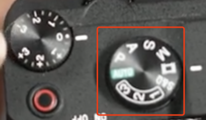
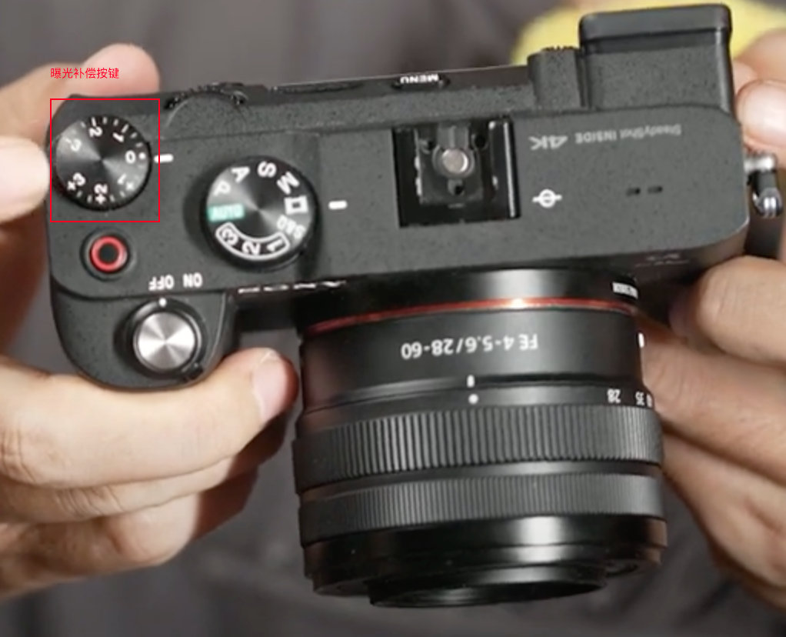
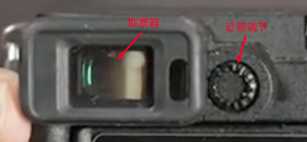
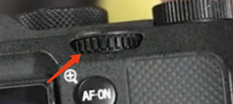
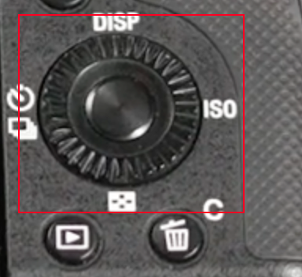
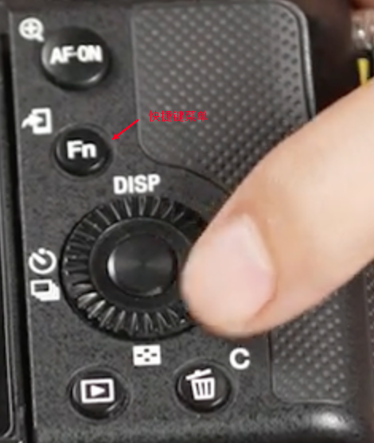
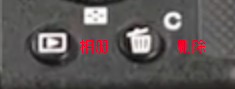

# 摄影入门

## 相机档位

- M 手动挡
- S 快门优先（运动物体）
- A 光圈优先（虚化背景）
- A 自动挡
- V 视频档

## 曝光补偿

ps: 只有在**A、S、P**档位下，曝光补偿键才会生效

## 取景器

## 旋转拨轮

ps: 

- 在**M、A、P**档位下，是调节光圈大小的
- 在**S**档位下，是调节快门速度的

- 在**M、A、P**档位下，是调节快门速度的
- 在**S**档位下，是调节快门速度的

## 快捷键

## 相册和删除

