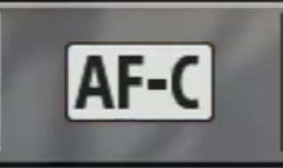
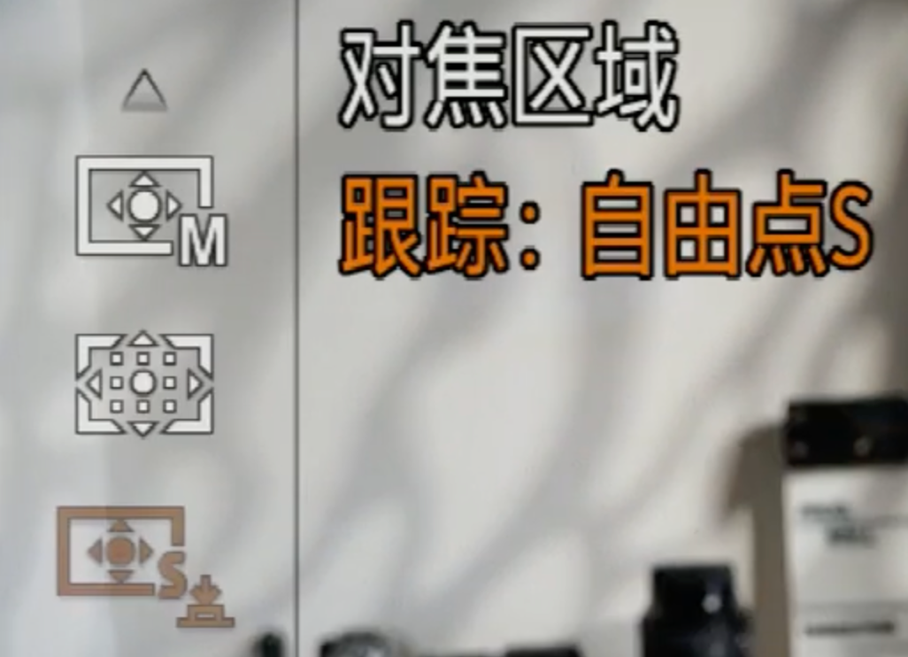

# 对焦

## 对焦模式

### AF-S

一般正常使用，可以用单次对焦模式即可

### AF-C

主要用来拍摄运动题材的照片时，可以使用连续对焦模式

### MF

如果需要更加精确的对焦，则使用手动对焦

## 对焦区域

- 区对焦

- 中间对焦

- 自由点（推荐）

- 扩展自由点

## 技巧

### 跟踪自由点

如果想移动拍摄某个物体，不要重复对焦，可以使用该模式。

ps: 要使用该功能需要设置**对焦模式（AF-S）+ 对焦区域(跟踪自由点)**

