# 人像拍摄

## 一、设置图片格式

图片设置为 RAW 格式(或者 RAW + JPEG)

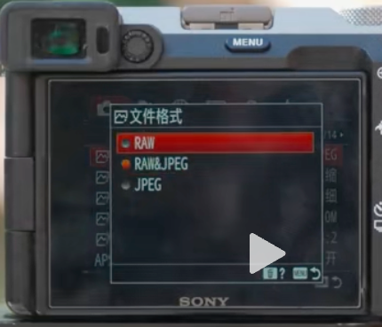

## 二、设置为M档

将档位转动到 M 档，可以精准控制图片三要素（快门、光圈、ISO感光度）

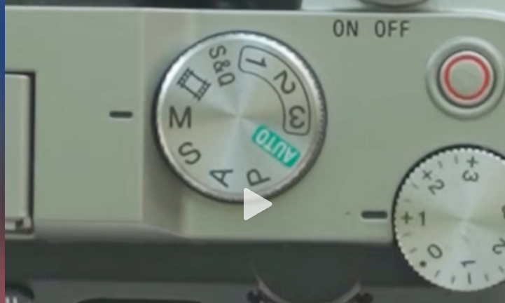

## 三、设置曝光参数

### 3.1 快门参数

曝光参数可以**根据物体运动速度**，控制快门来判断

1. 静止物体
  - 快门： 1/200秒
2. 运动物体
  - 快门： 1/500秒以上

### 3.2 光圈系数

控制画面虚实美感

1. 背景相对清晰
  - 小光圈（F8以上）

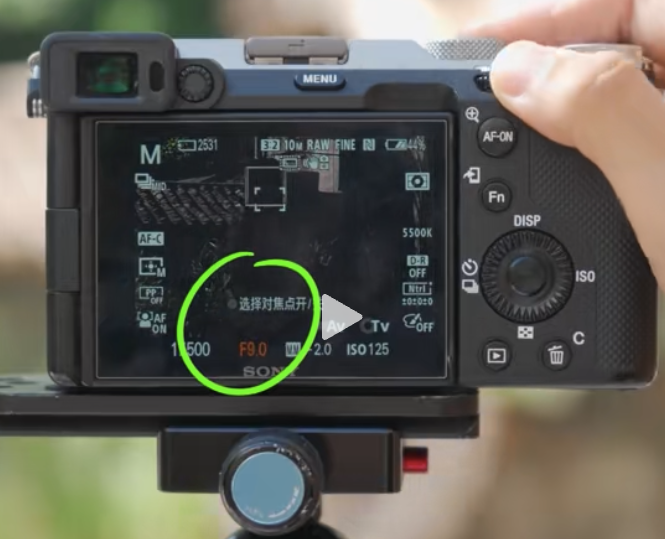

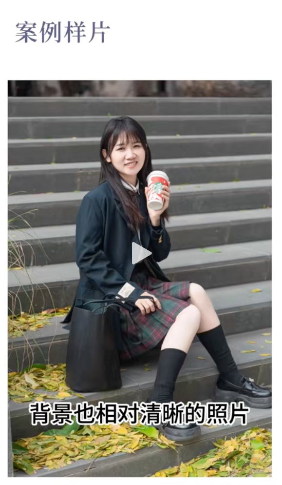

2. 背景虚化
  - 大光圈(F2.8左右)
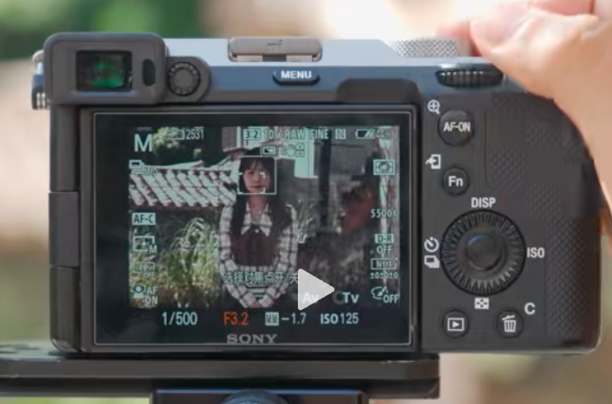

### 3.3 ISO感光度

1. 白天户外
  - 感光度设置：100-400左右

## 四、设置对焦参数

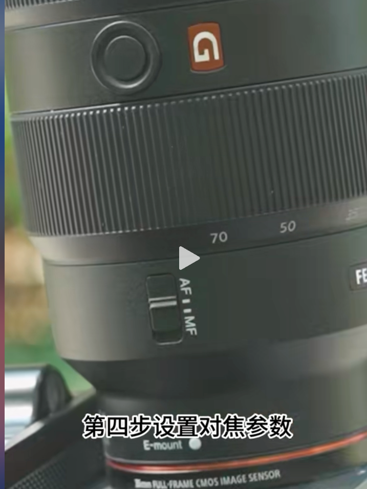

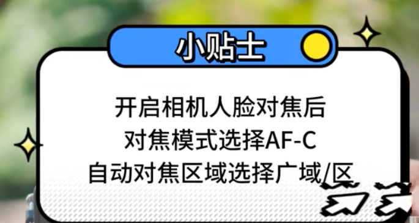

1. 对焦模式：AF-C

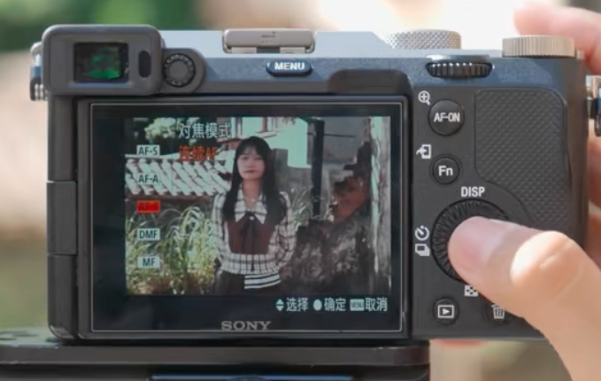

2. 自动对焦区域选择广域

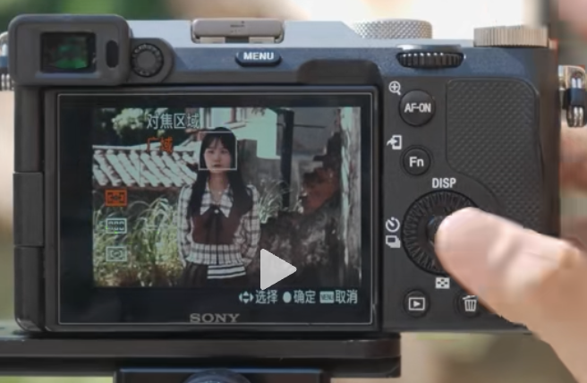

3. 开启人脸部对焦

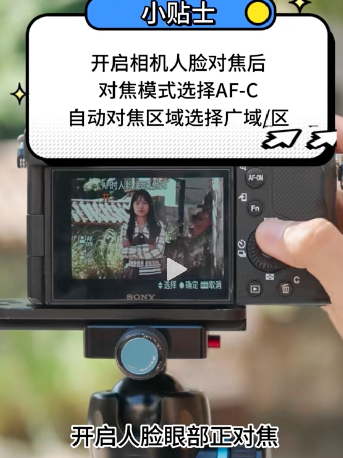

## 五、画面色调参数

1. 找到白平衡设置

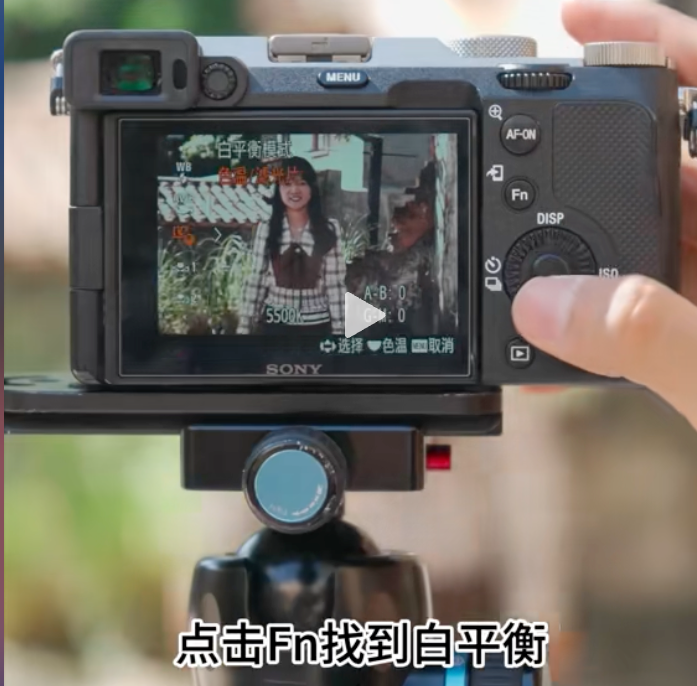

2. 小清新：设置4500K-4800K

3. 复古：5800K

## 六、拍摄模式

1. 静止物体（单拍模式）

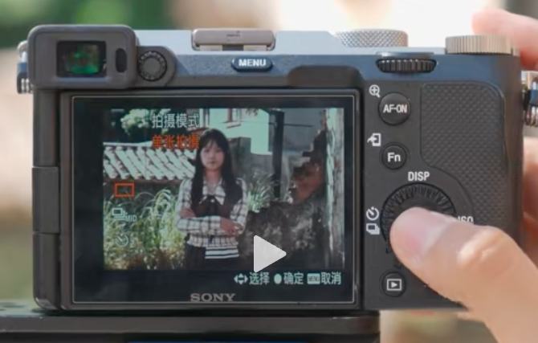

2. 运动物体（连拍模式）

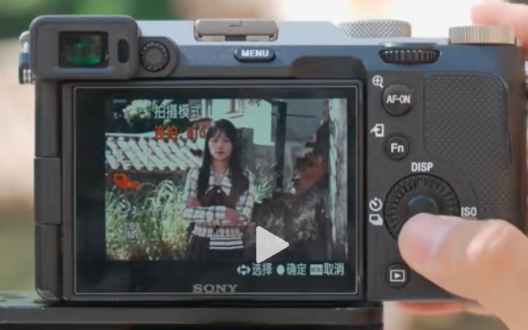