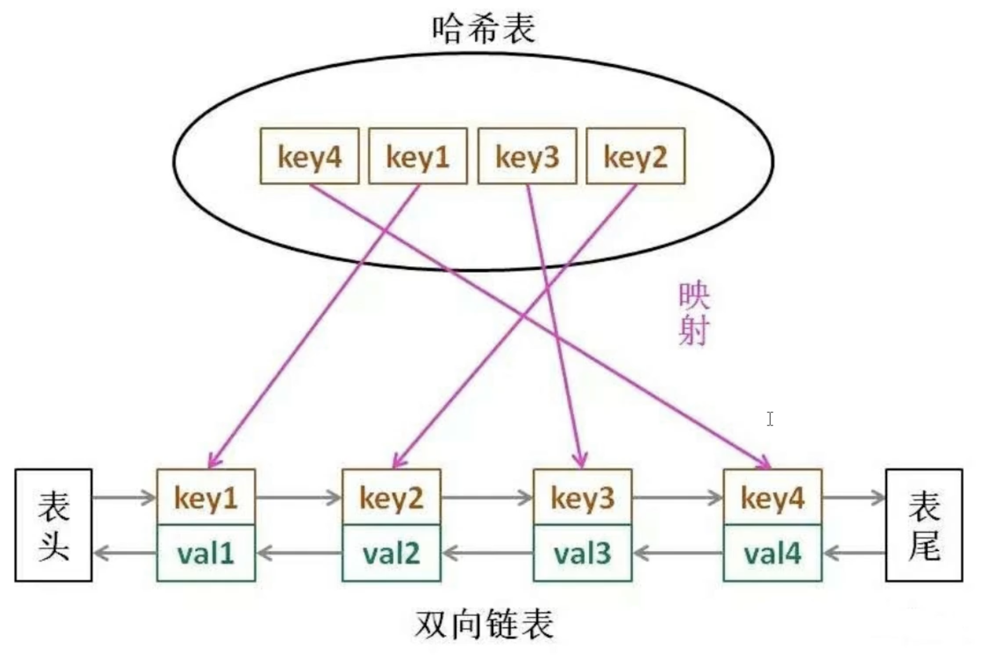

# LRU 算法

> LRU（Least Recently Used）缓存算法是一种常用的页面置换算法，用于管理内存中的数据。它的核心思想是当内存不足时，优先移除最长时间未被使用的数据。

在许多场景下，LRU缓存机制可以有效地优化数据的存取速度和减少数据加载的延迟。




实现一个基础的LRU缓存通常涉及以下几个关键点：

1. 存储容量限制：LRU缓存应该有一个最大容量限制，在达到容量限制时，最老（最久未被使用）的数据项会被移除以空出空间给新的数据项。
2. 快速访问数据：需要能够快速访问缓存中的数据项。通常，使用哈希表（或类似结构）实现O(1)时间复杂度的数据访问。
3. 记录访问顺序：除了存储数据本身，还需要记录每个数据项的访问顺序，以便知道哪些数据项是最近被访问的，哪些是最久未被访问的。这通常通过双向链表实现，链表的头部表示最近被访问的数据，尾部表示最久未被访问的数据。


```ts
class LinkNode {
  key: number;
  value: number;
  prev: LinkNode | null;
  next: LinkNode | null;
  constructor(key = -1, value = -1) {
    this.key = key;
    this.value = value;
    this.prev = null;
    this.next = null;
  }
}

class LRUCache {
  capacity: number;
  map: Map<number, LinkNode>;
  head: LinkNode;
  tail: LinkNode;

  constructor(capacity: number) {
    this.capacity = capacity;
    this.map = new Map();
    this.head = new LinkNode();
    this.tail = new LinkNode();
    this.head.next = this.tail;
    this.tail.prev = this.head;
  }

  get(key) {
    const item = this.map.get(key);
    if (!item) {
      return -1;
    }
    // 移动节点到头部
    this.removeNode(item);
    this.addHeadNode(item);
    return item.value;
  }

  put(key, value) {
    if (this.map.has(key)) {
      // 如果键已存在，更新值并移动到头部
      const existingItem = <LinkNode>this.map.get(key);
      this.removeNode(existingItem);
      existingItem.value = value;
      this.addHeadNode(existingItem);
    } else {
      if(this.map.size >= this.capacity) {
        const item = <LinkNode>this.removeLastNode()
        this.map.delete(item.key);
      }
      // 创建新节点并添加到头部
      const newItem = new LinkNode(key, value);
      this.map.set(key, newItem);
      this.addHeadNode(newItem);
    }
  }

  addHeadNode(item) {
    const headNext = <LinkNode>this.head.next;
    item.next = headNext;
    headNext.prev = item;
    this.head.next = item;
    item.prev = this.head;
  }

  removeNode(item) {
    const prevNode = item.prev;
    const nextNode = item.next;
    prevNode.next = nextNode;
    nextNode.prev = prevNode;
  }

  removeLastNode():LinkNode {
    const lastItem = this.tail.prev;
    if (lastItem !== this.head) { // 确保链表不为空
        this.removeNode(lastItem); // 使用removeNode确保节点从链表中正确移除
        return lastItem; // 返回被移除的节点，便于从map中删除对应键
    }
  }
}


let lRUCache = new LRUCache(2);
lRUCache.put(1, 1); // 缓存是 {1=1}
lRUCache.put(2, 2); // 缓存是 {1=1, 2=2}
console.log(lRUCache.get(1));    // 返回 1
lRUCache.put(3, 3); // 该操作会使得关键字 2 作废，缓存是 {1=1, 3=3}
console.log(lRUCache.get(2));    // 返回 -1 (未找到)
lRUCache.put(4, 4); // 该操作会使得关键字 1 作废，缓存是 {4=4, 3=3}
console.log(lRUCache.get(1));    // 返回 -1 (未找到)
console.log(lRUCache.get(3));    // 返回 3
console.log(lRUCache.get(4));    // 返回 4
```