# TCP

> TCP（Transmission Control Protocol，传输控制协议）是一种面向连接的、可靠的、基于字节流的传输层协议，用于在网络上可靠地传输数据。

## 特点

1. 面向连接： TCP 是一种面向连接的协议，通信双方在数据传输之前必须先建立连接。连接的建立需要经过三次握手（Three-way Handshake）过程，即客户端发送连接请求（SYN），服务器回复连接确认（SYN-ACK），客户端再次回复连接确认（ACK），连接才算建立成功。
2. 可靠性： TCP 提供可靠的数据传输服务，保证数据的可靠性、有序性和不重复性。为实现这些特性，TCP 使用了序列号、确认应答、超时重传、流量控制和拥塞控制等机制。
3. 字节流： TCP 是一种基于字节流的协议，数据被划分为多个数据段（Segment），每个数据段都有序列号和确认应答，通过序列号可以将数据段重新组装成完整的数据流。
4. 流量控制： TCP 使用流量控制机制来控制数据的发送速率，防止发送方发送速度过快而导致接收方无法及时处理数据。流量控制通过**窗口大小（Window Size）**来实现，接收方可以通过调整窗口大小来告诉发送方自己的接收能力。
5. 拥塞控制： TCP 使用拥塞控制机制来避免网络拥塞和数据丢失。拥塞控制通过动态调整发送窗口大小、慢启动、拥塞避免和快速重传等算法来实现，在网络拥塞发生时可以有效地调整数据传输速率，保证网络的稳定性和可靠性。
6. 双向通信： TCP 提供全双工通信能力，即客户端和服务器可以同时进行双向的数据传输。每个TCP连接都是点对点的，每个连接都有一个独立的发送方和接收方。
7. 可靠的错误检测和恢复： TCP 使用校验和、确认应答、超时重传等机制来实现可靠的错误检测和恢复，确保数据传输过程中的错误能够及时被发现和纠正。

总的来说，TCP协议是一种可靠的、面向连接的、基于字节流的传输层协议，通过可靠性、流量控制、拥塞控制等机制实现了在网络上的可靠数据传输和通信。

## 协议结构

> TCP头部和数据部分共同构成了TCP段（Segment），TCP段在IP层封装成IP数据报（Datagram）进行传输。TCP头部的长度最小为20字节，如果包含了选项字段，长度将会增加。TCP协议的结构设计简单而灵活，提供了可靠的数据传输和通信功能。

User
控制位分别都是什么含义

ChatGPT

TCP协议的结构由**TCP头部和数据部分**组成，具体如下：

### TCP首部（TCP Header）：

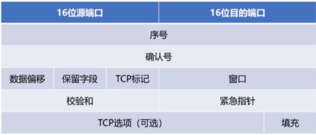

1. 源端口号（Source Port）： 16位，表示发送方端口号。
2. 目标端口号（Destination Port）： 16位，表示接收方端口号。
3. 序列号（Sequence Number）： 32位，表示本数据段的序列号，用于按顺序重组数据流。
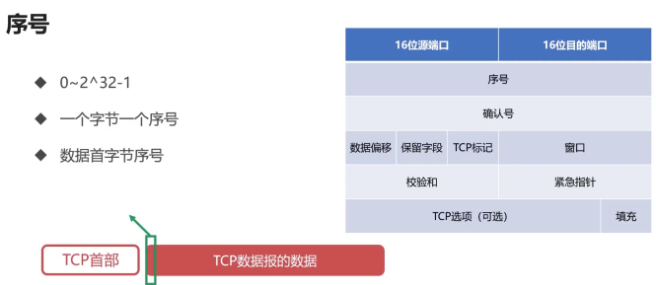
4. 确认号（Acknowledgment Number）： 32位，表示期望接收的下一个数据段的序列号。
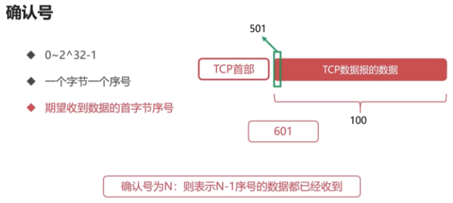
5. 数据偏移（Data Offset）： 4位，表示TCP头部的长度，以32位字为单位。
6. 保留位（Reserved）： 6位，保留字段，未使用，置为0。
7. 控制位（Control Flags）： 包括6个标志位，用于控制TCP连接的建立、终止和数据传输过程，包括SYN、ACK、FIN、RST、PSH、URG等。
8. 窗口大小（Window Size）： 16位，表示接收方的接收窗口大小，用于流量控制。
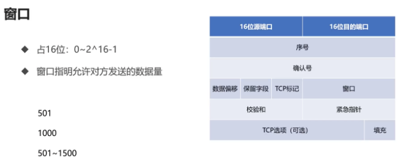
9. 校验和（Checksum）： 16位，用于检测TCP头部和数据部分的错误。
10. 紧急指针（Urgent Pointer）： 16位，仅在URG标志位被设置时有效，用于指示紧急数据的位置。
11. 选项（Options）： 可选，用于支持一些特定的功能和扩展，如选择性确认、时间戳、最大段大小等。

### 数据部分（Data）：
  - 数据部分是TCP协议传输的实际数据，长度不固定，最大长度由TCP头部中的窗口大小字段和选项字段确定。
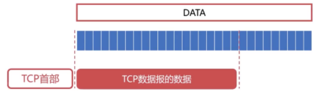

### 标志位

> TCP头部中的控制位是用于控制TCP连接状态和数据传输过程的标志位，共有6个标志位.

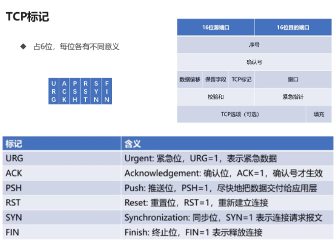

它们的含义如下：

1. URG（Urgent）
  - 表示紧急指针（Urgent Pointer）字段有效。
  - 当该标志位被设置时，表示紧急数据存在，紧急数据的位置由紧急指针字段指示。
2. ACK（Acknowledgment）
  - 表示确认应答字段（Acknowledgment Number）有效。
  - 当该标志位被设置时，表示确认号字段包含了一个有效的确认应答序列号，表示接收方已经成功接收到发送方发送的数据。
3. PSH（Push）
  - 表示接收方应该立即将收到的数据推送给应用层。
  - 当该标志位被设置时，表示发送方请求接收方立即将收到的数据推送给应用层，而不是等到缓冲区填满再推送。
4. RST（Reset）
  - 表示连接复位。
  - 当该标志位被设置时，表示发生了异常情况，需要强制终止连接，并且重置TCP连接状态。
5. SYN（Synchronize）
  - 表示发起连接请求或同步序列号。
  - 当该标志位被设置时，表示发起一个连接请求，用于建立新的TCP连接或进行连接的初始化。
6. FIN（Finish）
  - 表示连接终止。
  - 当该标志位被设置时，表示发送方已经完成数据的发送，希望关闭连接。

这些控制位的组合和设置状态不同，可以表示不同的TCP连接状态和数据传输过程，例如建立连接、数据传输、连接终止等。通过对这些控制位的设置和解析，可以实现可靠的数据传输和通信。

## 可靠传输原理

> TCP 协议之所以被称为可靠传输协议，是因为它实现了多种机制来确保数据的可靠性.

主要包括：

1. 序列号和确认应答机制： TCP 在每个数据段中都包含了序列号字段和确认应答字段。发送方发送的每个数据段都会标记一个序列号，接收方收到数据后会发送确认应答，确认序列号为接收到的最后一个字节的序列号。发送方根据确认应答确定哪些数据已经成功送达，哪些数据需要重传。
2. 超时重传机制： 如果发送方在一定时间内没有收到接收方的确认应答，就会认为数据丢失或损坏，会触发超时重传机制，重新发送丢失或损坏的数据段。这样可以保证数据能够在网络中正确传输。
3. 流量控制： TCP 使用滑动窗口机制进行流量控制，即接收方会告知发送方自己的接收窗口大小，发送方根据接收窗口大小调整发送速率，避免发送过多的数据导致接收方无法及时处理。
4. 拥塞控制： TCP 使用拥塞控制机制来避免网络拥塞和数据丢失。发送方会根据网络的拥塞程度动态调整发送速率，当网络拥塞时会减少发送速率，以避免数据丢失和网络阻塞。
5. 校验和机制： TCP 使用校验和机制对数据段进行校验，接收方会检查数据段的校验和，以确保数据在传输过程中没有被篡改或损坏。

### ARQ（Automatic Repeat reQuest，自动重传请求）协议

> ARQ（Automatic Repeat reQuest，自动重传请求）是一种数据链路层和传输层上常用的协议，用于在不可靠的通信信道上实现可靠的数据传输。

ARQ协议主要分为停等协议（Stop-and-Wait ARQ）、滑动窗口协议（Sliding Window ARQ）和选择重传协议（Selective Repeat ARQ）等几种类型。

1. 停等协议（Stop-and-Wait ARQ）：
  - 停等协议是最简单的ARQ协议，发送方发送一个数据帧后，会停止发送其他数据，直到收到接收方对该数据的确认。
  - 如果在一定时间内未收到确认，发送方会重新发送相同的数据。
  - 这种协议的效率较低，因为发送方发送完一个数据帧后需要等待确认，期间无法发送其他数据。
2. 滑动窗口协议（Sliding Window ARQ）：
  - 滑动窗口协议允许发送方连续发送多个数据帧而不需要等待确认。
  - 接收方会维护一个窗口，表示可以接收的数据帧的范围，发送方会根据窗口大小来发送数据。
  - 发送方发送数据后，不会立即停止等待确认，而是继续发送下一个数据，直到窗口被填满。
  - 接收方收到数据后，会发送确认应答，确认已收到的数据，并通知发送方窗口的移动。
3. 选择重传协议（Selective Repeat ARQ）：
  - 选择重传协议是滑动窗口协议的一种改进，它允许发送方重传丢失的数据帧，而不是重传整个窗口。
  - 接收方会对收到的每个数据帧进行确认，并通知发送方哪些数据帧已经成功接收，哪些数据帧需要重传。
  - 发送方会根据接收方的确认信息，选择性地重传丢失的数据帧，而不是重传整个窗口。

ARQ协议通过重传机制和确认应答机制来确保数据的可靠传输，能够在不可靠的通信信道上实现可靠的数据传输。不同类型的ARQ协议具有不同的效率和适用场景，可以根据具体的通信需求选择合适的协议。

### 连续ARQ（Continuous ARQ）

> TCP使用的是滑动窗口协议（Sliding Window ARQ）的一种变体，称为连续ARQ（Continuous ARQ）。连续ARQ是滑动窗口协议的一种改进，允许发送方连续发送多个数据段而不需要等待确认，从而提高了网络的利用率。

在TCP中，发送方和接收方都会维护一个滑动窗口，用于控制数据的发送和接收。发送方的窗口表示可以发送但尚未收到确认的数据段序列号范围，而接收方的窗口表示可以接收但尚未收到的数据段序列号范围。

TCP中的滑动窗口具有以下特点：

1. 发送方可以在收到之前的确认之前发送多个数据段，以填满窗口。
2. 接收方会发送确认应答，确认已收到的数据段，并通知发送方窗口的移动。
3. 发送方会根据接收方的确认信息和窗口的大小，动态调整发送的数据段数量和发送速率。

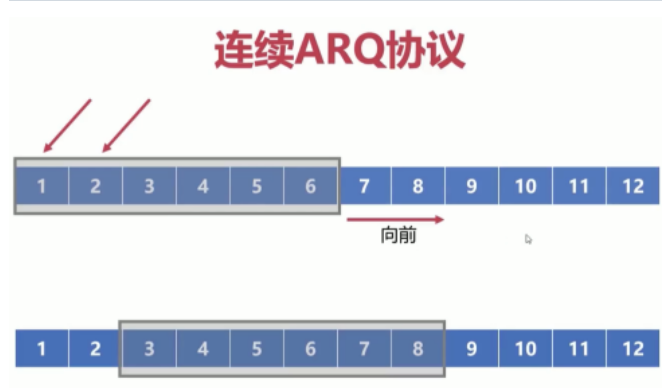

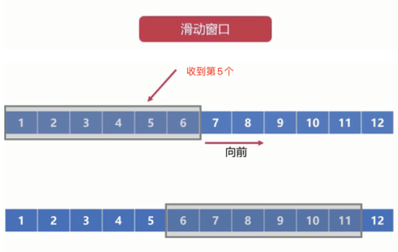

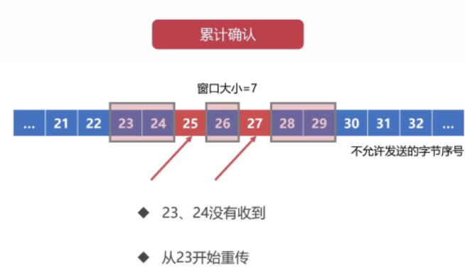

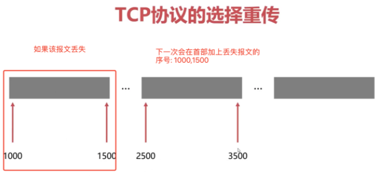

通过滑动窗口协议，TCP可以实现高效的数据传输，同时保证数据的可靠性和顺序性。这种协议能够在不可靠的网络环境中有效地传输数据，是TCP可靠传输的关键之一。

## 流量控制

> 流量控制是一种机制，用于控制数据的发送速率，以避免发送方发送过多的数据导致接收方无法及时处理。流量控制主要通过滑动窗口机制来实现。

具体来说，TCP的流量控制机制包括以下几个方面：

1. 接收窗口大小（Receive Window）： 接收方会告知发送方自己的接收窗口大小，即接收缓冲区的剩余空间。发送方根据接收窗口大小来调整发送速率，确保不会发送超过接收方能够处理的数据量。
2. 滑动窗口（Sliding Window）： 发送方和接收方都会维护一个滑动窗口，用于控制数据的发送和接收。发送方的窗口表示可以发送但尚未收到确认的数据段序列号范围，而接收方的窗口表示可以接收但尚未收到的数据段序列号范围。发送方根据接收方的窗口大小动态调整发送的数据量，确保不会超过接收方的处理能力。
3. 窗口更新（Window Update）： 接收方会定期发送窗口更新信息，通知发送方自己的接收窗口大小。发送方根据接收方的窗口更新信息来调整发送的数据量和发送速率，以适应网络状况的变化。

通过以上机制，TCP可以在发送方和接收方之间进行有效的流量控制，确保发送方发送的数据量不会超过接收方的处理能力，从而保证网络的稳定性和可靠性。流量控制是TCP协议中非常重要的一部分，能够有效地应对网络拥塞和数据丢失等问题，保证数据的可靠传输。

### 慢启动算法

> 慢启动（Slow Start）是TCP拥塞控制算法中的一种，用于在连接初始化或网络恢复后逐步增加发送窗口大小，以达到最佳的发送速率而不至于引发网络拥塞。

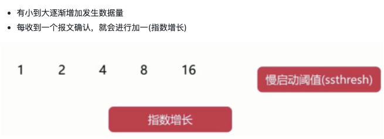

慢启动算法的基本原理如下：

1. 初始阶段： 当TCP连接建立时，发送方将初始的发送窗口大小设为一个较小的值（通常为1或者是一个较小的固定值），然后开始发送数据。
2. 指数增长： 发送方在每次收到一个确认应答时，就将发送窗口大小加倍（指数增长），这意味着发送方可以发送的数据量将呈指数级增长。例如，如果初始窗口大小为1，第一次确认后窗口大小变为2，第二次确认后窗口大小变为4，以此类推。
3. 拥塞避免阈值： 在达到一个阈值之前，发送方将继续以指数增长的方式增加发送窗口大小。当发送方的发送窗口大小达到一个预先设定的阈值（通常为拥塞窗口的一半），则切换到拥塞避免阶段。
4. 快速恢复： 如果发生超时或者收到重复确认时，慢启动算法将进入快速恢复阶段，此时发送方将发送窗口大小设置为拥塞避免阈值的一半，并继续使用拥塞避免算法来调整发送窗口大小。

慢启动算法通过逐步增加发送窗口大小，实现了对发送速率的控制，同时也能够有效地避免网络拥塞。这种算法能够在连接初始化和网络恢复时快速达到最佳的发送速率，提高了网络的利用率和数据传输的效率。

### 拥塞避免算法

> 拥塞避免（Congestion Avoidance）算法是TCP拥塞控制算法中的一种，用于在网络容量接近极限时，控制发送方的发送速率，以避免引发网络拥塞。

拥塞避免算法的基本原理如下：

1. 慢启动阶段： 当TCP连接建立或者从快速恢复状态退出时，会先进入慢启动阶段，此时发送方将发送窗口大小设为一个较小的值（通常为1或者是一个较小的固定值），然后开始发送数据。
2. 指数增长： 在慢启动阶段，每收到一个确认应答时，发送方将发送窗口大小加倍（指数增长），继续以指数增长的方式增加发送窗口大小，直到达到拥塞避免阈值。
3. 拥塞避免阶段： 一旦发送窗口大小达到拥塞避免阈值，发送方就会进入拥塞避免阶段。在这个阶段，发送方将采用线性增长的方式增加发送窗口大小，即每经过一个往返时间（RTT），发送窗口大小增加1个MSS（最大报文段长度）。
4. 拥塞检测： 如果发生超时或者收到重复确认时，TCP会认为发生了网络拥塞，此时会触发快速恢复和快速重传机制，而不再继续使用拥塞避免算法。

拥塞避免算法通过控制发送方的发送速率，逐渐增加发送窗口大小，以避免引发网络拥塞。与慢启动算法相比，拥塞避免算法在网络容量较大时可以更快地达到最佳的发送速率，从而提高了网络的利用率和数据传输的效率。

## 三次握手

> 三次握手是TCP协议用于建立可靠连接的过程，它确保了通信双方的状态同步和连接的可靠性。

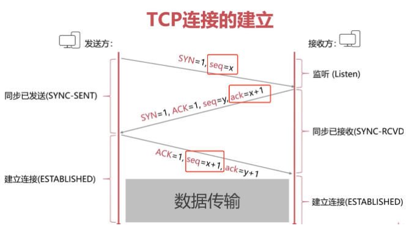

三次握手的过程如下：

1. 客户端向服务器发送连接请求：
  - 客户端向服务器发送一个SYN（同步）报文段，包含一个随机的初始序列号（ISN）。
  - 这个SYN报文段表明客户端希望建立连接，并指定了客户端发送数据的初始序列号。
2. 服务器应答并确认连接请求：
  - 服务器收到客户端的SYN报文段后，会向客户端发送一个ACK（确认）报文段，表示确认收到了客户端的连接请求。
  - 服务器也会发送一个SYN报文段，表明服务器同意建立连接，并指定服务器发送数据的初始序列号。
3. 客户端确认连接请求：
  - 客户端收到服务器的SYN和ACK报文段后，会向服务器发送一个ACK报文段，表示确认收到了服务器的确认，并同意建立连接。
  - 至此，连接建立完成，客户端和服务器可以开始进行数据传输。

三次握手的作用是确保通信双方都能够正常发送和接收数据，并且双方的状态保持一致。通过三次握手，客户端和服务器可以建立起可靠的连接，并在连接建立后进行数据传输。这个过程是TCP协议中非常重要的一部分，保证了连接的可靠性和稳定性。

### 为什么不使用两次握手

> 不能只进行两次握手建立连接的主要原因是无法防止已失效的连接请求报文段被服务端接收并建立连接。

1. 客户端向服务端发送连接请求（SYN报文段），但该**请求在网络中滞留**，服务端未收到该请求。
2. 客户端重新发送连接请求（另一个SYN报文段），但该请求到达服务端，服务端接受请求并向客户端发送确认（ACK报文段）。
3. 服务端建立连接后，客户端再次收到服务端的确认，但此时客户端并没有发出建立连接的请求。

在这种情况下，服务端会错误地认为客户端确实发起了连接请求，因此会建立连接。而客户端并不知道连接已建立，所以不会做出任何响应。这样，服务端会在等待客户端的数据时浪费资源，并且网络中可能存在无效的连接。

因此，进行三次握手的目的是确保双方都能确认对方的请求和响应，从而建立起可靠的连接。通过三次握手，可以避免上述情况下的错误连接，保证连接的可靠性和稳定性。

## 四次握手

>四次挥手是TCP协议用于关闭连接的过程，它确保了连接的可靠关闭和通信双方的状态同步。

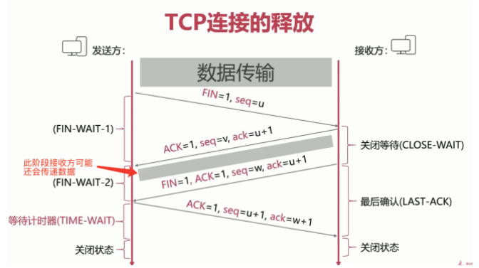

四次挥手的过程如下：

1. 客户端发起关闭连接请求
  - 客户端首先向服务器发送一个FIN（结束）报文段，表示客户端已经完成了数据的发送，希望关闭连接。
2. 服务器确认关闭请求并向客户端发送确认
  - 服务器收到客户端的FIN报文段后，会向客户端发送一个ACK（确认）报文段，表示已收到了客户端的关闭请求，并且服务器也准备好关闭连接。
3. 服务器关闭连接
  - 服务器在发送完所有数据后，会向客户端发送一个FIN报文段，表示服务器已经完成了数据的发送，希望关闭连接。
4. 客户端确认关闭请求并向服务器发送确认
  - 客户端收到服务器的FIN报文段后，会向服务器发送一个ACK报文段，表示已收到了服务器的关闭请求，并且客户端也准备好关闭连接。

### 为什么不用三次挥手

> TCP协议设计中采用四次挥手而不是三次挥手的主要原因是确保数据的可靠传输和连接的可靠关闭。

具体考虑以下情况：

1. 假设只进行三次挥手，客户端发送了FIN报文段，服务器接收到并发送了ACK报文段进行确认，然后关闭了连接，但是客户端并没有完全发送完所有数据。
2. 如果客户端此时也关闭连接，而服务器在关闭连接后可能还有未发送完的数据，这些数据就会丢失，导致数据传输的不完整性。

通过四次挥手，服务器可以在发送FIN报文段后继续等待一段时间，确保所有未发送完的数据都被发送到客户端，客户端接收到数据后再发送ACK报文段进行确认，然后再关闭连接，这样就可以确保数据的完整性和连接的可靠关闭。

因此，四次挥手提供了一个更加可靠和安全的连接关闭机制，确保了数据传输的完整性和连接状态的同步。虽然多一次握手和挥手可能会增加一些额外的开销，但是对于数据传输的可靠性和稳定性来说是非常重要的。
