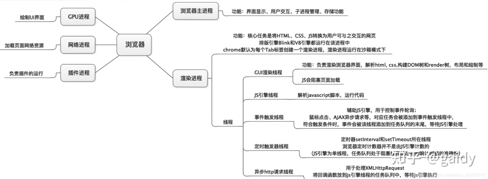
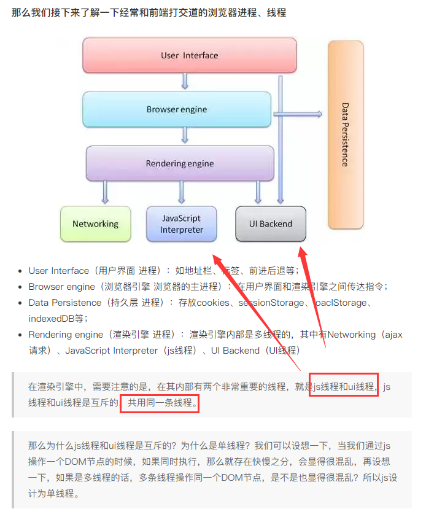

# 浏览器架构设计

> 这种多进程和多线程的设计有助于提高浏览器的性能、安全性和稳定性。不同的任务被分配到不同的进程和线程中，避免了一个标签页的问题影响整个浏览器，同时充分利用多核处理器的优势



1. 浏览器进程（Browser Process）：
  - 作用：
    - 负责整个浏览器的管理，包括用户界面、地址栏、书签栏等。
    - 管理多个标签页的创建、关闭、切换，以及处理用户输入。
  - 线程：
    - 主线程：处理用户界面、布局、绘制、解析 DOM 和执行 JavaScript。
    - 网络线程：处理网络请求、下载资源。
    - GPU 进程：处理与 GPU 相关的任务，如页面的 3D 渲染、硬件加速等。
    - 其他辅助线程：用于处理其他任务，如插件管理、浏览器同步等。

2. 渲染进程（Renderer Process）：
  - 作用：
    - 每个标签页对应一个独立的渲染进程，负责渲染页面内容、解析 HTML、CSS，执行 JavaScript。
    - 线程：
      - 主线程：处理用户界面、布局、绘制、解析 DOM 和执行 JavaScript（与浏览器进程的主线程类似）。
      - 网络线程：处理网络请求、下载资源。
      - 渲染线程：将渲染树转换为图层，进行页面的绘制和合成。
      - JavaScript 引擎线程：负责执行 JavaScript 代码，处理异步操作、事件循环等。

3. GPU 进程（GPU Process）：
  - 作用：
    - 处理与 GPU 相关的任务，如页面的 3D 渲染、硬件加速等。
4. 插件进程（Plugin Process）：
  - 作用：
    - 负责运行插件，如 Flash 插件、PDF 阅读器等。
5. 其他辅助进程（Utility Process）：
  - 作用：
    - 处理一些浏览器的辅助功能，如密码管理、浏览器同步等。
6. 其他可能的线程：
  - 定时器线程、事件循环线程等：
  - 用于处理定时器、异步事件等。




## 多进程设计

1. 浏览器进程（Browser Process）:
  - 负责整个浏览器的管理，包括用户界面、地址栏、书签栏等。
  - 管理多个标签页的创建、关闭、切换，以及处理用户输入。

2. 渲染进程（Renderer Process）:
  - 每个标签页对应一个独立的渲染进程。
  - 负责解析 HTML、CSS，构建 DOM 树和 CSSOM 树，生成渲染树，最终绘制在屏幕上。

3. 插件进程（Plugin Process）:
  - 负责运行插件，如 Flash 插件、PDF 阅读器等。
  - 独立的插件进程提高了插件的隔离性，防止插件崩溃影响整个浏览器。

4. GPU 进程（GPU Process）:
  - 处理与 GPU 相关的任务，如页面的 3D 渲染、硬件加速等。
  - 提高图形处理的性能。
  
5. 网络进程（Network Process）:
  - 处理网络请求、下载资源。
  - 使网络操作异步，不阻塞主线程。


## 多线程设计：
1. 主线程（Main Thread）：
  - 负责处理用户界面、布局、绘制、解析 DOM 和执行 JavaScript。
  - 处理用户输入、页面事件等。

2. 网络线程（Network Thread）：
  - 处理网络请求、下载资源。
  - 使网络操作异步，不阻塞主线程。

3. 渲染线程（Renderer Thread）：
  - 负责将渲染树转换为图层，进行页面的绘制和合成。
  - 独立的线程提高了页面的流畅性，不受其他任务的影响。

4. JavaScript 引擎线程（JavaScript Engine Thread）：
  - 负责执行 JavaScript 代码，处理异步操作、事件循环等。
  - 使 JavaScript 执行在单独的线程中，不阻塞其他任务。

5. 定时器线程（Timer Thread）：
  - 处理定时器相关的任务，执行定时器中的回调函数。

6. 事件循环线程（Event Loop Thread）：
  - 处理事件循环，监听事件队列，处理用户输入、定时器、网络请求等异步事件。


## 多进程和多线程的协同工作：

1. 进程间通信（IPC）：
  - 不同进程之间通过 IPC 机制进行通信，确保各个模块之间能够协同工作。

2. 任务分离：
  - 将不同的任务分配给不同的进程和线程，提高系统的并行性，加速任务的执行。

3. 资源共享和隔离：
  - 进程之间的内存空间是独立的，确保一个进程的问题不会直接影响其他进程。
  - 线程共享相同的内存空间，使得共享数据和通信更为简便。

4. 优化性能和响应性：
  - 通过多线程和多进程的设计，实现对 CPU、GPU、网络等硬件资源的充分利用，提高浏览器的性能和响应性。

### 其他补充知识

## 多线程和多进程

> 多线程和多进程是两种不同的并发执行的模型，它们在处理任务并行性、内存和通信等方面有一些关键区别。

1. 多进程（Multi-Process）
- 独立的内存空间: 不同进程拥有独立的内存空间，一个进程的变化不会直接影响其他进程。
- 通信复杂: 进程之间的通信较为复杂，通常需要使用进程间通信（IPC）的机制，如管道、消息队列、共享内存等。
- 资源消耗大: 每个进程都需要独立的内存空间和系统资源，因此资源消耗相对较大。
- 稳定性高: 由于独立的内存空间，一个进程崩溃通常不会影响其他进程。
- 适用于并行计算: 多进程适用于需要大量计算的任务，可以充分利用多核处理器的优势。

2. 多线程（Multi-Threading）
- 共享内存空间: 线程共享相同的内存空间，一个线程的变化会直接影响其他线程。
- 通信简单: 线程之间的通信相对简单，因为它们可以直接共享内存。
- 资源消耗小: 由于线程共享内存，资源消耗相对较小。
- 稳定性低: 一个线程崩溃可能导致整个进程崩溃，因为它们共享相同的内存空间。
- 适用于并发任务: 多线程适用于并发执行的任务，如 I/O 密集型任务，可以提高程序的响应速度

3. 共同点:
- 并发执行: 多进程和多线程都是为了实现任务的并发执行，提高系统的响应性和性能。
- 资源竞争: 由于共享资源，都可能面临资源竞争的问题，需要通过同步机制来解决。
- 调度: 操作系统负责对进程或线程进行调度，使它们交替执行。
- 并行性: 多进程和多线程都可以在多核处理器上实现并行执行，充分利用硬件资源。

4. 选择使用多进程还是多线程的考虑因素:
- 任务性质: 如果任务需要大量计算，适合使用多进程；如果是 I/O 密集型任务，适合使用多线程。
- 资源消耗: 多线程的资源消耗相对较小，适用于资源有限的环境。
- 通信需求: 如果任务之间需要频繁通信，使用多线程较为方便；如果通信较为复杂，多进程可能更适合。
- 稳定性需求: 如果一个任务的崩溃不能影响其他任务，多进程更为稳定；如果可以接受共享内存空间的稳定性风险，多线程可能更为简便。

## IPC 工作原理

> 进程间通信（Inter-Process Communication，IPC）是不同进程之间进行数据交换和共享信息的机制。在浏览器中，多进程设计使得不同的组件（如浏览器进程、渲染进程等）需要进行通信，以协同工作。

1. 管道（Pipe）：
  - 管道是一种单向通信机制，可以在两个进程之间传递数据。
  - 在浏览器中，浏览器进程和渲染进程之间可能使用管道进行通信，以传递一些关键的信息。

2. 消息队列（Message Queue）：
  - 消息队列是一种通过消息传递来实现进程间通信的机制。
  - 进程可以将消息发送到队列，其他进程则可以从队列中接收消息。
  ```
  例如，在浏览器中，浏览器进程和渲染进程之间可能使用消息队列传递渲染任务、用户输入等信息。
  ```

3. 共享内存（Shared Memory）：
  - 共享内存是一种高效的进程间通信方式，允许多个进程访问同一块内存区域。
  - 不同进程可以通过共享内存直接读写数据，而无需复制数据。
  - 在浏览器中，可能会使用共享内存来共享一些大型的数据结构，提高性能。
  
4. 信号（Signal）：
  - 信号是一种异步通信机制，用于通知进程发生了某个事件。
  - 进程可以通过发送信号来通知其他进程，接收信号的进程可以执行相应的处理。
  - 信号通常用于处理一些异常情况，如进程的中断、终止等。
 
5. 套接字（Socket）：
  - 套接字是一种网络通信的机制，也可以用于不同进程之间的通信。
  - 进程可以通过套接字在网络上发送数据，其他进程通过套接字接收数据。
  - 在浏览器中，可能使用套接字进行进程间通信，特别是在与远程服务器通信时。
  
6. RPC（Remote Procedure Call）：
  - RPC 是一种远程过程调用的机制，允许一个进程调用另一个进程的过程。
  - 在浏览器中，可能会使用 RPC 实现浏览器进程和渲染进程之间的远程调用，以执行一些特定的任务。