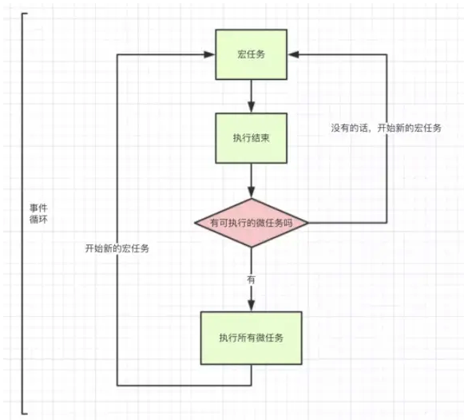

# 事件循环

> JavaScript 事件循环（Event Loop）是 JavaScript 引擎实现异步操作的基础机制之一，它负责处理代码执行和事件触发的顺序。


## Event Loop(事件循环)

Event Loop(事件循环)中，每一次循环称为 `tick`, 每一次tick的任务如下：

- 执行栈选择最先进入队列的宏任务(通常是script整体代码)，如果有则执行
- 检查是否存在 Microtask，如果存在则不停的执行，直至清空 microtask 队列
- 更新render(每一次事件循环，浏览器都可能会去更新渲染)
- 重复以上步骤

宏任务 > 所有微任务 > 宏任务，如下图所示：




## 执行栈


当执行某个函数、用户点击一次鼠标，Ajax完成，一个图片加载完成等事件发生时，只要指定过回调函数，这些事件发生时就会进入任务队列中，等待主线程读取,遵循先进先出原则。

执行任务队列中的某个任务，这个被执行的任务就称为**执行栈**。

## 主线程

要明确的一点是，主线程跟执行栈是不同概念，主线程规定现在执行执行栈中的哪个事件。

主线程循环：即主线程会不停的从执行栈中读取事件，会执行完所有栈中的同步代码。

当遇到一个异步事件后，并不会一直等待异步事件返回结果，而是会将这个事件挂在与执行栈不同的队列中，我们称之为**任务队列(Task Queue)**。

当主线程将执行栈中所有的代码执行完之后，主线程将会去查看任务队列是否有任务。如果有，那么主线程会依次执行那些任务队列中的回调函数。

```js
let a = () => {
  setTimeout(() => {
    // 7.宏任务
    console.log('任务队列函数1')
  }, 0)
  for (let i = 0; i < 5000; i++) {
    // 1.主线程
    console.log('a的for循环')
  }
  // 2.主线程
  console.log('a事件执行完')
}
let b = () => {
  setTimeout(() => {
    // 8.宏任务
    console.log('任务队列函数2')
  }, 0)
  for (let i = 0; i < 5000; i++) {
    // 3.主线程
    console.log('b的for循环')
  }
  // 4.主线程
  console.log('b事件执行完')
}
let c = () => {
  setTimeout(() => {
    // 9.宏任务
    console.log('任务队列函数3')
  }, 0)
  for (let i = 0; i < 5000; i++) {
    // 5.主线程
    console.log('c的for循环')
  }
  // 6.主线程
  console.log('c事件执行完')
}
a();
b();
c();
// 当a、b、c函数都执行完成之后，三个setTimeout才会依次执行
/**
 * output:
 a的for循环
 a事件执行完
5000 * b的for循环
 b事件执行完
5000 * c的for循环
 c事件执行完
 任务队列函数1
 任务队列函数2
 任务队列函数3
 */
```

## 原理

事件循环的基本原理如下：

1. 执行栈（Call Stack）： JavaScript 是单线程执行的，它使用**执行栈来管理代码的执行顺序**。执行栈是一个存储函数调用的栈结构，每当调用一个函数时，该函数会被推入栈顶，当函数执行完毕后，会从栈顶弹出。
2. 任务队列（Task Queue）： 除了执行栈外，JavaScript 还有一个**任务队列**，用于**存储异步任务和事件触发的回调函数**。任务队列中的任务会在执行栈为空时被执行，每次执行栈为空时，事件循环会检查任务队列中是否有任务，如果有，则将任务推入执行栈中执行。
3. 事件循环（Event Loop）： 事件循环负责不断地将任务队列中的任务推入执行栈执行，从而实现异步操作。事件循环会不断地执行以下步骤：
  - 检查执行栈是否为空，如果为空，则从任务队列中取出一个任务推入执行栈执行。
  - 如果执行栈不为空，则继续等待执行栈为空后再次检查任务队列。
4. 微任务队列（Microtask Queue）： 除了任务队列外，JavaScript 还有一个**微任务队列，用于存储微任务**。微任务是指**优先级较高的任务**，它会在当前宏任务执行完毕后立即执行。常见的微任务包括 Promise 的回调函数、MutationObserver 的回调函数等。


## 执行顺序

事件循环的执行过程可以总结为以下几个阶段：

1. 执行当前宏任务： 从执行栈中取出一个宏任务执行，直到执行栈为空或者遇到阻塞操作。
2. 执行微任务： 当前宏任务执行完毕后，立即执行微任务队列中的所有微任务，直到微任务队列为空。
3. 更新渲染： 更新页面渲染，如果有需要的话。
4. 等待新的宏任务： 检查任务队列中是否有新的宏任务，如果有，则取出一个宏任务推入执行栈执行；如果没有，则继续等待。

通过事件循环，JavaScript 实现了异步编程的核心机制，使得代码可以以非阻塞的方式处理异步操作，从而提高了程序的性能和响应性。

## 宏任务和微任务

> 在 JavaScript 中，宏任务（Macro Task）和微任务（Micro Task）是两种不同类型的任务，它们分别被添加到不同的任务队列中，并在事件循环的不同阶段执行。它们的主要区别在于执行时机和优先级。

### 宏任务（Macro Task）

1. 定时器任务（setTimeout、setInterval）： 在指定的时间间隔后执行的任务。
2. 事件监听器回调（addEventListener、click、DOMContentLoaded 等）： 当特定事件发生时触发的任务。
3. I/O 操作（文件读写、网络请求等）： 包括文件操作、网络请求等需要等待外部资源的任务。
4. 主线程中执行的代码（script 标签、代码块）： 在主线程执行的代码块，如 script 标签、普通代码块等。

### 微任务（Micro Task）

1. Promise 的回调函数： Promise 的状态变化时触发的任务，包括 then、catch、finally 方法注册的回调函数。
2. MutationObserver 的回调函数： 当监测到 DOM 结构发生变化时触发的任务。
3. process.nextTick（Node.js 环境下）： 在 Node.js 环境下执行的微任务，用于在当前执行栈结束后执行。

## 为什么script（整体代码）是宏任务却优先执行？


>在 JavaScript 的事件循环中，整体 script 代码也是一个宏任务。与其他宏任务不同的是，当浏览器加载 HTML 文档时，遇到 script 标签就会停止对文档的解析并立即执行脚本中的代码，因此 script 被认为是“特殊”的宏任务。

script 可能包含大量的代码，例如定义全局变量、函数、类等，或者涉及到 DOM 操作、网络请求等耗时操作。如果这些代码都被视为微任务，则会造成其他应用程序进程（如渲染进程）过长的卡顿和阻塞，影响用户体验。因此，浏览器通常会将外部 script 作为一个宏任务执行，以确保其他任务（如页面渲染）优先执行。

**整体 script 代码虽然是宏任务，但是包含的内容重要性高且预处理时间较长，所以是宏任务却优先执行。**

## 面试题

- case1:

```js
// 执行顺序问题，考察频率挺高的，先自己想答案**
setTimeout(function () {
    // 宏任务
    console.log(1);
});
new Promise(function(resolve,reject){
    // 1.主线程
    console.log(2)
    resolve(3)
}).then(function(val){
    // 微任务
    console.log(val);
})
// 2.主线程
console.log(4);

// output: 2,4,3,1
```


- case2:

```js
console.log('同步代码1');  // 1

async function async1 () {
   console.log('async1 start') // 2
   await async2()
   console.log('async1 end') // 6
}
async function async2 () {
   console.log('async2') // 3
}
async1()
    
setTimeout(() => {
    console.log('setTimeout1') // 10
    new Promise((resolve) => {
        console.log('Promise 1') // 11
        resolve()
    }).then(() => {
        console.log('promise.then1') // 12
    })
}, 10)

new Promise((resolve) => {
    console.log('同步代码2, Promise 2') // 4
    setTimeout(() => {
        console.log('setTimeout2') // 13
    }, 10)
    resolve()
}).then(() => {
    console.log('promise.then2'); // 7
    setTimeout(() => {
        console.log('setTimeout3') // 14
    }, 10);
    new Promise((resolve) => {
        console.log('Promise 3') // 8
        resolve()
    }).then(() => {
        console.log('promise.then3') // 9
    });
})

console.log('同步代码3'); // 5

/* 宏任务队列中第1个宏任务script的打印：*/
// 同步代码1
// async1 start
// async2
// 同步代码2, Promise 2
// 同步代码3
// async1 end
// promise.then2
// Promise 3
// promise.then3

/* 宏任务队列中第2个宏任务setTimeout1的打印：*/
// setTimeout1
// Promise 1
// promise.then1

/* 宏任务队列中第3个宏任务setTimeout2的打印：*/
// setTimeout2

/* 宏任务队列中第3个宏任务setTimeout3的打印：*/
// setTimeout3

```

- case3:(TODO)

```js
console.log('normal console');

setTimeout(() => {
  // 宏任务
  console.log('timeout 0');
}, 0);

setTimeout(() => {
  // 宏任务
  console.log('timeout 100');
}, 100);

Promise.resolve()
  .then(() => {
    console.log(0);
    return Promise.resolve(4);
  })
  .then(res => {
    console.log(res);
  });

Promise.resolve()
  .then(() => {
    console.log(1);
  })
  .then(() => {
    console.log(2);
  })
  .then(() => {
    console.log(3);
  })
  .then(() => {
    console.log(5);
  })
  .then(() => {
    setTimeout(() => {
      console.log('timeout 100 in Promise');
    }, 100);
  });
```