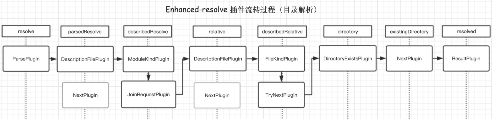

# 模块路径解析

> enhanced-resolve 是 Webpack 中的一个插件，用于解析模块的路径。它负责处理模块路径的解析和转换，将模块的路径映射到实际的文件位置，以便 Webpack 可以正确地加载和处理模块。

- enhanced-resolve 源码: https://github.com/webpack/enhanced-resolve

官方介绍:
- plugin system
- provide a custom filesystem
- sync and async node.js filesystems included




## enhance-resolve 的主要功能

1. 解析模块路径：根据模块的路径和文件后缀名等信息，确定模块的实际位置。例如，它可以将相对路径或者模块名映射到文件系统中的实际文件。

```js
const { resolve } = require('enhanced-resolve');

const resolver = resolve.create({
  fileSystem: require('fs')
});

resolver.resolve({}, '/path/to/project', './src/index.js', (err, result) => {
  if (err) {
    console.error('Error:', err);
  } else {
    console.log('Resolved path:', result);
  }
});
```

2. 查找依赖模块：对于每个模块，enhance-resolve 负责查找并解析其依赖的其他模块。它会根据模块之间的依赖关系，递归地处理所有依赖模块。
3. 支持自定义解析规则：enhance-resolve 支持自定义解析规则，可以根据项目的特定需求来配置模块的解析方式。例如，可以指定别名、查找模块的路径、处理不同类型的文件等。

```js
const resolve = require("enhanced-resolve");

resolve("/some/path/to/folder", "module/dir", (err, result) => {
	result; // === "/some/path/node_modules/module/dir/index.js"
});

resolve.sync("/some/path/to/folder", "../../dir");
// === "/some/path/dir/index.js"

const myResolve = resolve.create({
	// or resolve.create.sync
	extensions: [".ts", ".js"]
	// see more options below
});

myResolve("/some/path/to/folder", "ts-module", (err, result) => {
	result; // === "/some/node_modules/ts-module/index.ts"
});
```

4. 提供扩展功能：除了基本的模块解析功能外，enhance-resolve 还提供了一些扩展功能，例如解析 npm 包、处理 Node.js 内置模块、支持第三方模块解析器等。

总的来说，enhance-resolve 在 Webpack 的构建过程中扮演着非常重要的角色，它负责将模块的路径解析为实际的文件位置，并帮助 Webpack 正确地加载和处理模块。通过配置和使用 enhance-resolve，可以实现灵活和高效的模块解析，以满足项目的各种需求。