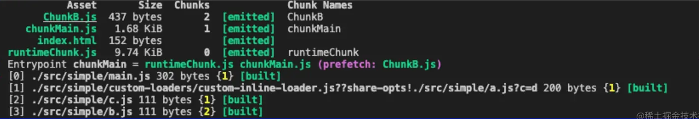
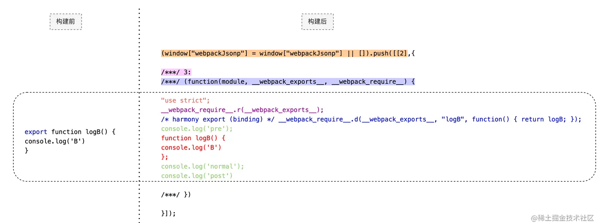

# webpack 构建产物分析

## 示例

定义如下文件:

- `src/main.js`
- `src/a.js`
- `src/b.js`
- `src/c.js`


```js
// 同步方式引入资源
import {logA} from './custom-loaders/custom-inline-loader.js??share-opts!./a?c=d'

function logAB() {
    logA();
    // 异步方式引入资源
    import(/* webpackChunkName: "ChunkB", webpackPrefetch: true */ './b').then(asyncModule => asyncModule.logB())
}

logAB()
```

```js
// src/a.js
import {logC} from './c'

export function logA() {
    logC()
    console.log('A')
}

export const A = 'A'
```

```js
// src/b.js
export function logB() {
    console.log('B')
}
```

```js
// src/c.js
export function logC() {
    console.log('C')
}
```


依赖关系如下:

1. 同步: `main -> a -> c`
2. 异步: `main -> b`


## 构建日志

执行 webpack build 之后，这个日志的输出由webpack/lib/Stats.js生成。



日志分析:

### 第一部分

下面这些信息都是从 `compilation.asstes` 中获取。

- Asset
- Size
- Chunks
- Chunk Name

输出的产物 chunk，主要分成三部分: `chunkMain`,`chunkB`,`runtimeChunk`

**runtimeChunk: webpack在构建后实际上提供自己的模块化机制，也就是这里的runtimeChunk**。该runtimeChunk是动态生成的，实际可以兼容commonjs、amd、esm等各种模块化机制。

### 第二部分

EntryPoint 显示了该entry(main.js)构建后生成的entryPoint（是一个特殊的ChunkGroup），等于号后面是该chunkGroup包含的所有文件的信息，一个ChunkGroup会包含多个Chunk，通常一个Chunk会对应一个文件。

看到这里EntryPoint关联了两个文件：chunkMain.js和runtimeChunk.js。
Stats.js中显示通过EntryPoint获取其包含的所有Chunk，然后再从各Chunk中获取包含的文件。

### 第三部分

构建过程中产生的模块的信息来自compilation.modules，而`[built]`对应如NormalModule（extends Module）中built属性，用来表示该文件是否经过build，当调用normalModule.build()则会设置该属性，表明是经过模块构建的。

compilation.modules中的模块是Module类型，控制台展示路径取自userRequest属性的相对路径指向原始资源路径，主要是用来说明原始资源构建后的情况。

## 产物分析

### ChunkB.js

b.js 构建前后的内容对比



- 背景色部分：运行时相关的逻辑，保证被webpack的运行时正确加载和执行。
- 虚线框部分：原始内容的变更：loader修改的内容、export被转换为运行时相关的逻辑。

## chunkMain.js

```js
(window["webpackJsonp"] = window["webpackJsonp"] || []).push([[1],[
/* 0 */
/***/ (function(module, __webpack_exports__, __webpack_require__) { 
    // main.js 转换后的内容
/***/ }),
/* 1 */
/***/ (function(module, __webpack_exports__, __webpack_require__) {
    // a.js 转换后的内容
/***/ }),
/* 2 */
/***/ (function(module, __webpack_exports__, __webpack_require__) {
    // c.js 转换后的内容
/***/ })
],[[0,0]],[2]]);
```

该模块主要包含了 `main.js`,`a.js`,`c.js` 三个模块的定义

`(window["webpackJsonp"] = window["webpackJsonp"] || [])` 方法的入参是一个数组，入参分别是四个数组

## runtimeChunk.js

> 这个文件（runtimeChunk）的主要功能是webpack自己模块化机制，目的是为了兼容其他模块化规范，实际的做法是将其他的模块化都转为webpack自己的模块化形式，然后只需要提供自己的模块化机制就可以了。所以该文件是额外输出的，并没有原始文件与之对应。

官网参考： https://webpack.js.org/concepts/manifest/#runtime

### runtime是如何发挥作用的？

始于 index.html

```html
<!DOCTYPE html>
<html>
<head>
    <script src="./runtimeChunk.js"></script>
    <script src="./chunkMain.js"></script>
</head>
<body></body>
</html>
```

由于runtimeChunk.js是底层依赖，需要先于所有的js文件先执行，并且需要引入我们页面的主入口chunkMain.js.

### runtimeChunk.js的加载和执行

```js
// 首先是一个立即执行函数，参数modules用来保存当前运行时加载的所有模块
(function (modules) { // modules 缓存加载了文件包含的模块的定义，此时模块未执行也为注册
    var installedModules = {}; // 保存已经执行并且注册了的模块，区别于modules

    // 存储chunk的加载状态，枚举值有：undefined、null、Promise、0
    // undefined：chunk尚未加载, 
    // null：chunk preloaded/prefetched
    // Promise：当前chunk正在加载 
    // 0：chunk已经成功加载
    var installedChunks = { 0: 0 }; // key是chunkId,value是chunk的加载状态
    // 暂时只列出chunk加载和模块注册相关的逻辑
    
    // 1. 缓存chunk的加载状态 
    // 2. 缓存模块的定义 
    // 3. 异步模块加载的resolve() 
    // 4. 校验 + 执行待执行模块（data[2])
    function webpackJsonpCallback(data) {...};
      
    // 通过moduleId执行指定的模块，并获取该模块对外暴露的变量  
    function __webpack_require__(moduleId) {...}
    
    // 提供给具体的模块使用，模块通过该方法定义暴露的变量
    __webpack_require__.d = function (exports, name, getter) {...};
    
    // 异步模块的加载，主要是动态创建script标签挂载到页面上，并返回一个promise给调用者
    __webpack_require__.e = function requireEnsure(chunkId) {...}     
    
    // ... __webpack_require__.xxx 等其他方法的定义

    // 设置 window["webpackJsonp"]，并改写push方法指向webpackJsonpCallback
    var jsonpArray = window["webpackJsonp"] = window["webpackJsonp"] || [];
    jsonpArray.push = webpackJsonpCallback; // 注意：实际指向webpackJsonpCallback
})([]);

```

首先我们看到的是一个立即执行函数，好处是让入参modules在当前runtime的运行环境中为私有变量，如果有同时存在多个多个runtime.js，避免了全局作用域的污染，保证了隔离性和安全性。

内部关键的缓存对象:

- modules: 存储当前已经加载过的模块的定义，map结构
    - key：moduleId
    - value：`(function(module, __webpack_exports__, __webpack_require__) {...})`，此时只是缓存模块的定义，该模块尚未执行和注册
- installModules: 存储已经注册的模块，map结构
    - key：moduleId
    - value：对象，该对象的exports属性是关键，用来存储当前模块对外暴露的变量。 区别于上面的modules，installModules中的value就是执行modules中的value得到的结果
- installedChunks: 已经加载了的chunk信息，map结构
    - key：chunkId
    - value：该chunk关联的文件的加载状态（有：尚未加载、加载中、加载完成、预加载），


另外看到在window对象上添加webpackJsonp属性指向一个数组，改写push方法指向webpackJsonpCallback

## chunkMain.js的加载和执行

执行完runtimeChunk.js后执行chunkMain.js，这里调用了window["webpackJsonp"].push即webpackJsonpCallback，下面看下该方法的实现

webpackJsonpCallback

```js
function webpackJsonpCallback(data) {
    // 可以看到push的入参数数组的各个元素的含义

    // 当前文件关联的chunkId
    var chunkIds = data[0]; 
    // 当前文件包含了哪些模块，
    // 此时模块内容并未真正执行，实际的内容外面包了一层function(...){...}
    var moreModules = data[1]; 
    var executeModules = data[2];

    var moduleId, chunkId, i = 0, resolves = [];
    for (; i < chunkIds.length; i++) {
        chunkId = chunkIds[i];
        if (/*如果当前有正在异步加载的chunk*/) {
            // 保存异步模块加载时生成的resolve，即__webpack_require__.e中设置的resolve
            resolves.push(installedChunks[chunkId][0]); 
        }

        // chunk成功加载完成的标识
        installedChunks[chunkId] = 0; 
    }
    // 遍历 moreModules变缓存到modules
    // modules[moduleId] = moreModules[moduleId];

    // 调用父jsonFunction，有特定的场景，后面再说

    while (resolves.length) {
        // 异步模块加载的【关键】：执行 __webpack_require__.e 设置的 resolve
        resolves.shift()(); 
    }

    return checkDeferredModules(); // 执行 executeModules 中的模块
};

function checkDeferredModules() {
    var result;
    for(var i = 0; i < deferredModules.length; i++) {
        var deferredModule = deferredModules[i];
        var fulfilled = true;
        // 通过installedChunks判断依赖的chunks是否已经加载完成
        // 注意：从第2个（j = 1）元素开始算作依赖chunk
        for(var j = 1; j < deferredModule.length; j++) {
            var depId = deferredModule[j];
            if(installedChunks[depId] !== 0) fulfilled = false;
        }
        if(fulfilled) {
            deferredModules.splice(i--, 1);
            // 加载第1个元素
            result = __webpack_require__(__webpack_require__.s = deferredModule[0]);
        }
    }

    return result;
}
```

1. 通过installedChunks记录加载过的chunk，这里的chunkId是1，所以会记录installedChunks[1] = 0表明该chunk加载完成。然后遍历第二个元素是各个moduleId（对应数组索引）与模块定义的映射，缓存到modules上。
2. 如果存在异步加载的Chunk，则获取 __webpack_require__.e 设置的resolve并执行
3. 调用checkDeferredModules方法：
    1. 校验依赖的Chunks 是否都已经加载完成；
    2. 调用__webpack_require__执行并注册模块；这里就是[0,0]，第一个元素是需要执行并注册的moduleId，第二个（及其后面的）元素该模块依赖的chunkIds，只有这些chunk安装后才能执行并注册该模块。moduleId为0在这里指向chunkMain.js，chunkId为0在这里指向runtimeChunk.js。

## webpack_require

下面看下__webpack_require__方法以及执行和注册chunkMain.js逻辑


```js
// 根据moduleId执行并注册模块
function __webpack_require__(moduleId) {
    // 1. 已经安装过则直接返回
    // 2. 创建一个对象用来存储模块的信息，主要是exports存储对外暴露的变量
    var module = installedModules[moduleId] = {
        i: moduleId,
        l: false,
        exports: {}
    };
    // 3. 执行模块
    modules[moduleId].call(module.exports, module, module.exports, __webpack_require__);

    // 4. 设置
    module.l = true;
    // 5. 返回当前模块对外暴露的变量
    return module.exports;
}
```

逻辑很清楚了，构造一个对象用来存储moduleId对应的模块信息，主要是exports用来存储模块对外暴露的变量，关注下call方法的入参。

下面是chunkMain.js的内容。

```js
// 原始main.js构建后的内容
/***/ (function(module, __webpack_exports__, __webpack_require__) {
    "use strict";
    __webpack_require__.r(__webpack_exports__);
    /* harmony import */ var _custom_loaders_custom_inline_loader_js_share_opts_a_c_d__WEBPACK_IMPORTED_MODULE_0__ = __webpack_require__(1);
    console.log('pre');


    function logAB() {
        Object(_custom_loaders_custom_inline_loader_js_share_opts_a_c_d__WEBPACK_IMPORTED_MODULE_0__["logA"])(); 
        __webpack_require__.e(/* import() | ChunkB */ 2).then(__webpack_require__.bind(null, 3)).then(asyncModule => asyncModule.logB())
    }

    logAB();
    console.log('normal');
    console.log('post')

/***/ }),
```

1. 由于原始main.js同步引用了a.js，所以我们看到这里继续使用 __webpack_require__获取moduleId为 1 的模块（对应a.js），这个过程是同步的，逻辑同上不在赘述
2. 由于原始main.js异步引用了b.js，这里通过调用__webpack_require__.e 来进行模块的异步加载


## 异步加载chunkB.js

webpack_require.e

```js
// 加载异步模块
__webpack_require__.e = function requireEnsure(chunkId) {
    var promises = [];
    var installedChunkData = installedChunks[chunkId];
    if (installedChunkData !== 0) { // 0 means "already installed".
        if (installedChunkData) {
            // 避免同一个Chunk被多次加载
            promises.push(installedChunkData[2]);
        } else {
            var promise = new Promise(function (resolve, reject) {
                // 关键：将promise的resolve/reject和chunkId关联起来
                // webpackJsonpCallback 就可以通过chunkId找到resolve/reject对决定promise状态
                installedChunkData = installedChunks[chunkId] = [resolve, reject];
            });

            // 所以：installedChunkData [resolve, reject, promise]
            promises.push(installedChunkData[2] = promise); // 添加了一个数组元素
        }

        // 动态创建script标签挂载到document上
        // 设置定时器放置无限等待，reject
        // 添加onlaod事件 onScriptComplete: 清理定时器 + 处理异常
    }

    return Promise.all(promises)
}
```

1. 异步模块加载的入口，返回一个promise，主要实现是动态创建一个`<script/>`标签挂载到页面上.
2. 这里的巧妙出在于通过installedChunks[chunkId]保存了该promise的[resolve，reject]
3. 当文件chunkB.js加载完成后，浏览器会执行该js，立即执行webpackJsonpCallback，而对于异步加载的chunk来说，这里有个特殊的点，就是这里会执行resolves.shift()(); 来结束promise的pending状态从而进入后面的then逻辑， __webpack_require__.e只是创建`<script/>`用来加载并执行chunkB.js，b.js的模块的获取还得交给__webpack_require__

```js
__webpack_require__.e(/* import() | ChunkB */ 2)
    .then(__webpack_require__.bind(null, 3))
    .then(asyncModule => asyncModule.logB())
```

## webpack_require.d

最后我们看下__webpack_require__.d方法，在a.js和b.js中构建后内容中，都是通过该方法在module.exports对象上定义对外暴露的变量

```js
// chunkB.js，导出 logB
/* harmony export (binding) */ __webpack_require__.d(__webpack_exports__, "logB", function() { return logB; });
```

`__webpack_require__.d` 逻辑如下，逻辑很简单就是调用Object.defineProperty在exports对象上定义一个属性，值得注意的是，这里只定义了getter

```js
__webpack_require__.d = function (exports, name, getter) {
    // __webpack_require__.o => Object.prototype.hasOwnProperty.call(obj, prop)
    if (!__webpack_require__.o(exports, name)) { 
        Object.defineProperty(exports, name, {enumerable: true, get: getter});
    }
};
```

esm规范中，模块导出的值是只读的，重新赋值会报错；因此这里没有定义setter，默认是undefined在严格模式下给exports的属性赋值会报错，用来对齐esm规范。

