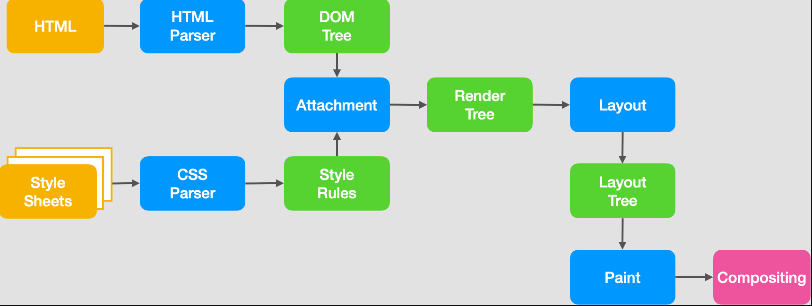
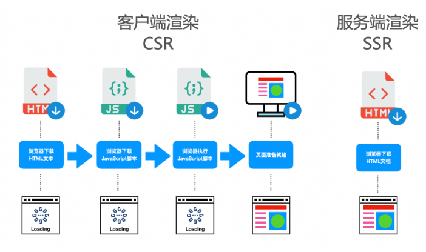
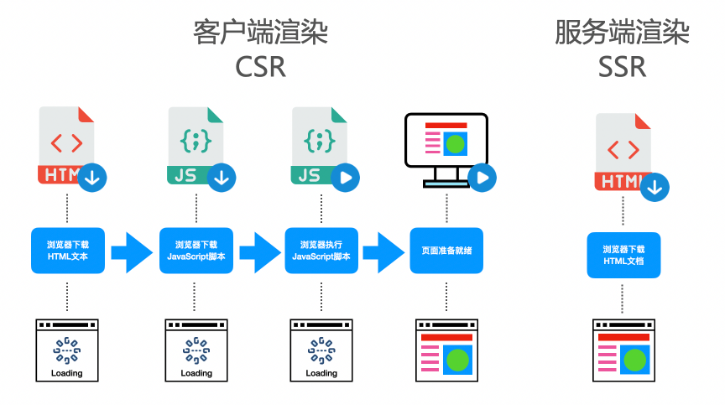
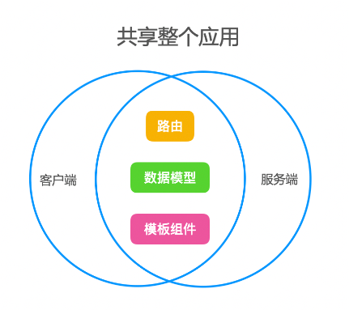

# SSR 渲染原理

在讲服务度渲染之前，我们先回顾一下页面的渲染流程：

1. 浏览器通过请求得到一个HTML文本
2. 渲染进程解析HTML文本，构建DOM树
3. 解析HTML的同时，如果遇到内联样式或者样式脚本，则下载并构建样式规则（stytle rules），若遇到JavaScript脚本，则会下载执行脚本。
4. DOM树和样式规则构建完成之后，渲染进程将两者合并成渲染树（render tree）
5. 渲染进程开始对渲染树进行布局，生成布局树（layout tree）
6. 渲染进程对布局树进行绘制，生成绘制记录
7. 渲染进程的对布局树进行分层，分别栅格化每一层，并得到合成帧
8. 渲染进程将合成帧信息发送给GPU进程显示到页面中

可以看到，页面的渲染其实就是浏览器将HTML文本转化为页面帧的过程。而如今我们大部分WEB应用都是使用 JavaScript 框架（Vue、React、Angular）进行页面渲染的，也就是说，在执行 JavaScript 脚本的时候，HTML页面已经开始解析并且构建DOM树了，**JavaScript 脚本只是动态的改变 DOM 树的结构，使得页面成为希望成为的样子，这种渲染方式叫动态渲染，也可以叫客户端渲染（client side rende）**。

那么什么是服务端渲染（server side render）？顾名思义，服务端渲染就是在浏览器请求页面URL的时候，服务端将我们需要的HTML文本组装好，并返回给浏览器，这个HTML文本被浏览器解析之后，不需要经过 JavaScript 脚本的执行，即可直接构建出希望的 DOM 树并展示到页面中。这个服务端组装HTML的过程，叫做服务端渲染。

## 服务端渲染的利弊

相比于客户端渲染，服务端渲染有什么优势？

### 利于SEO

有利于SEO，其实就是有利于爬虫来爬你的页面，然后在别人使用搜索引擎搜索相关的内容时，你的网页排行能靠得更前，这样你的流量就有越高。那为什么服务端渲染更利于爬虫爬你的页面呢？其实，爬虫也分低级爬虫和高级爬虫。

  - 低级爬虫：只请求URL，URL返回的HTML是什么内容就爬什么内容。
  - 高级爬虫：请求URL，加载并执行JavaScript脚本渲染页面，爬JavaScript渲染后的内容。

也就是说，低级爬虫对客户端渲染的页面来说，简直无能为力，因为返回的HTML是一个空壳，它需要执行 JavaScript 脚本之后才会渲染真正的页面。而目前像百度、谷歌、微软等公司，有一部分年代老旧的爬虫还属于低级爬虫，使用服务端渲染，对这些低级爬虫更加友好一些。

### 白屏时间更短

相对于客户端渲染，服务端渲染在浏览器请求URL之后已经得到了一个带有数据的HTML文本，浏览器只需要解析HTML，直接构建DOM树就可以。而客户端渲染，需要先得到一个空的HTML页面，这个时候页面已经进入白屏，之后还需要经过加载并执行 JavaScript、请求后端服务器获取数据、JavaScript 渲染页面几个过程才可以看到最后的页面。特别是在复杂应用中，由于需要加载 JavaScript 脚本，越是复杂的应用，需要加载的 JavaScript 脚本就越多、越大，这会导致应用的首屏加载时间非常长，进而降低了体验感。

### 服务端渲染缺点

并不是所有的WEB应用都必须使用SSR，这需要开发者自己来权衡，因为服务端渲染会带来以下问题：

1. 代码复杂度增加。为了实现服务端渲染，应用代码中需要兼容服务端和客户端两种运行情况，而一部分依赖的外部扩展库却只能在客户端运行，需要对其进行特殊处理，才能在服务器渲染应用程序中运行。
2. 需要更多的服务器负载均衡。由于服务器增加了渲染HTML的需求，使得原本只需要输出静态资源文件的nodejs服务，新增了数据获取的IO和渲染HTML的CPU占用，如果流量突然暴增，有可能导致服务器down机，因此需要使用响应的缓存策略和准备相应的服务器负载。
3. 涉及构建设置和部署的更多要求。与可以部署在任何静态文件服务器上的完全静态单页面应用程序 (SPA) 不同，服务器渲染应用程序，需要处于 Node.js server 运行环境。

所以在使用服务端渲染SSR之前，需要开发者考虑投入产出比，比如大部分应用系统都不需要SEO，而且首屏时间并没有非常的慢，如果使用SSR反而小题大做了。

## 同构

知道了服务器渲染的利弊后，假如我们需要在项目中使用服务端渲染，我们需要做什么呢？那就是同构我们的项目。

### 同构的定义

在服务端渲染中，有两种页面渲染的方式：

- 前端服务器通过请求后端服务器获取数据并组装HTML返回给浏览器，浏览器直接解析HTML后渲染页面
- 浏览器在交互过程中，请求新的数据并动态更新渲染页面

这两种渲染方式有一个不同点就是，一个是在服务端中组装html的，一个是在客户端中组装html的，运行环境是不一样的。

所谓同构，就是让一份代码，既可以在服务端中执行，也可以在客户端中执行，并且执行的效果都是一样的，都是完成这个html的组装，正确的显示页面。也就是说，一份代码，既可以客户端渲染，也可以服务端渲染。

### 同构的条件

为了实现同构，我们需要满足什么条件呢？首先，我们思考一个应用中一个页面的组成，假如我们使用的是Vue.js，当我们打开一个页面时，首先是打开这个页面的URL，这个URL，可以通过应用的路由匹配，找到具体的页面，不同的页面有不同的视图，那么，视图是什么？从应用的角度来看，`视图 = 模板 + 数据`，那么在 Vue.js 中， 模板可以理解成组件，数据可以理解为数据模型，即响应式数据。所以，对于同构应用来说，我们必须实现客户端与服务端的路由、模型组件、数据模型的共享。

[参考文章](https://github.com/yacan8/blog/issues/30)