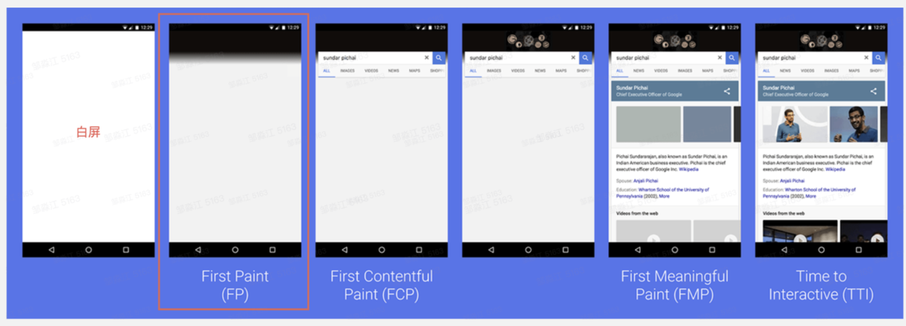

# 前端性能指标



## FCP (First Contentful Paint)

> FCP (First Contentful Paint) 是一个重要的网页性能指标，用于衡量用户打开网页后到浏览器渲染出页面上的第一个内容（文本、图像、SVG等）所需的时间。这个指标关键在于反映了用户等待页面开始显示内容的时间长度，是用户体验的重要组成部分。

FCP 是衡量网页初次加载速度的关键指标，直接影响用户的首次印象。这影响用户留存率以及存量。

### 影响 FCP 的因素

FCP 可以受到多种因素的影响，包括但不限于：

- 资源文件大小：较大的CSS、JavaScript或图像文件会增加加载时间，从而延迟内容的渲染。
- 服务器响应时间：服务器响应时间长会延迟浏览器接收内容的时间，影响 FCP。
- 渲染阻塞资源：浏览器在解析HTML和构建DOM时，如果遇到需要加载的外部CSS或同步JavaScript，会暂停渲染过程，直到这些资源加载完成。
- 客户端渲染：使用大量JavaScript进行客户端渲染的应用可能会延迟首次内容渲染的时间。


### 如何获取指标

通过 W3C Paint Timing 规范草案 中的描述， PerformancePaintTiming 中包含当前 Web 页面的绘制性能打点信息，可通过 `performance.getEntriesByType('paint')` 方法获取， FP和 FCP 就在其中。

```js
// 方法一
performance.getEntriesByType('paint')

// 方法二
new PerformanceObserver((entryList) => {
  for (const entry of entryList.getEntriesByName('first-contentful-paint')) {
    console.log('FCP:', entry.startTime);
  }
}).observe({type: 'paint', buffered: true});
```


- fp: 找到 name 为 first-paint 的对象，描述的即为 FP 的指标数据，其中 startTime 即为 FP 时间。
- fcp: 找到 name 为 first-contentful-paint 的对象，描述的即为 FCP 的指标数据，其中 startTime 即为 FCP 时间。

## LCP (Largest Contentful Paint)

> LCP 衡量的是在视口中最大的内容元素（如图像、视频、或文本块）完成渲染的时间。这个指标关注于页面主要内容的加载速度。


### 如何计算 LCP

页面上最大的元素即绘制面积最大的元素，所谓绘制面积可以理解为每个元素在屏幕上的 “占地面积”，如果元素延伸到屏幕外，或者元素被裁切了一部分，被裁切的部分不算入在内，只有真正显示在屏幕里的才算数。


页面在加载过程中，是线性的，元素是一个一个渲染到屏幕上的，而不是一瞬间全渲染到屏幕上，所以“渲染面积”最大的元素随时在发生变化。

如果元素被删除，LCP算法将不再考虑该元素，如果被删除的元素刚好是 “绘制面积” 最大的元素，则使用新的 “绘制面积” 最大的元素创建一个新的性能条目。

该过程将持续到用户第一次滚动页面或第一次用户输入（鼠标点击，键盘按键等），也就是说，一旦用户与页面开始产生交互，则停止报告新的性能指标。


## FMP (First Meaningful Paint)

> FMP 是指页面主要内容开始出现在屏幕上的时间，反映了用户实际能够看到页面主要信息的时刻。


## TTI (Time to Interactive)

> TTI 指标衡量的是页面从开始加载到主要子页面可交互所需的时间。"可交互"意味着页面上的元素可以稳定、可靠地响应用户的输入。

TTI 不直接由 Performance API 提供，但可以通过检查长任务（long tasks）完成的时间来近似计算。长任务是指那些执行时间超过 50 毫秒的任务，它们可能会阻塞主线程，影响用户交互。

## 如何获取TTI

用户访问 Web 页面，通常会有两种模式:

1. 直接通过服务端路由切换的同步跳转场景
2. 通过客户端路由跳转的 SPA 页面切换场景

### 算法描述

- Long Task ：在浏览器主线程执行时间超过 50ms 的 Task。
- 静默窗口期：窗口所对应的时间内没有 Long Task，且进行中的网络请求数不超过 2 个。


1. 从起始点（一般选择 FCP 或 FMP）时间开始，向前搜索一个不小于 5s 的静默窗口期。静默窗口期：窗口所对应的时间内没有 Long Task，且进行中的网络请求数不超过 2 个。
2. 找到静默窗口期后，从静默窗口期向后搜索到最近的一个 Long Task，Long Task 的结束时间即为 TTI。
3. 如果没有找到 Long Task，以起始点时间作为 TTI。
4. 如果 2、3 步骤得到的 TTI < DOMContentLoadedEventEnd，以 DOMContentLoadedEventEnd 作为TTI。


## FID (First Input Delay)

```js
new PerformanceObserver((entryList) => {
  const entries = entryList.getEntries();
  for (const entry of entries) {
    // 只关注第一次交互
    console.log('FID:', entry.processingStart - entry.startTime);
  }
}).observe({type: 'first-input', buffered: true});

```

## CLS (Cumulative Layout Shift)

> 累积布局偏移 (CLS，Cumulative Layout Shift) 是测量视觉稳定性的一个以用户为中心的重要指标，因为该项指标有助于量化用户经历意外布局偏移的频率，较低的 CLS 给用户呈现的效果是交互流程自然、没有延迟和卡顿。

### CLS 分数如何计算？

浏览器在计算布局偏移分数时，会查看可视区域大小和两个已渲染帧之间的可视区域中不稳定元素的位移。CLS分数是该位移的两个度量的乘积：影响分数和距离分数（两者定义如下）。

```
CLS分数 = 影响分数 * 距离分数
```

### 影响分数

影响分数测量不稳定元素对两帧之间的可视区域产生的影响。前一帧和当前帧的所有不稳定元素的可见区域集合（占总可视区域的部分）就是当前帧的影响分数。


在上图中，有一个元素在一帧中占据了一半的可视区域。接着，在下一帧中，元素下移了可视区域高度的 25%。红色虚线矩形框表示两帧中元素的可见区域集合，在本示例中，该集合占总可视区域的 75%，因此其影响分数为0.75 。

### 距离分数

CLS分数计算公式的另一部分测量不稳定元素相对于可视区域位移的距离。距离分数指的是任何不稳定元素在一帧中位移的最大距离（水平或垂直）除以可视区域的最大尺寸维度（宽度或高度，以较大者为准）。


在上方的示例中，最大的可视区域尺寸维度是高度，不稳定元素的位移距离为可视区域高度的 25%，因此距离分数为 0.25。 所以，在这个示例中，影响分数是0.75 ，距离分数是0.25 ，所以CLS分数是0.75 * 0.25 = 0.1875 。

### 怎样算是良好的 CLS 分数？

为了提供良好的用户体验，网站应该将 CLS 分数控制在0.1 或以下。为了确保您能够在大部分用户的访问期间达成建议目标值，一个良好的测量阈值为页面加载的第 75 个百分位数，且该阈值同时适用于移动和桌面设备。


### 指标获取实现细节

```js
let clsValue = 0;
new PerformanceObserver((entryList) => {
  for (const entry of entryList.getEntries()) {
    if (!entry.hadRecentInput) {
      clsValue += entry.value;
    }
  }
}).observe({type: 'layout-shift', buffered: true});

window.addEventListener('visibilitychange', () => {
  if (document.visibilityState === 'hidden') {
    console.log('CLS:', clsValue);
  }
});
```
