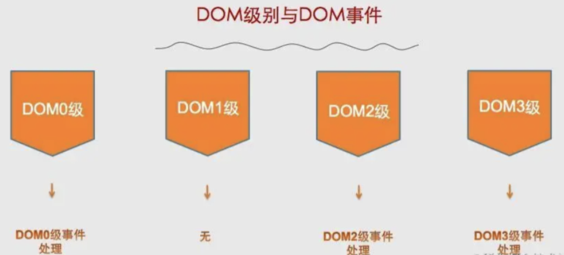
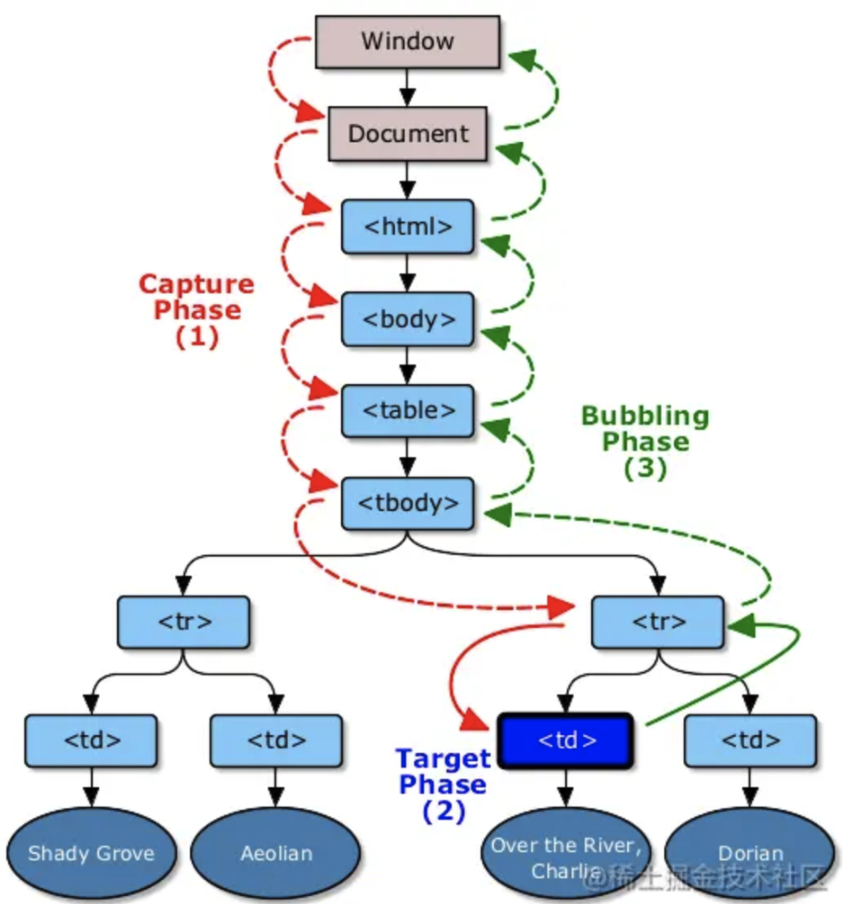

# DOM 事件

> DOM 事件是指与 HTML 文档中的元素相关联的各种事件，如点击、鼠标移动、键盘按下等。在 JavaScript 中，可以通过添加事件监听器来捕获这些事件，并在事件发生时执行相应的操作。

## DOM 事件分级



1. DOM0级事件： 也称为元素级事件，是最初的事件处理方式。通过在 DOM 元素上直接设置事件处理函数来实现，例如 onclick、onmouseover 等事件属性。

```js
const button = document.getElementById('myButton');
button.onclick = function() {
  console.log('Button clicked!');
};
```
这种方式会覆盖之前设置的相同类型的事件处理函数。


2. DOM2级事件： 引入了标准的事件模型，通过 addEventListener() 和 removeEventListener() 方法来添加和移除事件处理函数。这种方式支持添加多个事件处理函数，不会覆盖之前设置的事件处理函数。

```js
const button = document.getElementById('myButton');
button.addEventListener('click', function() {
  console.log('First click handler');
});

button.addEventListener('click', function() {
  console.log('Second click handler');
});
// 输出: "First click handler" 和 "Second click handler"。
```

3. DOM3级事件： 进一步扩展了事件模型，在 DOM3 级事件中新增了对更多事件类型的支持，例如鼠标滚轮事件、键盘事件等。DOM3 级事件是在 DOM2 级事件的基础上添加了更多的事件类型，允许自定义事件。


- UI事件，当用户与页面上的元素交互时触发，如：load、scroll
- 焦点事件，当元素获得或失去焦点时触发，如：blur、focus
- 鼠标事件，当用户通过鼠标在页面执行操作时触发如：dbclick、mouseup
- 滚轮事件，当使用鼠标滚轮或类似设备时触发，如：mousewheel
- 文本事件，当在文档中输入文本时触发，如：textInput
- 键盘事件，当用户通过键盘在页面上执行操作时触发，如：keydown、keypress
- 合成事件，当为IME（输入法编辑器）输入字符时触发，如：compositionstart
- 变动事件，当底层DOM结构发生变化时触发，如：DOMsubtreeModified


```js
// 自定义事件
var event = new Event('test')
// 给元素绑定事件
domElement.addEventListener('test', function() {
    console.log('event test')
},)

// 触发事件
setTimeout(function() {
    domElement.dispatchEvent(event)
}, 1000)

```

## DOM 事件流

> DOM 事件流描述了浏览器中事件从发生到被处理的过程。事件流程主要分为捕获阶段、目标阶段和冒泡阶段。这三个阶段构成了事件的传播过程，而在这个过程中，事件会经历从最外层的节点（文档根节点）到最具体的节点（目标节点）的传播路径。

1. 捕获阶段（Capture Phase）：


> 事件按 window -> document -> html -> body -> ... -> 目标元素 的方向向下层元素传递。

事件首先从文档根节点（或者是注册了捕获事件监听器的祖先节点）开始传播，沿着 DOM 树向下传播到目标节点。在捕获阶段，事件会依次经过所有节点，从根节点开始，一直到目标节点。在这个阶段，最具体的节点（目标节点）是事件的起始节点。

2. 目标阶段（Target Phase）：

当事件达到目标节点时，即目标阶段开始。在这个阶段，事件已经到达了其目标节点，但是尚未开始冒泡。如果事件是一个冒泡事件，此时将执行目标节点上的事件处理函数。

3. 冒泡阶段（Bubble Phase）：

在目标阶段完成后，事件开始沿着 DOM 树向上传播，从目标节点开始，一直传播到文档根节点（或者是注册了冒泡事件监听器的祖先节点）。在冒泡阶段，事件会依次经过所有节点，从目标节点开始，一直到根节点。在这个阶段，目标节点是事件的终止节点。




事件流程总结：
- 事件从最外层的节点开始传播（捕获阶段）。
- 事件传播到目标节点（目标阶段）。
- 事件从目标节点开始向上冒泡（冒泡阶段）。