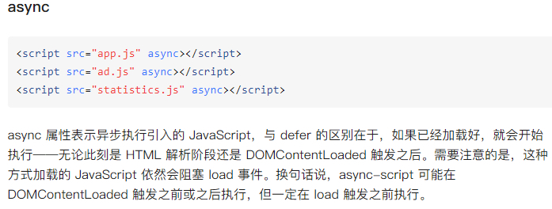
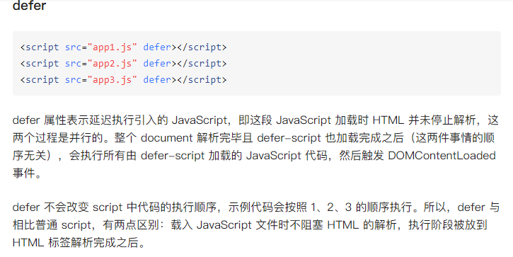

# async、defer

> `<script>` 标签的 async 和 defer 属性都是用于控制脚本加载和执行的行为。

## async

1. 当浏览器解析到带有 async 属性的 `<script>` 标签时，会异步加载该脚本，即不会阻塞 HTML 解析和页面渲染。
2. 异步加载的脚本会在加载完成后立即执行，而不需要等待页面的其他资源加载完成。
3. 异步脚本的执行顺序不受页面中其它资源的加载顺序影响，即它们在加载完成后会立即执行。
4. 对于多个带有 async 属性的脚本，它们的**执行顺序是不确定的**，因为它们是并行加载和执行的。

## defer

1. 当浏览器解析到带有 defer 属性的 `<script>` 标签时，会异步加载该脚本，但会在 HTML 解析完毕后、`DOMContentLoaded` 事件触发前执行。
2. 异步加载的脚本会按照它们在页面中出现的顺序执行，即后面的脚本会等待前面的脚本执行完成后再执行。
3. defer 属性保证了脚本的**执行顺序与它们在 HTML 中出现的顺序一致**，因此适合用于需要按顺序加载执行的脚本。

