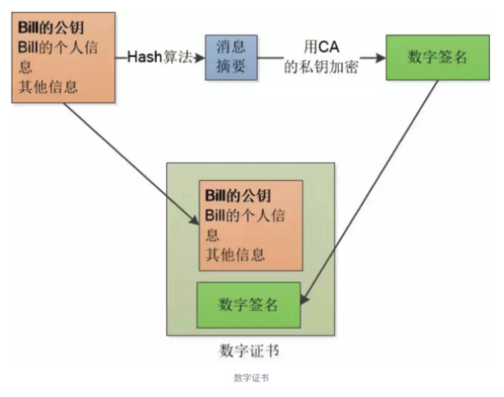
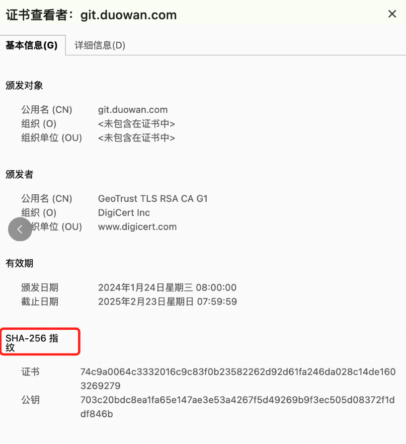
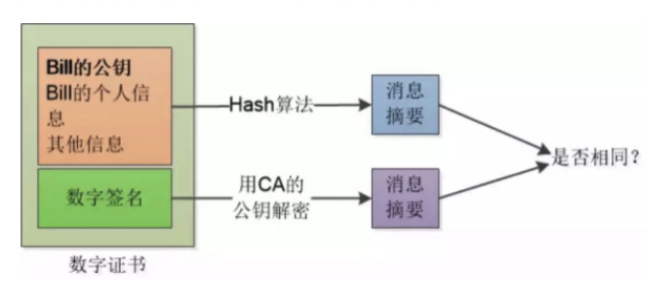

# HTTPS

HTTPS 的工作原理可以简述如下：

1. 握手阶段： 客户端发起连接请求，服务器将自己的证书（包含公钥）发送给客户端。客户端验证服务器的证书是否合法，如果合法则生成一个随机数，并用服务器的公钥对随机数进行加密，发送给服务器。
2. 密钥协商： 服务器收到客户端发送的加密后的随机数后，使用自己的私钥解密，得到随机数。接着服务器和客户端根据协商的加密套件生成一个对称密钥（session key），用于后续的数据加密和解密。
3. 加密通信： 服务器和客户端使用协商好的对称密钥进行数据的加密和解密，确保数据在传输过程中的机密性和完整性。

## SSL/TLS

> SSL（Secure Sockets Layer）和 TLS（Transport Layer Security）是用于网络通信安全的协议，它们的作用是加密通信数据，确保数据在传输过程中的安全性和完整性。

SSL 最初由网景公司（Netscape）开发，用于保护 Web 浏览器和 Web 服务器之间的通信。TLS 是 SSL 的继任者，它在 SSL 的基础上做了一些改进和扩展，成为了一个国际标准，并被广泛应用于互联网通信中。

SSL/TLS 协议的基本工作原理如下：

1. 握手阶段（Handshake）： 在通信开始之前，客户端和服务器之间会进行一次握手，以确保双方都支持 SSL/TLS 协议，并协商加密算法和密钥等参数。握手过程包括以下步骤：
  - 客户端发送一个连接请求到服务器，并请求建立 SSL/TLS 连接。
  - 服务器将自己的证书（包含公钥）发送给客户端。
  - 客户端验证服务器证书的合法性，包括验证证书的签发机构、有效期等。
  - 客户端生成一个随机数，用服务器的公钥加密后发送给服务器。
  - 服务器使用自己的私钥解密客户端发送的随机数，并生成一个共享密钥（session key）。
  - 客户端和服务器使用共享密钥进行对称加密通信。
2. 加密通信阶段（Encrypted Communication）： 握手过程完成后，客户端和服务 器使用共享密钥进行对称加密通信。对称加密是一种加密方式，发送方和接收方使用相同的密钥进行加密和解密。使用对称加密算法对传输的数据进行加密，确保数据在传输过程中不被窃听和篡改。
3. 数据完整性： SSL/TLS 协议使用摘要算法（如 HMAC）对传输的数据进行签名，以确保数据在传输过程中不被篡改。这种签名机制可以保障数据的完整性，即使在传输过程中数据被修改也会被及时发现。

## 如何进行数据加密

- 对称加密（Symmetric Encryption）
- 非对称加密（Asymmetric Encryption）
- 哈希函数（Hash Function）
- 混合加密（Hybrid Encryption）

### 1. 对称加密

> 对称加密使用相同的密钥（称为对称密钥）来进行加密和解密。加密和解密双方都使用相同的密钥来进行数据的加密和解密操作。常见的对称加密算法有 DES（Data Encryption Standard）、AES（Advanced Encryption Standard）等。对称加密的优点是加密解密速度快，但存在密钥分发的安全性问题。


对称加密可以理解为**数据的可逆变换**

比如 hello，如果每一个字母的 ASCII 码向后移动一位，就可以变换为 ifmmp。
因此，这里的秘钥就是1，当对方拿到秘钥后，对数据内容的每一个字母的 ASCII 码值向前移动一位，就可以还原为原来的信息 hello。

### 2. 非对称加密

> 非对称加密是一种加密算法，也称为公钥加密算法。它使用一对密钥来进行加密和解密，分别是公钥和私钥。这两个密钥是相关联的，公钥用于加密数据，私钥用于解密数据。由于加密和解密使用了不同的密钥，因此称为非对称加密。

他的思想很简单，类似于两个质数的乘积，但是反过来，计算分解两个质数就很难

非对称加密算法的常见应用场景包括**数据加密、数字签名、密钥交换等**。常见的非对称加密算法有 **RSA、DSA、ECDSA 等**。


下面是非对称加密的基本原理和流程：

1. 密钥生成： 在使用非对称加密算法之前，首先需要生成一对密钥，即公钥和私钥。这两个密钥是一一对应的，通过数学相关性可以相互推导得到。
2. 加密过程：
  - 发送方使用接收方的公钥来加密要发送的数据。
  - 加密后的数据只能使用接收方的私钥才能解密。
3. 解密过程：
  - 接收方使用自己的私钥来解密收到的加密数据。
  - 解密后得到原始的数据。


代码示例

```js
// 引入 Crypto 模块
const crypto = require('crypto');

// 生成密钥对
const { publicKey, privateKey } = crypto.generateKeyPairSync('rsa', {
    modulusLength: 2048,  // 密钥长度
    publicKeyEncoding: {
        type: 'spki',  // 公钥编码类型
        format: 'pem'  // 公钥格式
    },
    privateKeyEncoding: {
        type: 'pkcs8',  // 私钥编码类型
        format: 'pem',   // 私钥格式
    }
});

// 要加密的原始数据
const originalData = 'Hello, this is a secret message!';

// 使用公钥加密数据
const encryptedData = crypto.publicEncrypt(publicKey, Buffer.from(originalData, 'utf-8'));

// 打印加密后的数据
console.log("加密后的数据:", encryptedData.toString('base64'));

// 使用私钥解密数据
const decryptedData = crypto.privateDecrypt(privateKey, encryptedData);

// 打印解密后的数据
console.log("解密后的数据:", decryptedData.toString('utf-8'));

```

非对称加密的优点包括：
- 安全性高：加密和解密使用了不同的密钥，即使公钥泄露，私钥也不会被暴露，因此安全性较高。
- 密钥分发简单：只需将公钥发送给对方即可，私钥保留在本地。

非对称加密的缺点包括：
- 加密解密速度慢：与对称加密算法相比，非对称加密算法的加密解密速度较慢。
- 密钥长度较长：为了保证安全性，非对称加密算法的密钥长度通常较长，导致加密数据量较大。

非对称加密通常与对称加密结合使用，称为混合加密，以兼顾加密速度和安全性。在混合加密中，使用对称加密算法加密要发送的数据，然后使用接收方的公钥加密对称密钥，以确保密钥的安全传输。

## 加密通信

如果使用加密通信，使得通信过程除了三次握手以外，还多加了两个步骤：
1. SSL/TLS 握手过程： 在 TCP 连接建立之后，客户端和服务器之间会进行一次 SSL/TLS 握手过程，以确保双方都支持 SSL/TLS 协议，并协商加密算法和密钥等参数。SSL/TLS 握手过程主要包括以下几个步骤：
  - 客户端向服务器发送一个连接请求，并请求建立 SSL/TLS 连接。
  - 服务器返回自己的证书（包含公钥）给客户端。
  - 客户端验证服务器证书的合法性，包括验证证书的签发机构、有效期等。
  - 客户端生成一个随机数，并使用服务器的公钥对随机数进行加密，发送给服务器。
  - 服务器使用自己的私钥解密客户端发送的随机数，并生成一个共享密钥（session key）。
  - 客户端和服务器使用共享密钥进行对称加密通信。
2. 数据加密和解密过程： 在 SSL/TLS 握手成功后，客户端和服务器使用共享密钥进行对称加密通信。对称加密算法用于加密传输的数据，确保数据在传输过程中不被窃听和篡改。数据传输完成后，客户端和服务器丢弃共享密钥，以确保每个连接都使用唯一的密钥。
3. 数据完整性保护： SSL/TLS 协议使用摘要算法（如 HMAC）对传输的数据进行签名，以确保数据在传输过程中不被篡改。这种签名机制可以保障数据的完整性，即使在传输过程中数据被修改也会被及时发现。

总的来说，加密通信过程中除了传统的 TCP 三次握手外，还需要进行 SSL/TLS 握手，以确保通信的安全性和完整性。通过 SSL/TLS 握手过程和数据加密、解密、完整性保护等步骤，可以确保加密通信的安全性，防止数据在传输过程中被窃听、篡改或伪造。


## 非对称加密真的安全吗

如果服务端返回的公钥被中间人拦截，并替换成自己的公钥，这样就变成了：

1. 客户端：发起一个 HTTPS 请求，获取服务端公钥
2. 服务端：返回服务端公钥
3. 中间人：拦截掉服务端公钥，替换成自己的公钥，返回给客户端
4. 客户端：客户端对公钥加密，并发送秘钥给服务端
5. 中间人：用自己的秘钥进行解密，并用服务端的公钥进行加密，返回给服务端
6. 服务端：收到请求后，解密获取秘钥，并使用该秘钥进行对称加密

这里的中间人，类似于我们的抓包工具，通过中间人的操作，就可以达到监听窃取数据的目的了。

因此，我们需要对公钥进行安全传输。

## 证书颁发机构（CA）

> 证书颁发机构（CA，Certificate Authority）是负责颁发数字证书的可信任实体。数字证书是一种用于验证网络通信方身份的电子证书，通常包含了公钥、所有者信息以及数字签名等信息。

以下是证书颁发机构的一些重要角色和职责：

1. 证书签发： CA 负责颁发数字证书给申请者，其中包含了申请者的公钥以及其他相关信息。证书通常用于证明持有者的身份和加密通信。
2. 证书验证： CA 负责验证数字证书的真实性和合法性。这包括验证证书持有者的身份，确保证书未被篡改，并确保证书的有效期等。
3. 证书吊销： 如果数字证书的持有者丢失私钥、证书过期或者证书被盗用等情况发生，CA 可以吊销相应的数字证书，以防止不法分子利用该证书进行恶意活动。
4. 信任链管理： CA 维护了一套信任链（Trust Chain），这是一个层级化的信任体系，其中包含了根证书、中间证书以及终端证书。客户端可以通过信任链来验证服务器发送的数字证书的真实性。
5. 证书更新： CA 负责定期更新数字证书，以确保证书持续有效，并与最新的安全标准和法律法规保持一致。
6. 安全性管理： CA 负责维护数字证书的安全性，防止证书被未经授权的个人或组织篡改或冒充。
7. 法律合规性： CA 需要遵守当地的法律法规，并确保其证书颁发和管理的合法性和合规性。

## 数字证书

> 数字证书是一种用于验证网络通信方身份的电子证书，通常用于在公开网络中建立安全通信。数字证书基于公钥基础设施（PKI，Public Key Infrastructure）技术，通过证书颁发机构（CA，Certificate Authority）对数字证书进行签发和管理。



数字证书包含了以下主要信息：

1. 证书持有者信息： 包括持有者的名称、组织信息等。这些信息用于标识证书的持有者，例如个人、组织或者网站。
2. 公钥： 数字证书中包含了持有者的公钥。公钥用于加密数据或验证数字签名，确保通信的安全性和完整性。
3. 证书有效期： 数字证书有一个有效期限，通常包括起始日期和截止日期。证书在有效期内可用，过期后需要重新颁发。
4. 数字签名： 数字证书包含了一个数字签名，用于验证证书的真实性和完整性。数字签名由证书颁发机构使用其私钥对证书内容进行签名生成，而其他人可以使用证书颁发机构的公钥来验证数字签名。
5. 证书颁发机构信息： 数字证书中包含了颁发该证书的证书颁发机构的信息，包括其名称、数字签名等。这些信息用于验证证书的真实性。

## 数字证书指纹

> 数字证书指纹是证书的一种唯一标识，用于验证证书的真实性和完整性。它通常是通过对证书中的公钥或整个证书内容进行哈希计算得到的固定长度的字符串。



常见的数字证书指纹算法包括：
1. SHA-1（安全散列算法1）： 这是最早也是最广泛使用的一种哈希算法，生成的指纹长度为 40 个十六进制字符。但是由于其安全性较弱，已经逐渐被更安全的算法取代。
2. SHA-256、SHA-384、SHA-512： 这些算法是 SHA-1 的改进版本，提供了更高的安全性。SHA-256 生成的指纹长度为 64 个十六进制字符，SHA-384 生成的指纹长度为 96 个字符，SHA-512 生成的指纹长度为 128 个字符。

生成数字证书指纹的过程通常包括以下步骤：
1. 从数字证书中提取公钥或整个证书内容。
2. 对提取的内容应用指定的哈希算法，如 SHA-256 或 SHA-1。
3. 将哈希计算结果表示为固定长度的十六进制字符串，即为证书的指纹。

数字证书指纹的主要作用是验证证书的真实性和完整性，通常在安全传输、数字签名和身份认证等场景中使用。当用户接收到一个数字证书时，可以通过对比证书的指纹和预期的指纹来确定证书是否被篡改或伪造。

## 数字签名

> 数字签名是一种用于确保数字信息的完整性、认证发送方身份以及防止信息抵赖的技术手段。它使用非对称加密算法结合哈希函数来实现。

数字签名的基本原理如下：

1. 生成消息摘要（Hash）： 发送方首先对要发送的消息进行哈希运算，生成消息的摘要（也称为哈希值）。哈希函数将消息的任意长度转换为固定长度的唯一哈希值。
2. 使用私钥加密摘要： 发送方使用自己的私钥对消息摘要进行加密。这个过程相当于对消息摘要进行数字签名。
3. 发送消息和数字签名： 发送方将原始消息和数字签名一起发送给接收方。
4. 验证数字签名： 接收方收到消息和数字签名后，首先使用发送方的公钥解密数字签名，得到消息的摘要。然后接收方对收到的消息进行哈希运算，得到新的摘要。最后，接收方将两个摘要进行比对，如果相同，则验证成功，否则验证失败。

通过数字签名，接收方可以确保以下内容：

- 完整性： 接收方可以验证消息在传输过程中是否被篡改，因为任何对消息的篡改都会导致摘要不匹配。
- 认证性： 接收方可以确定消息的发送方，因为只有发送方才拥有对应的私钥来生成数字签名。
- 不可否认性： 发送方无法否认他曾经发送过这条消息，因为数字签名是使用发送方的私钥生成的，其他人都无法伪造。

数字签名常用于安全通信、文件完整性验证、软件身份认证等场景中，以保证数据的安全性和可靠性。常见的数字签名算法包括 RSA、DSA、ECDSA 等。

## 如何判断证书是否被篡改



1. 验证数字签名： 数字证书包含了一个数字签名，用于验证证书的真实性和完整性。接收方可以使用证书颁发机构的公钥来解密数字签名，然后对比解密后的签名和证书内容进行哈希运算生成的摘要，如果两者一致，则证明证书未被篡改。如果签名无法解密或者解密后的摘要与证书内容不一致，则证明证书可能被篡改。
2. 检查证书有效期： 检查证书的有效期，确保证书在有效期内。如果证书过期，则可能存在篡改的风险。
3. 验证证书颁发机构的真实性： 检查证书中包含的颁发该证书的证书颁发机构（CA）的信息，确保该 CA 是可信任的。如果 CA 不可信或者证书中的 CA 信息被篡改，则证书可能不可靠。
4. 验证证书链： 证书链是一系列相关证书的集合，包括根证书、中间证书和终端证书。接收方可以验证证书链的完整性，确保每个证书都是由上一个证书签发的，并且最终链接到根证书。如果证书链中的任何一个证书被篡改或者不可信，则整个链可能不可靠。
5. 比对证书信息： 比对证书的信息，如持有者信息、公钥等，与预期的信息进行对比。如果信息不一致或者与预期的信息不符，则证书可能被篡改。

## HTTPS 请求流程

> HTTPS（Hypertext Transfer Protocol Secure）是一种安全的超文本传输协议，用于在计算机网络上安全地传输数据。HTTPS 在 HTTP 协议的基础上添加了 SSL/TLS 加密层，通过加密通信内容、验证服务器身份和保护通信安全性来确保数据传输的安全性。

1. 建立连接： 客户端（如浏览器）向服务器发起 HTTPS 请求，连接默认使用 TCP 协议，端口号为 443。客户端发送一个 ClientHello 消息给服务器，其中包含了客户端支持的 SSL/TLS 版本、加密算法、压缩方法等信息。
2. 服务器响应： 服务器收到客户端的 ClientHello 消息后，会向客户端发送一个 ServerHello 消息，其中包含了服务器选择的 SSL/TLS 版本、加密算法、证书等信息。服务器还会向客户端发送服务器的数字证书，该证书包含了服务器的公钥、服务器身份信息以及证书颁发机构的信息。
3. 验证证书： 客户端收到服务器发送的数字证书后，首先会验证证书的真实性和合法性。客户端会检查证书的有效期、证书链的完整性以及证书颁发机构的可信任性。如果验证通过，则继续握手过程，否则会发出警告或者拒绝连接。
4. 生成密钥： 客户端从服务器的数字证书中提取服务器的公钥，并使用该公钥来生成一个随机的对称密钥（称为会话密钥），用于加密通信内容。然后客户端使用服务器的公钥加密这个会话密钥，并将加密后的密钥发送给服务器。
5. 握手完成： 客户端发送一个 ClientKeyExchange 消息，其中包含了使用服务器公钥加密后的会话密钥。服务器收到客户端的会话密钥后，使用自己的私钥解密会话密钥。此时，客户端和服务器都已经拥有了会话密钥，可以开始使用对称加密算法进行通信。
6. 安全通信： 握手完成后，客户端和服务器之间的通信就会使用对称加密算法（如 AES、DES）来加密通信内容，保证通信的机密性。通信过程中还可能使用数字签名来验证数据的完整性和服务器的身份认证。

通过以上步骤，客户端和服务器建立了安全的通信连接，可以安全地传输数据。HTTPS 的安全性来自于 SSL/TLS 协议的加密和身份验证机制，能够有效地防止数据被窃听、篡改和伪造。


