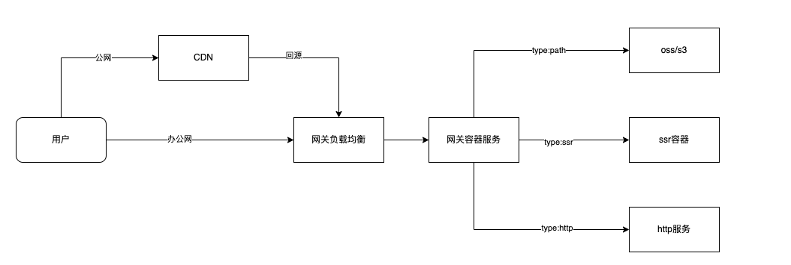
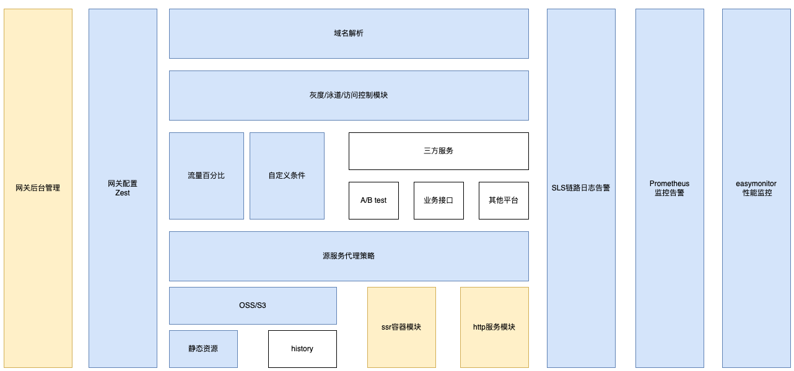
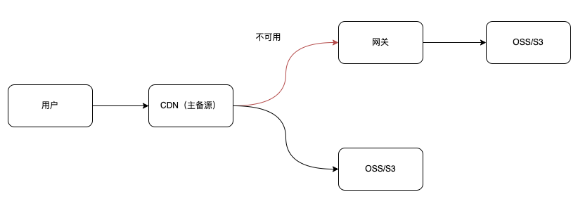

# 前端网关

> 前端网关是一种位于网络架构前端的服务器或服务，用于处理和转发网络请求。前端网关通常负责一些与安全、性能优化、路由转发等相关的任务，以便为后端服务器提供更好的服务和保护。

在 CDN 场景中，前端网关可能用于与 CDN 服务进行通信和协调，例如通过设置回源规则、缓存策略等来控制 CDN 缓存节点的行为。

## 网关架构

1. 网关服务层
  - 网关服务层是整个网关架构的核心，负责接收和处理来自客户端的请求，并将请求转发到后端服务或系统。
  - 可以采用多种技术来实现网关服务，如反向代理服务器（如 Nginx、HAProxy）、API 网关（如 Kong、Apigee）、自定义开发的微服务等。
  - 网关服务应该具备高可用性和水平扩展能力，可以部署多个实例以实现负载均衡和故障转移。
2. 路由和请求转发
  - 网关需要具备灵活的路由和请求转发机制，能够根据请求的路径、方法、头部信息等条件，将请求路由到不同的后端服务或系统。
  - 可以根据业务需求配置路由规则，支持动态路由、路由版本控制、路径重写等功能。
3. 安全性
  - 网关需要提供安全性保护，包括身份认证、访问控制、数据加密等功能，以防止恶意攻击和非法访问。
  - 可以采用 OAuth、JWT 等标准协议实现身份认证和授权管理，同时支持基于 IP 黑白名单、访问控制列表等方式进行访问控制。
4. 性能优化
  - 网关需要具备高性能的请求处理能力，能够快速地处理大量的请求，并保证低延迟和高吞吐量。
  - 可以采用缓存、连接池、请求重用等技术来优化性能，减少网络延迟和资源消耗。
5. 监控和日志
  - 网关需要提供监控和日志功能，能够实时监控网关的运行状态和性能指标，并记录请求的处理过程和结果。
  - 可以采用监控工具（如Prometheus、Grafana）和日志系统（如ELK Stack）来实现监控和日志记录。
6. 容灾和故障恢复
  - 网关需要具备容灾和故障恢复能力，能够应对网络故障、服务中断等突发情况，保证服务的高可用性。
  - 可以采用负载均衡、熔断、降级等策略来实现容灾和故障恢复。

## 代理服务

> 一般来说，实现网关可以通过配置代理服务器的路由、过滤规则以及访问控制策略来完成。

1. 正向代理（Forward Proxy）
  - 正向代理位于客户端和目标服务器之间，**代表客户端**向目标服务器发送请求，并将目标服务器的响应返回给客户端。
  - 客户端需要配置使用正向代理服务器，所有的请求都会先发送到正向代理服务器，然后由代理服务器转发请求到目标服务器，目标服务器将响应返回给代理服务器，最后代理服务器再将响应返回给客户端。
  - 正向代理常用于隐藏客户端的真实 IP 地址、访问受限资源、突破网络封锁等场景。例如，公司内部网络中的代理服务器用于代表员工访问外部互联网资源。
2. 反向代理（Reverse Proxy）
  - 反向代理位于目标服务器和客户端之间，**代表目标服务器**向客户端发送响应，并将客户端的请求转发给后端的目标服务器。
  - 客户端直接访问反向代理服务器，将请求发送到代理服务器，代理服务器根据预定义的路由规则将请求转发给后端的目标服务器，后端服务器处理请求并返回响应，然后代理服务器再将响应返回给客户端。
  - 反向代理常用于负载均衡、缓存加速、安全防护等场景。例如，将反向代理放置在公共网络与内部网络之间，用于接收外部用户的请求并将请求转发到内部的多台服务器进行处理，从而实现负载均衡和高可用性。

对比
- 正向代理其实是客户端的代理，帮助客户端访问其无法访问的服务器资源。反向代理则是服务器的代理，帮助服务器做负载均衡，安全防护等。
- 正向代理一般是客户端架设的，比如在自己的机器上安装一个代理软件。而反向代理一般是服务器架设的，比如在自己的机器集群中部署一个反向代理服务器。
- 正向代理中，服务器不知道真正的客户端到底是谁，以为访问自己的就是真实的客户端。而在反向代理中，客户端不知道真正的服务器是谁，以为自己访问的就是真实的服务器。
- 正向代理和反向代理的作用和目的不同。正向代理主要是用来解决访问限制问题。而反向代理则是提供负载均衡、安全防护等作用。二者均能提高访问速度。

## 容灾

## SLS（Service Level Specification）

> SLS（Service Level Specification）链路是指服务级别规范链路，它是一种用于定义和跟踪服务质量（QoS）指标的链路。在网络和系统管理中，SLS链路通常用于监控和管理网络服务的性能和可用性，并确保满足用户和业务的需求。

SLS链路通常包括以下几个关键方面：
1. 服务水平协议（SLA）： SLA是一种协议，用于定义服务提供商和用户之间的服务水平规范。SLA通常包括服务的可用性、性能、容量、故障恢复时间等指标，以及相应的补偿措施和违约责任等条款。
2. 监控和测量： SLS链路需要对服务性能和可用性进行持续的监控和测量。这包括对网络流量、带宽利用率、延迟、丢包率、故障发生率等指标进行实时监控，并记录历史数据以进行分析和趋势预测。
3. 报警和警告： 当服务质量指标超出了预先定义的阈值或SLA规定的要求时，SLS链路需要触发报警和警告机制，通知相关的网络和系统管理人员进行及时处理和调整。
4. 故障处理和恢复： 当服务出现故障或不符合SLA要求时，SLS链路需要启动相应的故障处理和恢复流程，以确保服务尽快恢复正常运行，并对用户和业务造成的影响进行最小化。
5. 性能优化和改进： 基于SLS链路的监控和分析结果，网络和系统管理人员可以进行性能优化和改进，以提高服务质量、降低故障风险，并满足不断变化的用户和业务需求。

综上所述，SLS链路是一种用于定义、跟踪和管理服务质量的链路，它通过监控、测量、报警、故障处理和性能优化等方式，确保网络和系统服务能够满足用户和业务的要求，并提供高性能、高可用性的服务。

## 安全策略

> OAuth（Open Authorization）和JWT（JSON Web Token）都是在网络安全领域常见的标准协议，用于实现身份验证和授权，但它们的功能和用途略有不同。

1. OAuth（开放授权）
  - OAuth 是一种开放标准的授权协议，用于委托第三方应用代表用户获取对受限资源的访问权限。
  - OAuth 协议通过授权服务器（Authorization Server）颁发访问令牌（Access Token），允许第三方应用代表用户向资源服务器（Resource Server）请求受保护的资源。
  - OAuth 通常用于实现用户在使用第三方应用时无需提供自己的用户名和密码，而是使用安全的方式授权第三方应用访问自己的资源。
2. JWT（JSON Web Token）
  - JWT 是一种开放标准的令牌格式，用于在网络中传输安全性声明。
  - JWT 使用 JSON 对象表示，包含了加密或签名后的用户身份信息和元数据，例如用户 ID、角色、过期时间等。
  - JWT 通常用于在客户端和服务器之间传递身份验证和授权信息，比如在认证系统中生成令牌并在每次请求中发送给服务器，以验证用户身份和访问权限。
  - JWT 可以使用对称加密、非对称加密或 HMAC 签名等方式进行加密和签名，以确保令牌的安全性和完整性。

总的来说，OAuth 主要用于实现用户授权和委托访问权限，而 JWT 主要用于实现跨域认证和授权，在网络中传递和验证用户身份和权限信息。在实际应用中，OAuth 和 JWT 通常可以结合使用，例如使用 OAuth 2.0 协议获取访问令牌，并使用 JWT 作为令牌的格式和传输方式。

### OAuth

> OAuth 是一种开放标准的授权协议，用于委托第三方应用代表用户获取对受限资源的访问权限。

OAuth 的接入通常包括以下步骤：

1. 注册应用：开发者需要在目标服务提供商（如Google、Facebook等）注册应用，并获取客户端ID和客户端密钥等凭证。
2. 用户授权：当用户使用第三方应用登录时，第三方应用需要向目标服务提供商发起授权请求，并引导用户进行登录和授权操作。
3. 获取访问令牌：用户授权通过后，目标服务提供商会颁发一个访问令牌（Access Token）给第三方应用，该令牌用于代表用户向目标服务请求受限资源。
4. 访问资源：第三方应用使用访问令牌向目标服务请求用户受限资源，目标服务根据令牌验证用户的身份和权限，并返回相应的资源。

OAuth 的原理

>通过授权服务器颁发访问令牌来实现用户对受限资源的授权访问，令牌可以包含用户的身份信息、权限信息等，并且具有一定的有效期限制，以确保安全性和可控性。

### JWT

> JWT 是一种基于 JSON 格式的令牌标准，用于在网络中传输安全性声明，常用于身份验证和信息交换。

JWT 的接入通常包括以下步骤：

1. 生成令牌：服务端根据用户的身份信息生成一个 JWT，并使用密钥对其进行签名，生成一个被认证和授权的令牌。
2. 传输令牌：服务端将 JWT 发送给客户端，并存储在客户端的本地存储（如 localStorage 或 Cookie）中。
3. 访问资源：客户端将 JWT 发送到服务端，并包含在每个请求的头部中，服务端接收到 JWT 后对其进行验证和解析，以确认用户的身份和权限，并根据需要返回相应的资源。

JWT 的原理

>通过对 JSON 对象进行签名和加密，生成一个被认证和授权的令牌，并在客户端和服务端之间传输该令牌来实现身份验证和授权。

综上所述，OAuth 和 JWT 是两种不同的身份验证和授权机制，它们可以结合使用来实现安全的身份验证和授权流程，其中 OAuth 主要用于委托第三方应用获取用户授权，而 JWT 主要用于在客户端和服务端之间传输认证和授权信息。
