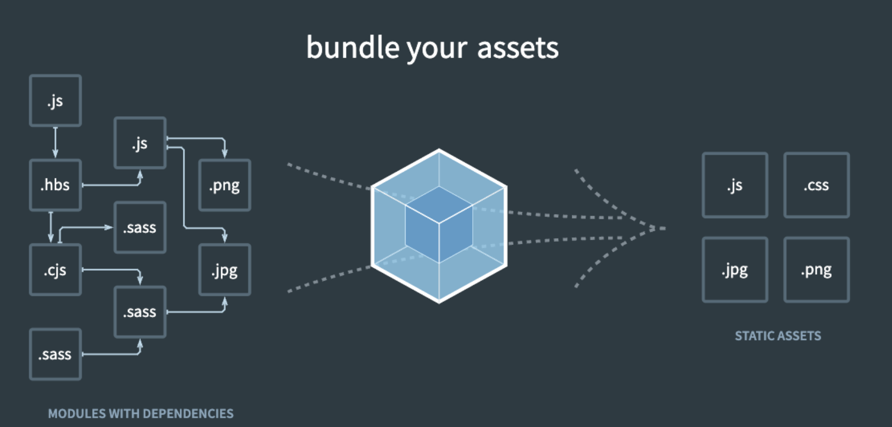
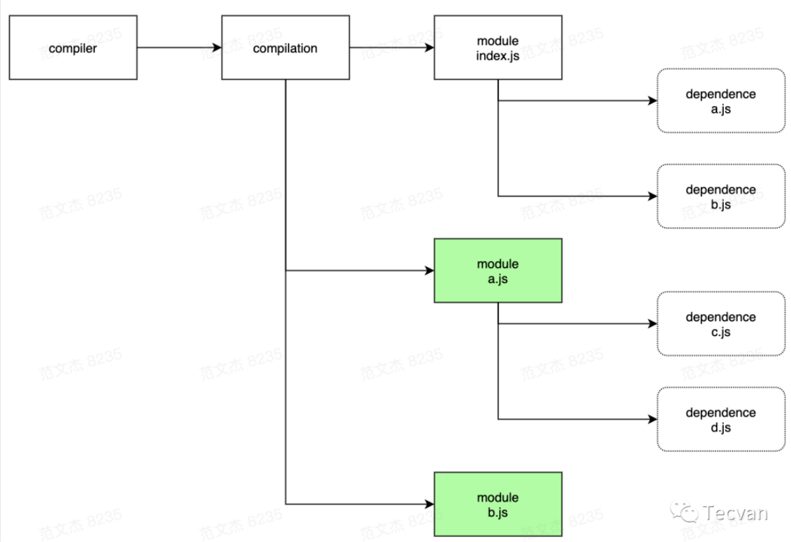
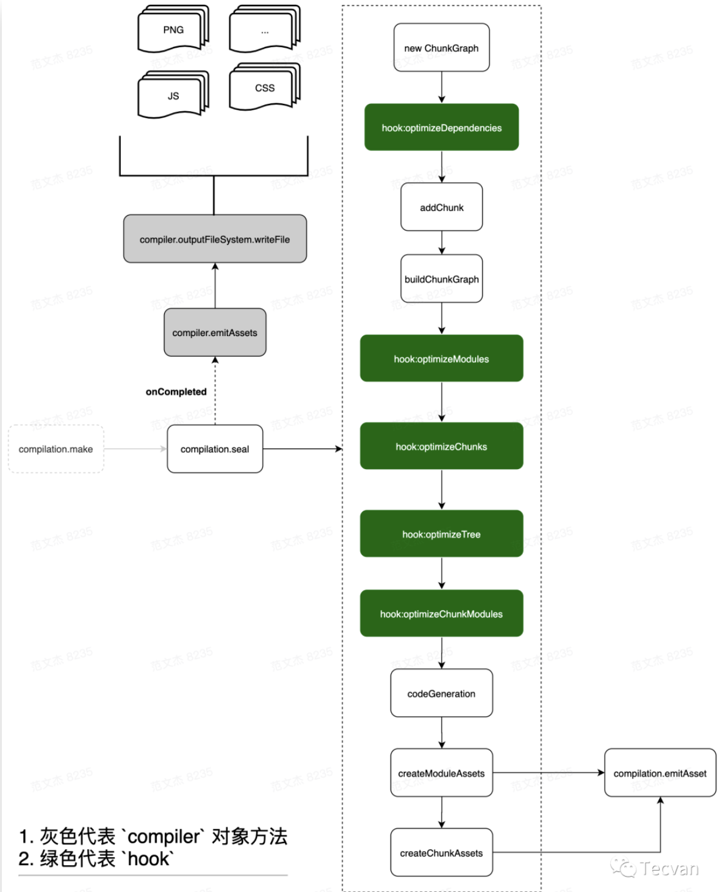
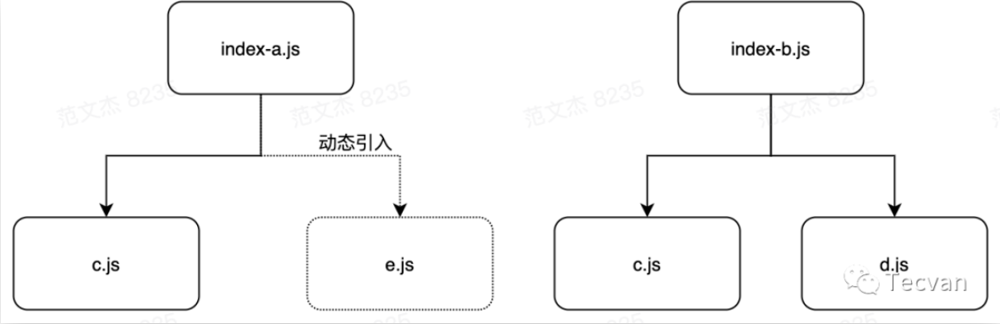
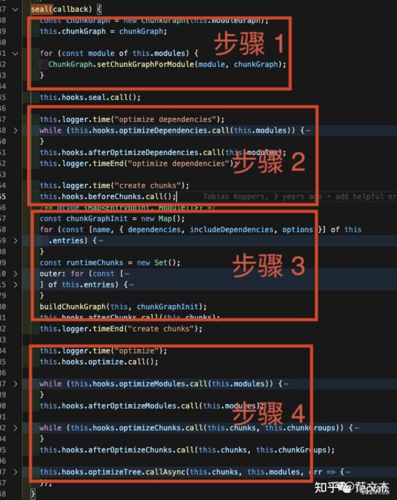
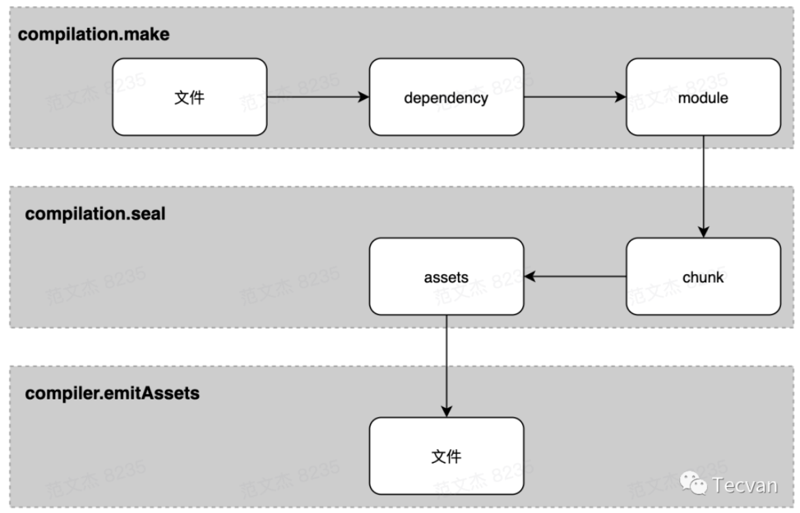

# webpack

> Webpack 是一个现代 JavaScript 应用程序的静态模块打包工具。它主要用于将各种类型的文件（如 JavaScript、CSS、图像等）打包成一个或多个静态资源文件，以便在浏览器中加载。

## webpack 原理



Webpack 的原理可以概括如下：

1. 初始化阶段：
  - 初始化参数：从配置文件、 配置对象、Shell 参数中读取，与默认配置结合得出最终的参数
  - 创建编译器对象：用上一步得到的参数创建 Compiler 对象
  - 初始化编译环境：包括注入内置插件、注册各种模块工厂、初始化 RuleSet 集合、加载配置的插件等
  - 开始编译：执行 compiler 对象的 run 方法
  - 确定入口：根据配置中的 entry 找出所有的入口文件，调用 compilition.addEntry 将入口文件转换为 dependence 对象
2. 构建阶段：
  - 编译模块(make)：根据 entry 对应的 dependence 创建 module 对象，调用 loader 将模块转译为标准 JS 内容，调用 JS 解释器将内容转换为 AST 对象，从中找出该模块依赖的模块，再 递归 本步骤直到所有入口依赖的文件都经过了本步骤的处理
  - 完成模块编译：上一步递归处理所有能触达到的模块后，得到了每个模块被翻译后的内容以及它们之间的 依赖关系图
3. 生成阶段：
  - 输出资源(seal)：根据入口和模块之间的依赖关系，组装成一个个包含多个模块的 Chunk，再把每个 Chunk 转换成一个单独的文件加入到输出列表，这步是可以修改输出内容的最后机会
  - 写入文件系统(emitAssets)：在确定好输出内容后，根据配置确定输出的路径和文件名，把文件内容写入到文件系统

- Entry：编译入口，webpack 编译的起点
- Compiler：编译管理器，webpack 启动后会创建 compiler 对象，该对象一直存活知道结束退出
- Compilation：单次编辑过程的管理器，比如 watch = true 时，运行过程中只有一个 compiler 但每次文件变更触发重新编译时，都会创建一个新的 compilation 对象
- Dependence：依赖对象，webpack 基于该类型记录模块间依赖关系
- Module：webpack 内部所有资源都会以“module”对象形式存在，所有关于资源的操作、转译、合并都是以 “module” 为基本单位进行的
- Chunk：编译完成准备输出时，webpack 会将 module 按特定的规则组织成一个一个的 chunk，这些 chunk 某种程度上跟最终输出一一对应
- Loader：资源内容转换器，其实就是实现从内容 A 转换 B 的转换器
- Plugin：webpack构建过程中，会在特定的时机广播对应的事件，插件监听这些事件，在特定时间点介入编译过程

## 初始化阶段

- 将 process.args + webpack.config.js 合并成用户配置
- 调用 validateSchema 校验配置
- 调用 getNormalizedWebpackOptions + applyWebpackOptionsBaseDefaults 合并出最终配置
- 创建 compiler 对象
- **遍历用户定义的 plugins 集合，执行插件的 apply 方法**
- 调用 new WebpackOptionsApply().process 方法，加载各种内置插件

主要逻辑集中在 WebpackOptionsApply 类，webpack 内置了数百个插件，这些插件并不需要我们手动配置，WebpackOptionsApply 会在初始化阶段根据配置内容动态注入对应的插件，包括：

注入 EntryOptionPlugin 插件，处理 entry 配置
根据 devtool 值判断后续用那个插件处理 sourcemap，可选值：EvalSourceMapDevToolPlugin、SourceMapDevToolPlugin、EvalDevToolModulePlugin
注入 RuntimePlugin ，用于根据代码内容动态注入 webpack 运行时
到这里，compiler 实例就被创建出来了，相应的环境参数也预设好了，紧接着开始调用 compiler.compile 函数：

```js
// 取自 webpack/lib/compiler.js 
compile(callback) {
    const params = this.newCompilationParams();
    this.hooks.beforeCompile.callAsync(params, err => {
      // ...
      const compilation = this.newCompilation(params);
      this.hooks.make.callAsync(compilation, err => {
        // ...
        this.hooks.finishMake.callAsync(compilation, err => {
          // ...
          process.nextTick(() => {
            compilation.finish(err => {
              compilation.seal(err => {...});
            });
          });
        });
      });
    });
  }
```

Webpack 架构很灵活，但代价是牺牲了源码的直观性，比如说上面说的初始化流程，从创建 compiler 实例到调用 make 钩子，逻辑链路很长：

- 启动 webpack ，触发 lib/webpack.js 文件中 createCompiler 方法
- createCompiler 方法内部调用 WebpackOptionsApply 插件
- WebpackOptionsApply 定义在 lib/WebpackOptionsApply.js 文件，内部根据 entry 配置决定注入 entry 相关的插件，包括：DllEntryPlugin、DynamicEntryPlugin、EntryPlugin、PrefetchPlugin、ProgressPlugin、ContainerPlugin
- Entry 相关插件，如 lib/EntryPlugin.js 的 EntryPlugin 监听 compiler.make 钩子
- lib/compiler.js 的 compile 函数内调用 this.hooks.make.callAsync
- 触发 EntryPlugin 的 make 回调，在回调中执行 compilation.addEntry 函数
- compilation.addEntry 函数内部经过一坨与主流程无关的 hook 之后，再调用 handleModuleCreate 函数，正式开始构建内容

## 构建阶段(make)

1. 调用 handleModuleCreate ，根据文件类型构建 module 子类
2. 调用 loader-runner 仓库的 runLoaders 转译 module 内容，通常是从各类资源类型转译为 JavaScript 文本
3. 调用 acorn 将 JS 文本解析为AST
4. 遍历 AST，触发各种钩子
5. 在 HarmonyExportDependencyParserPlugin 插件监听 exportImportSpecifier 钩子，解读 JS 文本对应的资源依赖
6. 调用 module 对象的 addDependency 将依赖对象加入到 module 依赖列表中
7. AST 遍历完毕后，调用 module.handleParseResult 处理模块依赖
8. 对于 module 新增的依赖，调用 handleModuleCreate ，控制流回到第一步
9. 所有依赖都解析完毕后，构建阶段结束

这个过程中数据流` module => ast => dependences => module `，先转 AST 再从 AST 找依赖。这就要求 loaders 处理完的最后结果必须是可以被 acorn 处理的标准 JavaScript 语法，比如说对于图片，需要从图像二进制转换成类似于 `export default "data:image/png;base64,xxx" `这类 base64 格式或者 `export default "http://xxx"` 这类 url 格式。

compilation 按这个流程递归处理，逐步解析出每个模块的内容以及 module 依赖关系，后续就可以根据这些内容打包输出。



## 生成阶段(seal)

构建阶段围绕 module 展开，生成阶段则围绕 chunks 展开。经过构建阶段之后，webpack 得到足够的模块内容与模块关系信息，接下来开始生成最终资源了。代码层面，就是开始执行 compilation.seal 函数：

```js
// 取自 webpack/lib/compiler.js 
compile(callback) {
    const params = this.newCompilationParams();
    this.hooks.beforeCompile.callAsync(params, err => {
      // ...
      const compilation = this.newCompilation(params);
      this.hooks.make.callAsync(compilation, err => {
        // ...
        this.hooks.finishMake.callAsync(compilation, err => {
          // ...
          process.nextTick(() => {
            compilation.finish(err => {
              **compilation.seal**(err => {...});
            });
          });
        });
      });
    });
  }
```

seal 原意密封、上锁，我个人理解在 webpack 语境下接近于 “将模块装进蜜罐” 。seal 函数主要完成从 module 到 chunks 的转化，核心流程：



简单梳理一下：

1. 构建本次编译的 ChunkGraph 对象；
2. 遍历 compilation.modules 集合，将 module 按 entry/动态引入 的规则分配给不同的 Chunk 对象；
3. compilation.modules 集合遍历完毕后，得到完整的 chunks 集合对象，调用 createXxxAssets 方法
4. createXxxAssets 遍历 module/chunk ，调用 compilation.emitAssets 方法将 assets 信息记录到 compilation.assets 对象中
5. 触发 seal 回调，控制流回到 compiler 对象



这一步的关键逻辑是将 module 按规则组织成 chunks ，webpack 内置的 chunk 封装规则比较简单：

- entry 及 entry 触达到的模块，组合成一个 chunk
- 使用动态引入语句引入的模块，各自组合成一个 chunk

chunk 是输出的基本单位，默认情况下这些 chunks 与最终输出的资源一一对应，那按上面的规则大致上可以推导出一个 entry 会对应打包出一个资源，而通过动态引入语句引入的模块，也对应会打包出相应的资源，我们来看个示例。


## SplitChunksPlugin 的作用

> SplitChunksPlugin 是 webpack 架构高扩展的一个绝好的示例，我们上面说了 webpack 主流程里面是按 entry / 动态引入 两种情况组织 chunks 的，这必然会引发一些不必要的重复打包，webpack 通过插件的形式解决这个问题。

回顾 compilation.seal 函数的代码，大致上可以梳理成这么4个步骤：

1. 遍历 compilation.modules ，记录下模块与 chunk 关系
2. 触发各种模块优化钩子，这一步优化的主要是模块依赖关系
3. 遍历 module 构建 chunk 集合
4. 触发各种优化钩子



上面 1-3 都是预处理 + chunks 默认规则的实现，不在我们讨论范围，这里重点关注第4个步骤**触发的 optimizeChunks 钩子**，这个时候已经跑完主流程的逻辑，得到 chunks 集合，SplitChunksPlugin 正是使用这个钩子，分析 chunks 集合的内容，按配置规则增加一些通用的 chunk ：

```js
module.exports = class SplitChunksPlugin {
  constructor(options = {}) {
    // ...
  }

  _getCacheGroup(cacheGroupSource) {
    // ...
  }

  apply(compiler) {
    // ...
    compiler.hooks.thisCompilation.tap("SplitChunksPlugin", (compilation) => {
      // ...
      compilation.hooks.optimizeChunks.tap(
        {
          name: "SplitChunksPlugin",
          stage: STAGE_ADVANCED,
        },
        (chunks) => {
          // ...
        }
      );
    });
  }
};
```


## 资源形态流转




## When: 什么时候会触发钩子

- compiler.hooks.compilation ：
  - 时机：启动编译创建出 compilation 对象后触发
  - 参数：当前编译的 compilation 对象
  - 示例：很多插件基于此事件获取 compilation 实例
- compiler.hooks.make：
  - 时机：正式开始编译时触发
  - 参数：同样是当前编译的 compilation 对象
  - 示例：webpack 内置的 EntryPlugin 基于此钩子实现 entry 模块的初始化
- compilation.hooks.optimizeChunks ：
  - 时机：seal 函数中，chunk 集合构建完毕后触发
  - 参数：chunks 集合与 chunkGroups 集合
  - 示例：SplitChunksPlugin 插件基于此钩子实现 chunk 拆分优化
- compiler.hooks.done：
  - 时机：编译完成后触发
  - 参数：stats 对象，包含编译过程中的各类统计信息
  - 示例：webpack-bundle-analyzer 插件基于此钩子实现打包分析
  
这是我总结的钩子的三个学习要素：触发时机、传递参数、示例代码。
