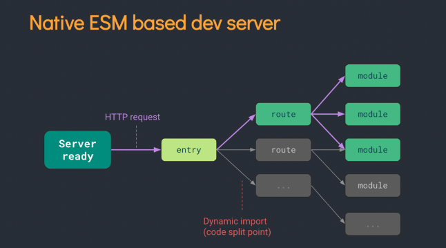
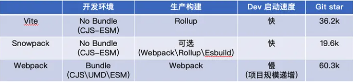
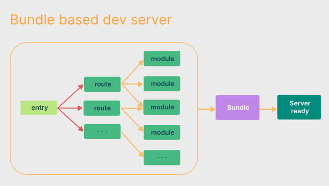
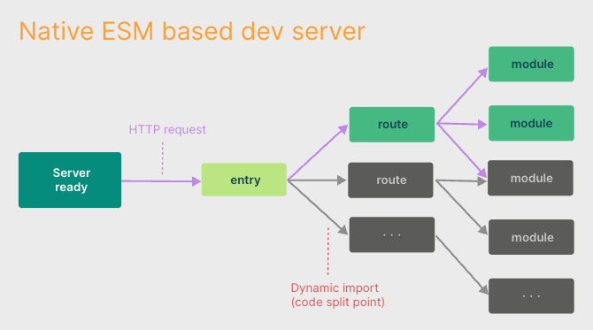

# Vite

## 什么是 vite

> Vite是新一代的前端构建工具，在尤雨溪开发Vue3.0的时候诞生。类似于Webpack+ Webpack-dev-server。其主要利用浏览器ESM特性导入组织代码，在服务器端按需编译返回，完全跳过了打包这个概念，服务器随起随用。生产中利用Rollup作为打包工具，号称下一代的前端构建工具。

Vite有如下特点：

1. 快速冷启动: No bundle + esbuild 预构建
2. 即时的模块热更新: 基于 ESM 的 HMR, 同时利用浏览器缓存策略提升速度
3. 按需加载: 利用浏览器 ESM 特性，实现按需加载

Vite相比于Webpack而言，没有打包的过程，而是直接启动了一个开发服务器devServer。Vite劫持浏览器的HTTP请求，在后端进行相应的处理将项目中使用的文件通过简单的分解与整合，然后再返回给浏览器(整个过程没有对文件进行打包编译)。所以编译速度很快。

ESM的执行可以分为三个步骤：

1. 构建: 确定从哪里下载该模块文件、下载并将所有的文件解析为模块记录
2. 实例化: 将模块记录转换为一个模块实例，为所有的模块分配内存空间，依照导出、3. 导入语句把模块指向对应的内存地址。
4. 运行：运行代码，将内存空间填充

从上面实例化的过程可以看出，ESM使用实时绑定的模式，导出和导入的模块都指向相同的内存地址，也就是值引用。而CJS采用的是值拷贝，即所有导出值都是拷贝值。

## 为什么选择 vite

> 在浏览器支持 ES 模块之前，JavaScript 并没有提供原生机制让开发者以模块化的方式进行开发。

这也正是我们对 “打包” 这个概念熟悉的原因：**使用工具抓取、处理并将我们的源码模块串联成可以在浏览器中运行的文件**。

然而，当我们开始构建越来越大型的应用时，需要处理的 JavaScript 代码量也呈指数级增长。包含数千个模块的大型项目相当普遍。

基于 JavaScript 开发的工具就会开始遇到性能瓶颈：**通常需要很长时间（甚至是几分钟！）才能启动开发服务器，即使使用模块热替换（HMR），文件修改后的效果也需要几秒钟才能在浏览器中反映出来**。如此循环往复，迟钝的反馈会极大地影响开发者的开发效率和幸福感。

### 出现原因

**Vite 旨在利用生态系统中的新进展解决上述问题：浏览器开始原生支持 ES 模块，且越来越多 JavaScript 工具使用编译型语言编写**。

## 缓慢的服务器启动

> 当冷启动开发服务器时，基于打包器的方式启动必须优先抓取并构建你的整个应用，然后才能提供服务。

Vite 通过在一开始将应用中的模块区分为 **依赖** 和 **源码** 两类，改进了开发服务器启动时间。

- **依赖**：大多为在开发时不会变动的纯 JavaScript。一些较大的依赖（例如有上百个模块的组件库）处理的代价也很高。依赖也通常会存在多种模块化格式（例如 ESM 或者 CommonJS）。

Vite 将会使用 esbuild 预构建依赖。esbuild 使用 Go 编写，并且比以 JavaScript 编写的打包器预构建依赖快 10-100 倍。

- **源码**： 通常包含一些并非直接是 JavaScript 的文件，需要转换（例如 JSX，CSS 或者 Vue/Svelte 组件），时常会被编辑。同时，并不是所有的源码都需要同时被加载（例如基于路由拆分的代码模块）。

Vite 以 原生 ESM 方式提供源码。这实际上是让浏览器接管了打包程序的部分工作：Vite 只需要在浏览器请求源码时进行转换并按需提供源码。根据情景动态导入代码，即只在当前屏幕上实际使用时才会被处理。

webpack: 

vite:

## 缓慢的更新

基于打包器启动时，重建整个包的效率很低。原因显而易见：因为这样更新速度会随着应用体积增长而直线下降。

在 Vite 中，HMR 是在原生 ESM 上执行的。当编辑一个文件时，**Vite 只需要精确地使已编辑的模块与其最近的 HMR 边界之间的链失活（大多数时候只是模块本身），使得无论应用大小如何，HMR 始终能保持快速更新**。

