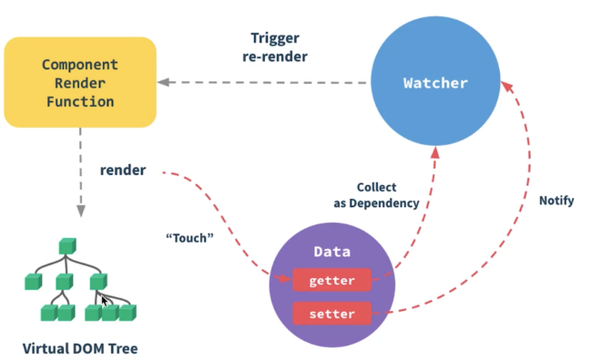

# Vue 组件渲染过程

## 流程图



## 1.解析模板

> Vue使用基于HTML的模板语法。当一个Vue组件被创建时，Vue会首先解析组件的模板。这包括HTML、CSS以及Vue特定的指令和插值表达式。

编译 Vue 模板的过程可以通过 `vue-template-compiler` 模块来实现。

编译过程分为三个阶段：解析（Parse）、优化（Optimize）和生成（Generate）。

1. 解析：将模板字符串转换成AST（抽象语法树）。
2. 优化：遍历AST，并标记静态子树。这些不需要在每次重新渲染时重新生成的节点。
3. 生成：将AST转换成渲染函数的代码字符串。

```js
const compiler = require('vue-template-compiler');

// Vue 模板
const template = `
  <div>
    <h1>{{ message }}</h1>
    <button @click="handleClick">Click me</button>
  </div>
`;

// 编译 Vue 模板
const compiled = compiler.compile(template);

// 输出编译结果
console.log(compiled.render);
```

### 解析（Parse）

> 在解析阶段，编译器将模板字符串转换成抽象语法树（AST）。AST是用JavaScript对象表示的树形结构，能够以一种易于处理的方式描述模板的结构。这个过程涉及到词法分析（将字符串分解成有意义的代码块，称为“token”）和语法分析（根据语言的语法规则将这些token组织成AST）。

解析器会处理HTML标签、指令（如v-if、v-for等）、插值表达式（`{{ }}`) 和组件。对于每一个找到的结构，解析器会创建AST节点，并建立节点之间的父子关系，最终形成一棵完整的树。

### 优化（Optimize）

> Vue的编译器在生成渲染函数之前会对AST进行优化。优化的目的是标记静态子树。静态子树是指在模板中不会发生变化的部分，例如纯文本内容和只包含静态属性的元素。

通过标记这些静态树，Vue在后续的更新过程中可以跳过它们。这是因为静态内容不需要重新渲染，可以直接被复用。这个优化可以显著提高Vue应用的渲染性能，特别是在进行大规模DOM更新时。

### 生成（Generate）

> 在生成阶段，编译器将优化后的AST转换为渲染函数的代码。渲染函数是一个JavaScript函数，当被调用时，它返回一个虚拟DOM节点（VNode）。这些VNode将由Vue的运行时系统用来生成实际的DOM结构和进行后续的更新。

生成过程涉及到遍历AST，并创建代码字符串，这些代码字符串当执行时能够返回对应的VNode。对于AST中的每一种节点类型（如元素、文本、表达式等），生成过程都有相应的逻辑来处理它们。


### 例子
例如： `<div>{{message}}</div>` 模板，渲染函数如下:

```js
function render() {
  return _c('div', [_v(_s(message))]);
}
```

- `_c` 是创建元素VNode的函数
- `_v` 是创建文本VNode的函数
- `_s` 是将值转换为字符串的函数

这些函数都是Vue运行时的一部分。


## 2.生成渲染函数

> 生成渲染函数的过程是Vue模板编译的最后一步，这一步将优化后的AST（抽象语法树）转换为实际的JavaScript代码，这段代码就是渲染函数。渲染函数的核心作用是返回一个虚拟DOM（VNode），Vue的运行时会根据这个VNode来创建或更新真实的DOM。

### 渲染函数

> 在Vue中，渲染函数是一个非常强大的概念，它提供了一种使用JavaScript直接声明式地生成DOM结构的方法。渲染函数接收一个createElement函数作为参数，通常缩写为h，然后使用这个函数来构建VNode树。

1. 遍历AST：编译器遍历AST的每个节点，根据节点的类型（如元素、文本、表达式）调用不同的生成函数。
2. 处理指令和属性：对于元素节点，编译器会处理其属性和指令（如v-if、v-for、事件绑定等），将这些逻辑转换为JavaScript代码片段。
3. 创建VNode表达式：根据节点类型，编译器生成相应的createElement调用表达式，这些表达式最终会组合成渲染函数的返回值。
4. 优化静态节点：对于在优化阶段标记为静态的节点，编译器会生成不同的代码路径，以便于Vue运行时能够直接复用这些静态节点，而不是在每次渲染时重新创建它们。

### 示例

简单模板如下：

```js
<div id="app">
  <p>{{ message }}</p>
</div>
```

解析过程：
1. 解析：首先，这个模板会被解析成AST，其中包含一个根节点（div）和一个子节点（p）。
2. 优化：然后，编译器会检查这些节点，标记它们是否是静态的。
3. 生成：最后，编译器会遍历AST，并为每个节点生成相应的createElement调用。

渲染函数如下:

```js
function render(h) {
  return h('div', { attrs: { id: 'app' } }, [
    h('p', [this.message])
  ]);
}
```
在这个函数中，h函数被用来创建每个元素的VNode。

- 第一个参数是元素的标签名
- 第二个参数是一个包含元素属性的对象
- 第三个参数是子节点数组或文本内容。

对于文本绑定，如 `{{ message }}`，它被转换为JavaScript表达式，这样当message属性变化时，Vue能够自动重新执行渲染函数并更新DOM。

Vue将模板编译成渲染函数（Render Function）。这一步通常在构建过程中完成，如果使用了Vue单文件组件（.vue文件），这个过程会由Vue的构建工具（如vue-loader）自动完成。渲染函数是JavaScript代码，能够返回虚拟DOM（Virtual DOM）节点。


生成 Virtual DOM 的过程实际上是执行渲染函数，将模板转换为 Virtual DOM。


## 3.响应式系统初始化

> Vue的响应式系统确保当组件的状态（响应式数据）变化时，组件会自动重新渲染。Vue通过使用响应式代理（在Vue 3中是Proxy对象，在Vue 2中是Object.defineProperty）来跟踪数据的变化，并在数据变化时触发组件的重新渲染。

在初始化阶段，Vue会通过Object.defineProperty将数据对象的每个属性转换成getter/setter，并收集依赖（依赖是指依赖这个属性的组件），以便在属性的值发生变化时通知依赖进行更新。这个过程主要在src/core/observer/index.js中实现。


## 4.虚拟DOM渲染和更新

> Vue使用虚拟DOM来实现高效的DOM更新。组件的渲染函数（无论是用户提供的还是编译模板得到的）返回一个虚拟DOM树。

- 首次渲染：Vue会根据渲染函数返回的虚拟DOM树创建真实的DOM元素，并将其挂载到DOM上。
- 数据变化时的更新：当响应式数据变化触发重新渲染时，新的虚拟DOM树会与上一个树进行比较（diff算法），计算出需要进行的最小更新，然后应用这些更新到真实DOM上。

这个过程主要在src/core/vdom目录下实现。


## 5.组件挂载和更新

> 在组件的更新过程中，Vue会调用不同的生命周期钩子，例如beforeUpdate和updated。这些钩子给开发者提供了在不同阶段介入组件更新过程的机会。


