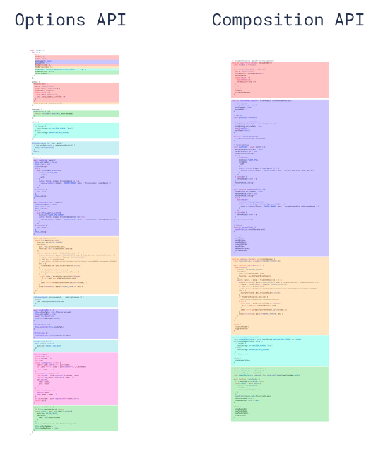

# Composition API

> Composition API 是 Vue 3 中引入的一种新的组件和逻辑复用方式，旨在解决 Vue 2 中使用选项式 API（Options API）时遇到的一些限制，尤其是在处理复杂组件时的逻辑复用和组织问题。

通过 Composition API，开发者可以更灵活地组织代码，将相关的功能逻辑组合在一起，而不是分散在一个组件的不同选项中。

## 为什么要有组合式 API？

### 更好的逻辑复用

- 组合式 API 最基本的优势是它使我们能够通过组合函数来实现更加简洁高效的逻辑复用。在选项式 API 中我们主要的逻辑复用机制是 mixins，而组合式 API 解决了 mixins 的所有缺陷。
- 组合式 API 提供的逻辑复用能力孵化了一些非常棒的社区项目，比如 VueUse，一个不断成长的工具型组合式函数集合。组合式 API 还为其他第三方状态管理库与 Vue 的响应式系统之间的集成提供了一套简洁清晰的机制，例如不可变数据、状态机与 RxJS。

### 更灵活的代码组织

许多用户喜欢选项式 API 的原因是它在默认情况下就能够让人写出有组织的代码：大部分代码都自然地被放进了对应的选项里。然而，选项式 API 在单个组件的逻辑复杂到一定程度时，会面临一些无法忽视的限制。这些限制主要体现在需要处理多个逻辑关注点的组件中，这是我们在许多 Vue 2 的实际案例中所观察到的。

我们以 Vue CLI GUI 中的文件浏览器组件为例：这个组件承担了以下几个逻辑关注点：
- 追踪当前文件夹的状态，展示其内容
- 处理文件夹的相关操作 (打开、关闭和刷新)
- 支持创建新文件夹
- 可以切换到只展示收藏的文件夹
- 可以开启对隐藏文件夹的展示
- 处理当前工作目录中的变更

你可以看到，处理相同逻辑关注点的代码被强制拆分在了不同的选项中，位于文件的不同部分。在一个几百行的大组件中，要读懂代码中的一个逻辑关注点，需要在文件中反复上下滚动，这并不理想。另外，如果我们想要将一个逻辑关注点抽取重构到一个可复用的工具函数中，需要从文件的多个不同部分找到所需的正确片段。

而如果用组合式 API 重构这个组件，将会变成下面右边这样：



现在与同一个逻辑关注点相关的代码被归为了一组：我们无需再为了一个逻辑关注点在不同的选项块间来回滚动切换。此外，我们现在可以很轻松地将这一组代码移动到一个外部文件中，不再需要为了抽象而重新组织代码，大大降低了重构成本，这在长期维护的大型项目中非常关键。

### 更好的类型推导

背景: 很多想要搭配 TS 使用 Vue 的开发者采用了由 vue-class-component 提供的 Class API。然而，**基于 Class 的 API 非常依赖 ES 装饰器**，选项式 API 是在 2013 年被设计出来的，那时并没有把类型推导考虑进去，因此我们不得不**做了一些复杂到夸张的类型体操**才实现了对选项式 API 的类型推导。但尽管做了这么多的努力，选项式 API 的类型推导在处理 mixins 和依赖注入类型时依然不甚理想。

相比之下，组合式 API 主要利用**基本的变量和函数**，它们本身就是类型友好的。

用组合式 API 重写的代码可以享受到完整的类型推导，不需要书写太多类型标注。大多数时候，用 TypeScript 书写的组合式 API 代码和用 JavaScript 写都差不太多！这也让许多纯 JavaScript 用户也能从 IDE 中享受到部分类型推导功能。

类型体操

> "类型体操"（Type Gymnastics）是一个非正式的术语，通常在 TypeScript 或其他具有强大类型系统的编程语言的上下文中使用。它指的是使用类型系统的高级特性来执行复杂和巧妙的类型转换、操作或推导。类型体操可以帮助开发者构建更安全、更可维护的代码，通过在编译时捕获更多的错误，而不是在运行时。

类型体操的一些常见用途包括：

1. 类型转换
  - 改变一个类型的形状，使其符合另一个类型的结构。这包括拾取（Pick）、排除（Exclude）、提取（Extract）和映射（Mapped）类型等高级操作。

2. 条件类型
  - 根据类型之间的关系或条件来选择或构造类型。条件类型使得类型可以根据其他类型是否满足特定条件来变化，类似于程序代码中的 if-else 逻辑。

3. 类型推导
  - 从现有代码中自动推导出类型。这可以是从函数参数推导返回类型，或者从对象属性推导出一个新的类型等。

4. 泛型编程
  - 使用泛型来创建可重用的、类型安全的组件，这些组件可以工作在多种类型而不是单一类型上。泛型可以提供灵活性，同时保持类型的完整性。

5. 类型守卫和断言
  - 使用类型守卫（Type Guards）和类型断言（Type Assertions）来更精确地控制类型的流动和变换，尤其是在类型不确定的情况下。

示例：

case1: 类型转换 - 映射类型

```ts
type Person = {
    name: string;
    age: number;
    location: string;
};

// 使用映射类型将 Person 类型中的所有属性变为可选的
type PartialPerson = {
    [P in keyof Person]?: Person[P];
};

```

case2: 条件类型

```ts
// 如果 T 能够赋值给 U，则类型是 X，否则是 Y
type ConditionalType<T, U, X, Y> = T extends U ? X : Y;
```

case3: 泛型

```ts
// 泛型函数，返回值类型与传入参数类型相同
function identity<T>(arg: T): T {
    return arg;
}
```


### 更小的生产包体积

> Vue 3 引入了 `<script setup>` 语法糖，为了使单文件组件（SFC）的编写更加简洁高效。使用 `<script setup>`，开发者可以写出更少的样板代码，同时 Vue 的编译器可以针对这种特定模式进行优化。这种优化不仅提高了开发效率，还有助于减小最终打包的体积。

搭配 `<script setup>` 使用组合式 API 比等价情况下的选项式 API 更高效，对代码压缩也更友好。

这是由于 `<script setup>` 形式书写的组件模板被编译为了一个内联函数，和 `<script setup>` 中的代码位于同一作用域。不像选项式 API 需要依赖 this 上下文对象访问属性，被编译的模板可以直接访问 `<script setup>` 中定义的变量，无需从实例中代理。这对代码压缩更友好，因为本地变量的名字可以被压缩，但对象的属性名则不能。

以下是 `<script setup>` 能够帮助减小打包体积的一些原理和方式：

1. 编译时优化

`<script setup>` 代码在构建时会被编译成普通的 JavaScript，这个过程允许 Vue 的编译器执行更多的静态分析和优化。例如，编译器可以自动移除未使用的组件导入，减少最终包的大小。

2. 更少的样板代码

传统的 Vue 组件需要显式地定义 `export default`，然后在其中声明组件的选项（如 data, methods 等）。

而 `<script setup>` 允许直接定义响应式状态、计算属性和函数，减少了需要写和传输的代码量。这种减少的代码量虽然在单个组件层面可能不显著，但在大型应用中累加起来会有较大的影响。

3. Tree-shaking

由于 `<script setup>` 促使开发者以更模块化和声明式的方式编写代码，这有助于打包工具（如 Vite、Webpack）更有效地进行 tree-shaking，也就是移除未使用的代码。在编译时，静态导入的组件和函数如果没有被使用，可以被自动识别并排除出最终的打包文件。

4. 局部变量和函数的自动推导

在 `<script setup>` 中，局部变量和函数默认为模板可用的状态或方法，这避免了在组件的 methods 或 data 选项中显式声明它们。这种自动推导减少了需要编写和理解的代码量，同时也减小了最终打包的体积，因为它减少了框架需要为组件实例化和管理上下文的工作。

5. 编译器优化

Vue 的编译器可以针对 `<script setup>` 中的代码模式应用特定的优化策略，如优化响应式变量的访问和更新路径。这些编译时优化有助于提高应用的运行时性能，同时减少了一些运行时的开销，间接影响打包体积。

## script setup 示例

```vue
<template>
  <button @click="increment">{{ count }}</button>
</template>

<script setup>
import { ref } from 'vue'

const count = ref(0)

function increment() {
  count.value++
}
</script>

```
在这个例子中，我们使用 `<script setup>` 导入了 Vue 的 ref 函数来创建一个响应式的计数器。然后，我们定义了一个 increment 函数来增加计数器的值。所有在 `<script setup>` 中声明的变量和函数都自动地可以在模板中使用，无需额外的注册或声明。

### 如何减少打包大小

当使用 `<script setup>` 时，Vue 的编译器会对组件进行优化处理，包括但不限于：

- 自动导入：Vue 3 的编译器能够自动识别和导入需要的 Vue API，避免了手动导入，减少了代码量。
- Tree-shaking：由于更显式的代码结构和模块化，未使用的变量和函数在打包时更容易被识别和移除。
- 编译优化：Vue 的编译器可以对 `<script setup>` 中的代码进行特定的编译优化，如静态提升，这可以减少运行时的开销。

