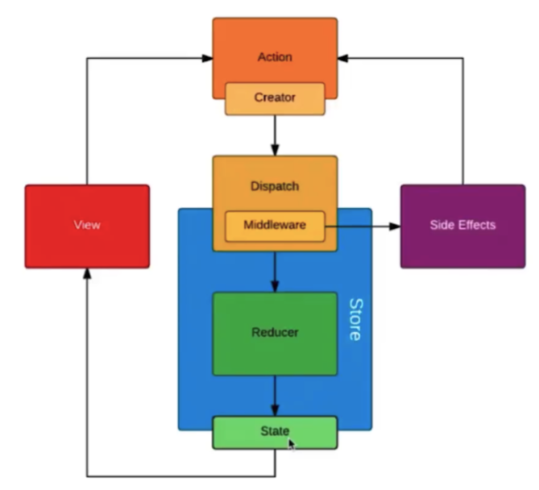

# redux 数据流转图

> Redux 的数据流是单向的，这是它设计中的一个核心特征。下面是一个简化的数据流转图，概述了 Redux 数据如何在应用中流转：



```
[Action] ---> [Dispatch] ---> [Reducers] ---> [State] ---> [View] ---> [User]
    |                                                           |
    <-----------------------------------------------------------
```

1. Action 创建函数被调用：首先，你的应用中的某个事件（比如用户点击按钮）会触发一个 action 创建函数。这个函数返回一个描述发生了什么的 action 对象。
2. Dispatch action：这个 action 对象通过 store.dispatch() 方法被发送到 store。
3. Reducers 处理：Store 会调用你提供的 reducer 函数。Reducer 是纯函数，它接收当前的 state 和 action，返回一个新的 state。
4. State 更新：Reducer 返回的新 state 替换掉了旧的 state，整个应用的 state 更新了。
5. View 更新：应用中订阅了 store 的组件会根据新的 state 更新视图。通常，在 React 中，这是通过 mapStateToProps 将 store 的 state 映射到组件的 props 来实现的。
6. 用户界面反馈：用户界面更新后，用户可以看到变化，并进行下一步操作，这可能会触发新的 actions，重复上述流程。


代码演示

```js
import { createStore } from 'react-redux'

// reducer 就是描述 action 如何把 state
// 变成新的 state 的过程
const reducer = (state, action) => {
    switch(action.type) {
        case 'A':
            return state.count + 1
        case 'B':
            return state.count - 1
        default:
            return state
    }
}

// createStore 接收一个 reducer
const store = createStore(reducer)

// 订阅
store.subscribe(() => {
    // 驱动视图更新
    console.log(store.getStore())
})

// 改变 store 的唯一方式就是通过 dispatch
// 一个 action 去修改 store
store.dispatch({
    type: 'A'
})
store.dispatch({
    type: 'B'
})

```
