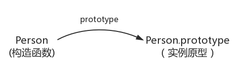
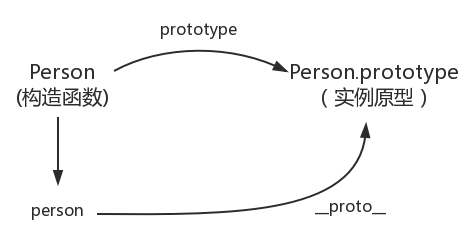
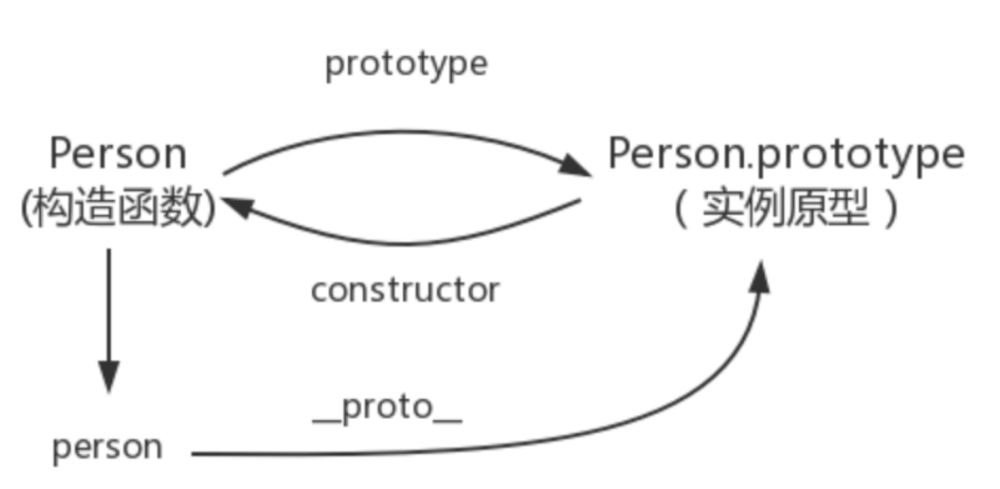
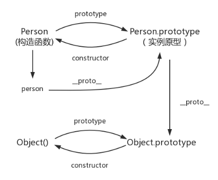
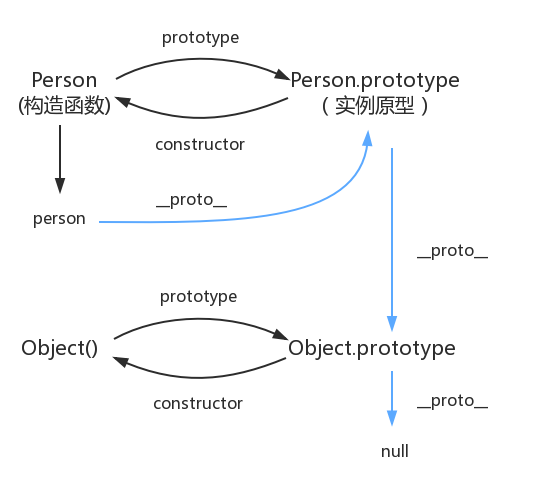

# Javascript

## 原型、原型链

> 原型(prototype): 一个简单的对象，用于实现对象的属性继承。可以简单的理解成对象的父节点。

### prototype

> 在JavaScript中，每个函数都有一个prototype属性，这个属性指向函数的原型对象。



### __proto__

> 这是每个对象(除null外)都会有的属性，叫做__proto__，这个属性会指向该对象的原型。


```js
function Person() {

}
var person = new Person();
console.log(person.__proto__ === Person.prototype); // true
```



### constructor


在 Firefox 和 Chrome 中，每个JavaScript对象中都包含一个__proto__ (非标准)的属性指向它的父节点(该对象的原型)，可obj.__proto__进行访问。

- 构造函数: 可以通过 `new` 来新建一个对象的函数。
- 实例: 通过构造函数和new创建出来的对象，便是实例。


实例通过__proto__指向原型，通过constructor指向构造函数。

```
function Person() {

}
console.log(Person===Person.prototype.constructor)  //true
```

`Object.hasOwnProperty()` 方法返回一个布尔值，判断对象是否包含特定的自身（非原型对象上的）属性。

可以根据上面的方法，判断对象的属性是自身属性还是原型上的属性

```js
function Person() {

}

var person = new Person();

console.log(person.__proto__ == Person.prototype) // true
console.log(Person.prototype.constructor == Person) // true
// 顺便学习一个ES5的方法,可以获得对象的原型
console.log(Object.getPrototypeOf(person) === Person.prototype) // true
```

```js
function Person() {

}
var person = new Person();
console.log(person.constructor === Person); // true
person.constructor === Person.prototype.constructor // true
```




### 实例与原型

>  当读取实例的属性时，如果找不到，就会查找与对象关联的原型中的属性，如果还查不到，就去找原型的原型，一直找到最顶层为止。

```js
function Person() {

}

Person.prototype.name = 'Kevin';

var person = new Person();

person.name = 'Daisy';
console.log(person.name) // Daisy

delete person.name;
console.log(person.name) // Kevin
```


### 原型的原型

我们已经讲了原型也是一个对象，既然是对象，我们就可以用最原始的方式创建它，那就是：

```js
var obj = new Object();
obj.name = 'Kevin'
console.log(obj.name) // Kevin
```

其实原型对象就是通过 Object 构造函数生成的，结合之前所讲，实例的 __proto__ 指向构造函数的 prototype




### 原型链

> 每个构造函数都有一个原型对象，原型对象都包含一个指向构造函数的指针，而实例都包含一个指向原型对象的内部指针。那么假如我们让原型对象等于另一个类型的实例，结果会怎样？显然，此时的原型对象将包含一个指向另一个原型的指针，相应地，另一个原型中也包含着一个指向另一个构造函数的指针。假如另一个原型又是另一个类型的实例，那么上述关系依然成立。如此层层递进，就构成了实例与原型的链条。


Object.prototype 的原型呢？

```js
console.log(Object.prototype.__proto__ === null) // true
```


原型链是由原型对象组成，每个对象都有 `__proto__` 属性，指向了创建该对象的构造函数的原型，`__proto__` 将对象连接起来组成了原型链。

原型链是一个用来实现继承和共享属性的有限的对象链。

- 属性查找机制: 当查找对象的属性时，如果实例对象自身不存在该属性，则沿着原型链往上一级查找，找到时则输出，不存在时，则继续沿着原型链往上一级查找，直至最顶级的原型对象Object.prototype，如还是没找到，则输出undefined；
- 属性修改机制: 只会修改实例对象本身的属性，如果不存在，则进行添加该属性，如果需要修改原型的属性时，则可以用: b.prototype.x = 2；但是这样会造成所有继承于该对象的实例的属性发生改变。


示意图如下




## JS 执行环境

### 1.执行上下文(EC)

> 执行上下文可以简单理解为一个栈，在执行一个函数的时候，会创建一个上下文，并且将其压入到执行栈中，当函数执行完毕，就会从执行栈中pop弹出。

它的类型:
- 全局执行上下文
- 函数执行上下文
- eval执行上下文

执行上下文包括三个重要的部分：

1. 变量对象（Variable Object）：
  - 在执行上下文被创建时，会被初始化为一个特殊的对象，用于存储变量、函数声明和函数参数。在全局上下文中，这个对象被称为全局对象。
2. 作用域链（Scope Chain）：
  - 作用域链是一个指向变量对象的指针列表，它保证了对变量和函数的有效访问。在执行上下文中，作用域链是在函数定义时确定的。
3. this 值：
  - this 值在运行时确定，取决于函数的调用方式。在全局上下文中，this 指向全局对象。

执行上下文的生命周期包括两个阶段：**创建阶段（Creation Phase）和执行阶段（Execution Phase）**。

创建阶段（Creation Phase）：
- 创建变量对象（VO）：
  - 创建 Variable Object，并初始化其中的变量、函数声明和函数参数。
- 创建作用域链（Scope Chain）：
  - 创建作用域链，将变量对象添加到作用域链中。
- 确定 this 值：
  - 确定 this 的值，取决于函数的调用方式。

执行阶段（Execution Phase）：
- 变量赋值：
  - 变量对象中的变量被赋予特定的值，包括从函数参数获取的值、函数内部声明的变量以及全局对象中的属性。
- 代码执行：
  - 顺序执行代码，根据语句进行赋值、计算等操作。

代码执行过程:
1. 创建全局上下文 (global Execute Context)
2. 全局执行上下文(caller) 逐行自上而下执行。遇到函数时，函数执行上下文(callee) 被push到执行栈顶层
3. 函数执行上下文被激活，成为 active EC, 开始执行函数中的代码，caller 被挂起
4. 函数执行完后，callee 被pop移除出执行栈，控制权交还全局上下文 (caller)，继续执行

### 2. 活动对象和变量对象

> 在 JavaScript 的执行上下文中，有两个概念：活动对象（Activation Object）和变量对象（Variable Object）。


变量对象（Variable Object）：
1. 定义：
  - 在创建执行上下文的创建阶段，会创建变量对象，用于存储变量、函数声明和函数参数。
2. 内容：
  - 包括变量、函数声明和函数参数。
  - 对于全局上下文，变量对象被称为全局对象，包含全局变量和函数。
  - 对于函数上下文，变量对象包含局部变量、函数声明和函数参数。

活动对象（Activation Object）：
1. 定义：
  - 活动对象是变量对象的一个特殊类型，用于表示当前执行上下文中的变量、函数声明和函数参数。
2. 作用：
  - 活动对象用于实现变量提升（Hoisting）和函数提升，确保在执行阶段之前可以访问到这些变量和函数。
3. 内容：
  - 与变量对象相似，包括变量、函数声明和函数参数。
  - 对于全局上下文，活动对象与变量对象一致，被称为全局对象。
  - 对于函数上下文，活动对象是变量对象的一个快照，包含了在函数执行过程中产生的变量、函数声明和函数参数。


**注意！这两个概念在 ES5 中使用，而在 ES6 中，规范引入了词法环境（Lexical Environment）的概念，取代了变量对象的角色。**

### 3. 词法环境

> 词法环境（Lexical Environment）是 ECMAScript 中用来管理标识符（变量、函数名等）与变量值之间关系的一种数据结构。

协议详情:
- [ECMA-262](https://262.ecma-international.org/13.0/)

词法环境包括两个主要组成部分：环境记录（Environment Record）和对外部词法环境的引用。

1. 环境记录（Environment Record）：
> 环境记录是词法环境的一部分，用于存储标识符与变量值之间的映射关系。

具体来说，有以下几种环境记录：
  - 对象环境记录（Object Environment Record）：
    - 使用对象来表示变量和值的映射关系，通常用于全局环境和 with 语句创建的环境。
    - 全局环境的环境记录就是全局对象（比如浏览器中的 window）。
  - 声明式环境记录（Declarative Environment Record）：
    - 使用类似于 Map 的结构来存储标识符与值的映射关系。
    - 用于函数和块级作用域内的变量声明。

2. 对外部词法环境的引用：

>词法环境还包括对外部词法环境的引用，即外部环境的词法环境。这个引用指向了包含当前环境的外部环境，形成了一个**词法作用域链**。这个链条是由外部环境一层层连接而成的，直到全局环境。

词法环境的创建过程：
1. 全局词法环境：
  - 在程序开始执行时，会创建一个全局词法环境，其环境记录是对象环境记录，引用了全局对象。
函数词法环境：
2. 每当一个函数被调用时，都会创建一个新的函数词法环境。
  - 函数的环境记录是声明式环境记录，用于存储函数内的变量和参数。
  - 函数词法环境的外部词法环境引用指向该函数的定义位置的词法环境。
3. 块级词法环境：
  - 在块级作用域（如 if 语句、for 循环等）中，也会创建新的块级词法环境。
  - 块级词法环境的环境记录是声明式环境记录，用于存储块级作用域内的变量。

### 4.暂时性死区

> ES6规定，let/const 命令会使区块形成封闭的作用域。若在声明之前使用变量，就会报错。总之，在代码块内，使用 let 命令声明变量之前，该变量都是不可用的。这在语法上，称为 “暂时性死区”（ temporal dead zone，简称 TDZ）。


ES6 明确规定，代码块（{}）中如果出现** let** 和 **const** 声明的变量，这些变量的作用域会被限制在代码块内，也就是块级作用域。

示例2
```js
var a = 1;
if(true){
	a = 2;
    console.log(a); // ?
	let a;
}
```
其实，上述例子在执行代码2的时候，已经报错： Cannot access 'a' before initialization。意思是无法再初始化 a 前，访问该变量。

暂时性死区的设计，也是为了提倡大家先声明，后使用，养成良好的编程习惯。

这个行为的目的是为了捕获在代码中可能存在的错误，防止在变量初始化之前就使用变量。

这与使用 var 声明的变量的行为不同，var 声明的变量在整个作用域内都是可见的，只是在初始化之前访问会得到 undefined。

```js
console.log(y); // undefined
var y = 10;
```


### 5. 作用域
> JavaScript 的作用域是指在代码中定义变量的区域，决定了变量的可见性和生命周期。作用域规定了变量在何处可以被引用，以及在何处它的值可以被修改。作用域规定如何查找变量，也就是确定**当前代码对变量的访问权限**。

作用域的类型

1. 全局作用域（Global Scope）：
  - 全局作用域是整个 JavaScript 程序的范围，它定义了在整个代码中都可以访问的变量。在浏览器中，全局作用域通常与 window 对象关联。
  - 在全局作用域中声明的变量对于整个应用程序都是可见的。

```js
var globalVariable = 10;

function globalFunction() {
  console.log(globalVariable); // 可以访问全局变量
}

globalFunction();
```

2. 局部作用域（Local Scope）：
- 局部作用域是在函数内部或代码块（如 if、for）内部定义的作用域。变量在这些局部作用域中声明，只在这些作用域内可见。
- 函数参数和在函数内部用 var 关键字声明的变量都属于局部作用域。
```js
function localFunction() {
  var localVar = 20;
  console.log(localVar); // 可以访问局部变量
}

localFunction();

console.log(localVar); // 报错，局部变量在外部不可见
```

**JavaScript 使用词法作用域（Lexical Scope）规则，也被称为静态作用域**。

这意味着作用域是在代码编写阶段确定的，而不是在运行时。在词法作用域中，一个函数内部的变量可以访问它被定义时所在的作用域中的变量，而不是调用它的作用域。

```js
var outerVar = 30;

function outerFunction() {
  var innerVar = 40;

  function innerFunction() {
    console.log(outerVar); // 可以访问外部函数的变量
    console.log(innerVar); // 可以访问自己的局部变量
  }

  innerFunction();
}

outerFunction();
```


特性:

- 声明提前: 一个声明在函数体内都是可见的, 函数优先于变量
- 非匿名自执行函数，函数变量为 **只读** 状态，无法修改
 
```js
let foo = function() { console.log(1) }
(function foo() {
    foo = 10  
    console.log(foo)
}()) 

// 由于foo在自执行函数中只为可读，因此赋值无效
// 结果打印：  ƒ foo() { foo = 10 ; console.log(foo) }
```

### 6. 活动对象(AO)

> 在函数执行过程中，会创建一个称为活动对象的特殊对象，用于存储函数的参数、局部变量和内部函数的引用。这个活动对象是在函数执行上下文（Execution Context）中创建的，可以看作是变量对象的实例。

活动对象的结构：
  - Arguments object（参数对象）： 包含函数的参数，可以通过索引或命名访问。
  - Function parameters（函数参数）： 通过参数名访问。
  - Inner variable declarations（内部变量声明）： 包括通过 var 声明的变量和函数。

```js
function example(a, b) {
  var c = 10;

  function inner() {
    var d = 20;
    console.log(a + b + c + d);
  }

  inner();
}

example(1, 2);
```

在上述例子中，执行 example(1, 2) 时，会创建 example 函数的执行上下文，其中包含一个活动对象（AO）。AO 中存储了参数 a、b，以及内部变量 c 和内部函数 inner 的引用。

### 7. [[scope]] 对象

> 每个函数在创建时都会保存一个内部属性 [[scope]]，该属性包含一个指向父级作用域的链。这个链表描述了函数在定义时的词法作用域，它是在函数创建时静态确定的。

[[scope]] 对象的结构：
- 作用域链中的每个作用域： 一个指向变量对象的指针，表示在定义时函数所处的词法作用域。
- 最后一个作用域指向全局对象（Global Object）： 表示全局作用域。

```js
function outer() {
  var x = 10;

  function inner() {
    var y = 20;
    console.log(x + y);
  }

  return inner;
}

var closure = outer();
closure();
```
在上述例子中，inner 函数的 [[scope]] 包含两个作用域，分别是 inner 函数自身的变量对象和 outer 函数的变量对象。当 closure 函数被调用时，它可以访问这两个作用域中的变量。


### 8. 作用域链

> 作用域链是 JavaScript 中一种用于查找标识符（变量、函数等）的机制。当在代码中引用一个变量或调用一个函数时，JavaScript 引擎会沿着作用域链查找这个标识符，以确定其在哪个作用域中被声明或定义。


1. 词法作用域：
  - JavaScript 使用词法作用域（也称为静态作用域）规则。这意味着作用域是在代码编写阶段确定的，而不是在运行时。一个函数内部的变量可以访问它被定义时所在的作用域中的变量，而不是调用它的作用域。
2. 作用域链的形成：
  - 当一个函数被创建时，它的作用域链就被创建了。作用域链包含当前函数的变量对象（变量和函数的声明）和对外部作用域的引用。
  - 当函数被调用时，会创建一个执行上下文，其中包括一个变量对象，该对象包含了函数的参数、局部变量和对外部作用域的引用。这个变量对象被添加到作用域链的最前面。
3. 作用域链的查找过程：
  - 当在函数内部引用一个变量时，JavaScript 引擎首先查找当前函数的变量对象，如果找到则使用该变量。如果在当前变量对象中找不到，引擎会继续沿着作用域链向外部作用域查找，直到找到该变量或到达全局作用域。
  - 如果变量在全局作用域中都找不到，则引擎会抛出 ReferenceError。

```js
var globalVar = "I'm global";

function outerFunction() {
  var outerVar = "I'm outer";

  function innerFunction() {
    var innerVar = "I'm inner";
    console.log(globalVar); // 可以访问全局变量
    console.log(outerVar); // 可以访问外部函数的变量
    console.log(innerVar); // 可以访问自己的局部变量
  }

  innerFunction();
}

outerFunction();
```
在上述例子中，innerFunction 的作用域链包括自己的变量对象、outerFunction 的变量对象和全局作用域。当访问变量时，引擎首先查找内部函数的变量对象，然后是外部函数的变量对象，最后是全局作用域。

## 闭包

> 闭包是指函数和其相关的引用环境的组合。它的定义可以理解为: 父函数被销毁 的情况下，返回出的子函数的[[scope]]中仍然保留着父级的单变量对象和作用域链。因此可以继续访问到父级的变量对象，这样的函数称为闭包。


具体来说，闭包使得函数可以访问其定义时的词法作用域（作用域链）中的变量，即使在函数在其他地方被调用时，它仍然可以访问这些变量。

理解闭包需要掌握以下几个关键点：

1. 函数嵌套： 在 JavaScript 中，函数可以嵌套定义，即在一个函数内部可以包含另一个函数。

```js
function outer() {
  var outerVar = "I am outer!";

  function inner() {
    var innerVar = "I am inner!";
    console.log(outerVar); // 可以访问外部函数的变量
  }

  inner();
}

outer();
```

2. 作用域链： JavaScript 使用词法作用域规则，即作用域是在代码编写阶段确定的。参考上面代码的例子，函数在定义时会保存对自己所在的作用域的引用，形成了作用域链。

3. 变量的生命周期： 闭包使得函数可以访问定义时的作用域中的变量，即使这个函数在定义时的作用域外被调用。

```js
function outer() {
  var outerVar = "I am outer!";

  function inner() {
    console.log(outerVar);
  }

  return inner;
}

var closureFn = outer();
closureFn(); // 可以访问 outerVar，即使 outer 函数已经执行完毕

```
5. 返回函数： 通过将函数作为值返回，可以创建闭包。在上面的例子中，outer 函数返回了 inner 函数，形成了闭包。

6. 私有变量： 闭包可以用于创建私有变量，因为外部作用域无法直接访问闭包内部的变量。

```js
function counter() {
  var count = 0;

  return function () {
    count++;
    console.log(count);
  };
}

var increment = counter();
increment(); // 输出 1
increment(); // 输出 2
```


闭包可能造成**内存泄漏**

```js
// 闭包最大的作用就是隐藏变量，闭包的一大特性就是内部函数总是可以访问其所在的外部函数中声明的参数和变量
// 即使在其外部函数被返回（寿命终结）了之后
// 全局执行上下文
function Person(){
  var name = 'cxk';
  this.getName = function(){
      return name;
  }
  this.setName = function(value){
      name = value;
  }
}

const cxk = new Person()

console.log(cxk.getName()) //cxk
cxk.setName('jntm')
console.log(cxk.getName()) //jntm
console.log(name) //name is not defined
```

闭包会产生一个很经典的问题:

>多个子函数的[[scope]]都是同时指向父级，是完全共享的。因此当父级的变量对象被修改时，所有子函数都受到影响。

解决方案:

- 变量可以通过 `函数参数的形式` 传入，避免使用默认的[[scope]]向上查找
- 使用setTimeout包裹，通过第三个参数传入
- 使用 `块级作用域`，让变量成为自己上下文的属性，避免共享

## Generator 函数

> ES6 中的 Generator 函数是一种特殊类型的函数，它允许你在函数执行过程中暂停并恢复。Generator 函数通过使用 function* 语法进行声明，并且在函数体内使用 yield 关键字来控制执行流。这使得你可以按需生成一系列的值，而不必一次性生成所有值，从而更灵活地控制异步流程或迭代过程。

以下是 Generator 函数的主要特性和使用方式：

1. 声明 Generator 函数：

```js
function* myGenerator() {
  yield 1;
  yield 2;
  yield 3;
}
```

使用 function* 关键字声明 Generator 函数，函数体内可以包含多个 yield 表达式，每个 yield 表达式表示一次暂停和生成的点。

2. 生成器对象：

调用 Generator 函数并不会立即执行函数体，而是返回一个生成器对象，该对象符合可迭代协议（Iterable Protocol）。

```js
const generator = myGenerator();
```

3. 迭代生成器：

使用 next() 方法迭代生成器，每次调用 next() 时，生成器会执行到下一个 yield 表达式，将 yield 后面的值作为结果返回，同时暂停执行。

```js
console.log(generator.next()); // { value: 1, done: false }
console.log(generator.next()); // { value: 2, done: false }
console.log(generator.next()); // { value: 3, done: false }
console.log(generator.next()); // { value: undefined, done: true }
```

当生成器函数执行完毕时，done 为 true，value 为 undefined。


4. 传递参数给 Generator：

通过 next() 方法传递参数给生成器函数。

```js
function* generatorWithParam() {
  const x = yield;
  const y = yield x + 1;
  yield y + 2;
}

const generator = generatorWithParam();
console.log(generator.next());      // { value: undefined, done: false }
console.log(generator.next(2));     // { value: 3, done: false }
console.log(generator.next(3));     // { value: 5, done: false }
console.log(generator.next());      // { value: undefined, done: true }
```
注意，第一次调用 next() 时不能传递参数给生成器，因为在第一次调用时生成器还没有执行到第一个 yield 表达式。

5. Generator 的迭代：

Generator 对象可以通过 for...of 循环进行迭代，或者通过扩展运算符 ... 将生成器转为数组。

```js
function* countToFive() {
  yield 1;
  yield 2;
  yield 3;
  yield 4;
  yield 5;
}

const generator = countToFive();

for (const value of generator) {
  console.log(value);
}
// 输出：
// 1
// 2
// 3
// 4
// 5

// 或者将生成器转为数组
const arrayFromGenerator = [...countToFive()];
```

Generator 函数的主要优势在于它可以使异步代码更易于理解和管理，同时还能方便地实现惰性计算和迭代。Generator 函数在处理异步任务时，通过 yield 暂停执行，可以更自然地表达异步代码的逻辑。


### Generator 函数和 async...await 异同

> 他们是 JavaScript 中用于处理异步编程的两种不同机制。虽然它们的目标都是简化异步代码的编写和理解，但它们之间存在一些关键的异同点：


Generator 函数：

1. 基于迭代器： Generator 函数是基于迭代器协议的，使用 yield 关键字来实现在函数执行过程中的暂停和恢复。每次调用 generator.next() 都会执行到下一个 yield。
2. 手动控制迭代： 开发者需要手动调用 generator.next() 来推进生成器的执行。这使得可以更细粒度地控制异步流程。
3. 可以生成多个值： Generator 函数可以通过多次调用 yield 来生成多个值，形成一个可迭代的序列。

```js
function* exampleGenerator() {
  yield 1;
  yield 2;
  yield 3;
}

const generator = exampleGenerator();
console.log(generator.next()); // { value: 1, done: false }
console.log(generator.next()); // { value: 2, done: false }
console.log(generator.next()); // { value: 3, done: false }
console.log(generator.next()); // { value: undefined, done: true }
```

async...await 函数：
1. 基于 Promise A+： async...await 是基于 Promise 的异步编程机制，用于更方便地处理异步代码，消除回调地狱。
2. 自动控制迭代： async 函数内部使用 await 关键字来等待异步操作完成，而不需要手动控制迭代。await 会暂停函数执行，直到 Promise 解决（或拒绝）。
3. 只能生成一个值： async 函数通常只能返回一个值，而不是像 Generator 函数那样可以通过多次 yield 生成多个值。如果需要处理多个异步操作，可以使用 Promise.all 等方法。

```js
async function exampleAsync() {
  const result1 = await asyncOperation1();
  const result2 = await asyncOperation2();
  return result1 + result2;
}
```


