# JavaScript 引擎

> JavaScript 引擎是一种软件程序，负责解释和执行 JavaScript 代码。它将 JavaScript 代码转换为可执行的指令，以便计算机能够理解和执行这些代码。JavaScript 引擎通常包括以下几个组件：

1. 解析器（Parser）：解析器负责将 JavaScript 代码转换为抽象语法树（Abstract Syntax Tree，AST），这是一种表示代码结构的树状数据结构。
2. 编译器（Compiler）：编译器将抽象语法树转换为可执行的字节码或机器代码。编译器通常包括优化步骤，以提高代码的执行效率。
3. 解释器（Interpreter）：解释器负责执行编译器生成的字节码或机器代码，并将其转换为计算机可以理解的指令。解释器通常会实时地执行代码，并且可以与编译器交互以实现即时编译（Just-In-Time Compilation，JIT Compilation）等技术。
4. 优化器（Optimizer）：优化器负责对 JavaScript 代码进行优化，以提高其执行速度和性能。优化器通常会分析代码的结构和执行路径，并应用各种优化技术，如内联缓存、函数内联、死代码删除等。


## 常见的 JavaScript 引擎包括：

V8：由 Google 开发的开源 JavaScript 引擎，用于 Google Chrome 浏览器和 Node.js 等环境。

SpiderMonkey：由 Mozilla 开发的 JavaScript 引擎，用于 Firefox 浏览器。

JavaScriptCore：由苹果开发的 JavaScript 引擎，用于 Safari 浏览器和 WebKit 渲染引擎。

Chakra：由微软开发的 JavaScript 引擎，用于 Edge 浏览器和 Node.js 的一些版本。

## V8

v8 源码： https://github.com/v8

> V8 是由 Google 开发的开源 JavaScript 引擎，它是 Chrome 浏览器的核心组件之一，也被广泛用于 Node.js 等 JavaScript 运行时环境中。V8 引擎采用了许多创新的技术，旨在提供高性能的 JavaScript 执行环境。

下面是关于 V8 引擎的一些详细讲解：

1. 即时编译（Just-In-Time Compilation，JIT Compilation）：
  - V8 使用了即时编译技术，将 JavaScript 代码直接编译成本地机器码，而不是像传统的解释型语言那样逐行解释执行。
  - 这使得 V8 能够在运行时实现更高的性能，因为编译后的机器码可以直接在 CPU 上执行，而无需再进行解释。
2. 垃圾回收（Garbage Collection）：
  - V8 使用了高效的垃圾回收机制，通过分代垃圾回收算法和增量式垃圾回收等技术，实现对 JavaScript 对象的自动内存管理。
  - V8 的垃圾回收器能够在不影响 JavaScript 代码执行的情况下，及时释放不再使用的内存，避免了内存泄漏和内存碎片化问题。
3. 内联缓存（Inline Caching）：
  - V8 引擎通过内联缓存技术优化了属性访问和函数调用的性能。
  - 当代码中的属性访问或函数调用被频繁执行时，V8 会将这些操作的结果缓存起来，以加快后续的访问和调用速度。
4. 优化编译器（Optimizing Compiler）：
  - V8 引擎内置了优化编译器，能够对 JavaScript 代码进行即时优化，并生成高效的机器码。
  - 优化编译器使用了诸如内联缓存、类型推断、函数内联等技术，以提高代码的执行效率。
5. 多线程执行（Multi-threaded Execution）：
  - V8 引擎在执行 JavaScript 代码时采用了多线程的方式，将耗时的计算任务分配给不同的线程执行，提高了并发性和响应性。

### 优化手段

1. 内联（Inlining）：
  - 当一个函数被频繁调用时，优化编译器可能会选择将该函数的代码直接插入到调用处，而不是通过函数调用的方式执行。
  - 例如，假设有一个简单的函数用于计算两个数的平方和，如果在代码中多次调用了这个函数，优化编译器可能会内联这个函数，以减少函数调用的开销。
2. 循环优化（Loop Optimization）：
  - 优化编译器可能会对循环结构进行优化，以减少循环体内的重复计算和优化循环的执行路径。
  - 例如，如果一个循环中的计算表达式不涉及循环变量的修改，并且循环迭代次数在编译时可知，优化编译器可能会将这个计算提取到循环外部以避免重复计算。
3. 类型推断（Type Inference）：
  - V8 引擎通过类型推断技术尽可能地确定变量的类型，从而优化代码的执行路径。
  - 例如，当一个变量在代码中的类型不断变化时，优化编译器可能会根据变量的使用情况推断出最可能的类型，并将其作为优化的依据。
4. 去除死代码（Dead Code Elimination）：
  - 优化编译器会检测和去除永远不会被执行的代码，从而减少代码的执行时间和内存消耗。
  - 例如，如果一个分支结构中的条件始终为假，优化编译器可能会移除与该条件相关的代码块，以优化代码的执行路径。
5. 多态内联缓存（Polymorphic Inline Cache，PIC）：
  - 当一个对象的属性被多次访问时，优化编译器可能会为这些属性访问生成多态内联缓存，以提高访问速度。
  - 例如，在循环中对对象的属性进行访问时，优化编译器可能会根据对象的类型生成不同的缓存路径，以加速属性的访问。

## v8 演化进程

1. v8 发布第一个版本(Codegen)

- 仅使用一个的 `Codegen` 编译器，编译、优化效率低

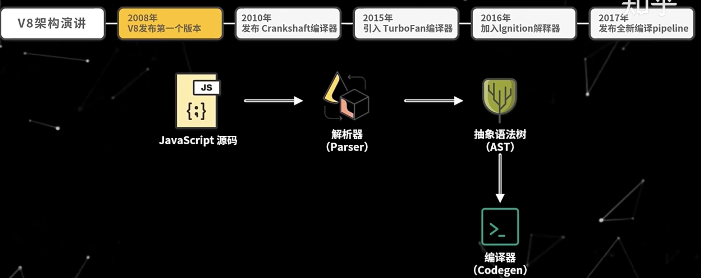

2. Crankshaft 编译器

- 代码先通过 `Full-Codegen` 编译
- 如果代码重复被执行（热点代码），则通过 `Crankshaft` 优化编译

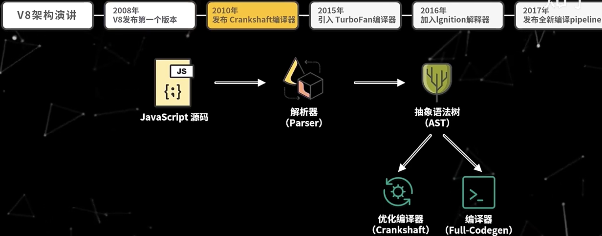

3. TurboFan 编译器

- 代码先通过 `Full-Codegen` 编译
- 如果代码重复被执行（热点代码），则通过 `Crankshaft` 优化编译
- `TurboFan` 引入了更多的优化技术，包括更强大的中间表示和优化阶段。它通过生成优化的机器码来执行JavaScript代码，这使得更多的优化策略成为可能

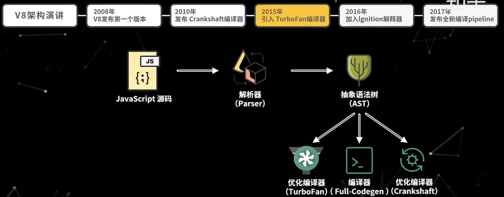

4. ignition 解释器

> Crankshaft 编译器,TurboFan 编译器实现架构都是**源码**编译成**机器码**。缺点也很明显，占用的内存较大（尤其是移动端设备）。

为了解决上述问题，v8 加入了`ignition 解释器`，重新引入了**字节码**。目的是减少内存消耗 

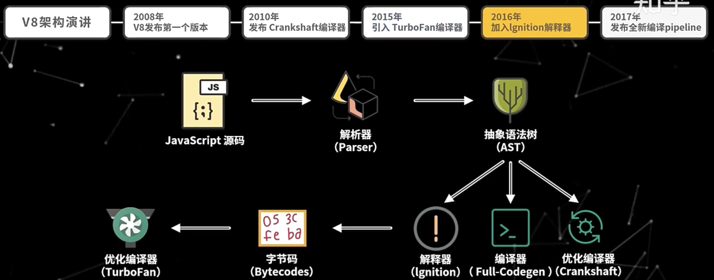

5. pipeline 编译

引入三个核心模块：解析器、解释器、优化编译器

- 首先`解析器`会将代码转换成 AST
- 然后 `解释器` 将 AST 转换成**字节码**
- `解释器`会记录代码的执行次数，如果代码频繁被调用（超过某个阈值），则会标记为**热代码(Hot Code)**，并将运行时的结果反馈给`优化编译器`
- `优化编译器`将字节码进行优化并编译字节码，生成优化后的机器码
- 当`解释器`再次执行该段代码后，就会直接执行优化后的机器码（JIT技术）

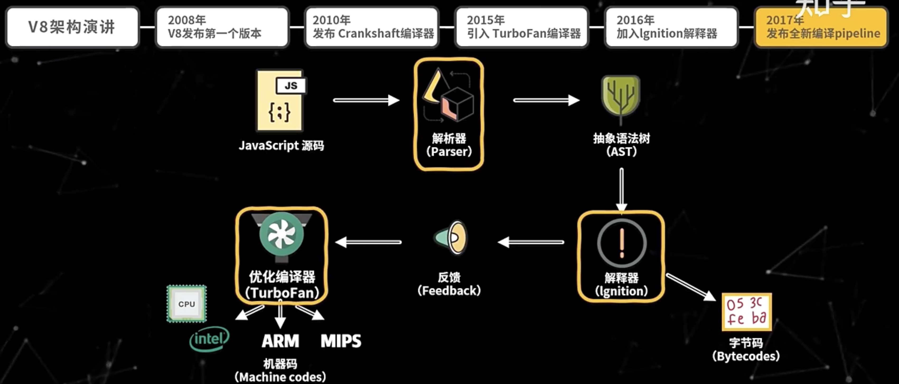


## 解析过程

1. 词法分析：将字符流转换为 `tokens`

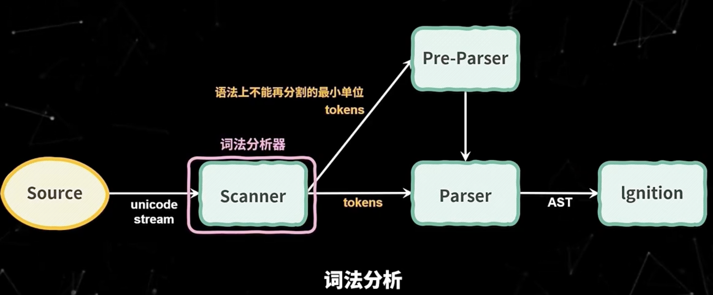


2. 语法分析：将 `tokens` 转换为具有嵌套层级的 `AST`

- 延迟解析，在解析过程中，如果不是立即执行的函数，则**只进行预解析**，只有当**函数调用**时，才进行**全量解析**


```js
// 从上往下解析，函数不执行，则只进行预解析
function foo(a,b) {
  var res = a + b;
  return res;
}

var a = 1;
var c = 2;

foo(1,2); // 函数执行时，进行全量解析 
```


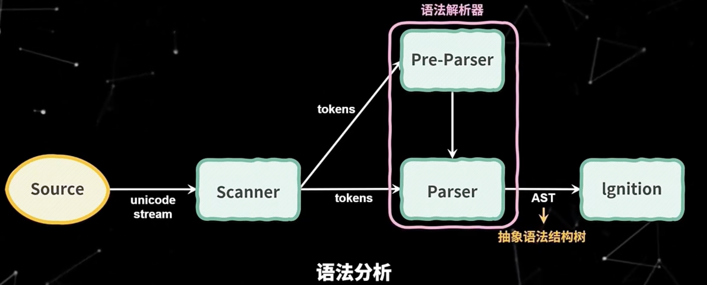

## 字节码执行流程

1. CPU 最终只能识别机器码，转换成字节码的目的是为了进行代码优化。

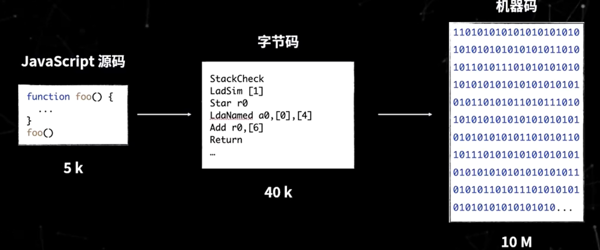

2. ignition 解释器主要使用通用寄存器和累加寄存器

- 通用寄存器: 函数参数和局部变量保存在此寄存器上。 
- 累加寄存器: 仅保存中间结果。

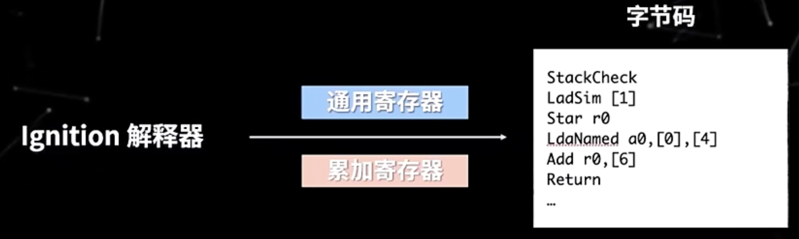

## 执行步骤演示

1. 将 a2 寄存器的值加载到累加寄存器上(150)
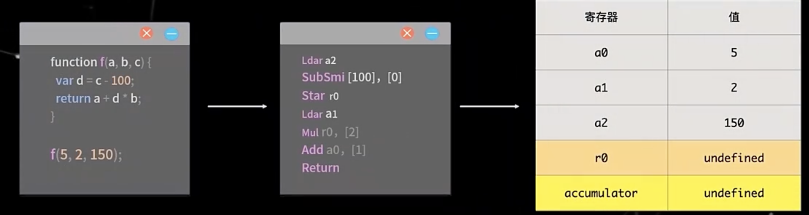

2. 将累加寄存器的值减少100，此时 accumulator 值为 50
  - [0] 表示反馈向量的索引
  - 反馈向量记录函数执行过程中的关键数据
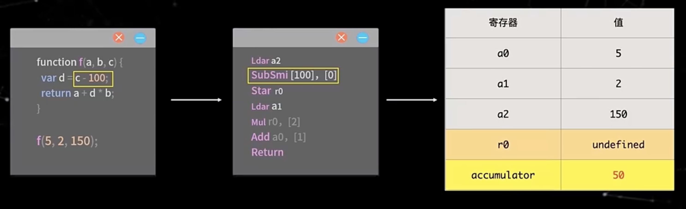

3. 将累加寄存器的结果，放到寄存器r0

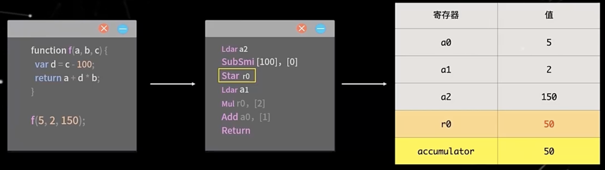

4. 将 a1 寄存器的值加载到累加寄存器上

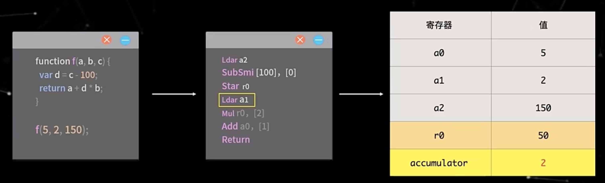

5. 将 r0 寄存器与累加寄存器的值（2）相乘

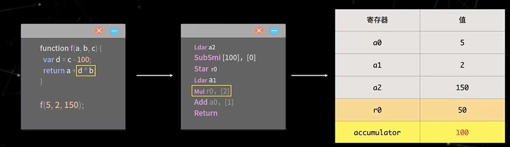

6. 将 a0 寄存器与累加寄存器(100)相加,并记录到累加寄存器中 
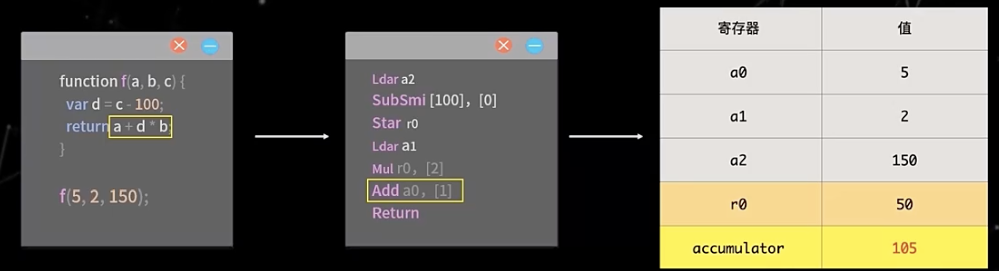

7. 返回累加器的值

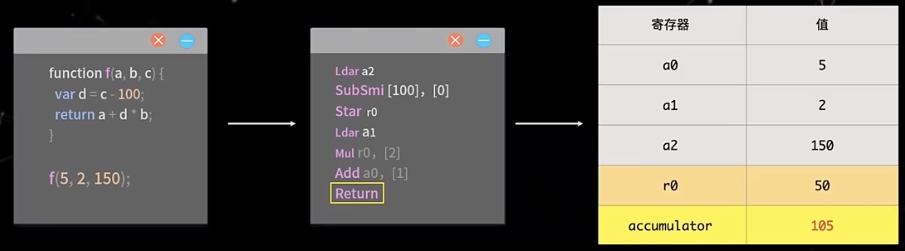