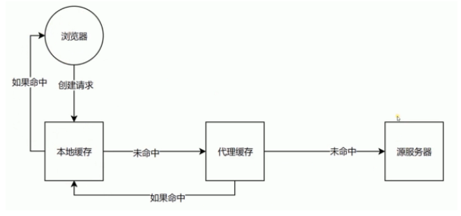
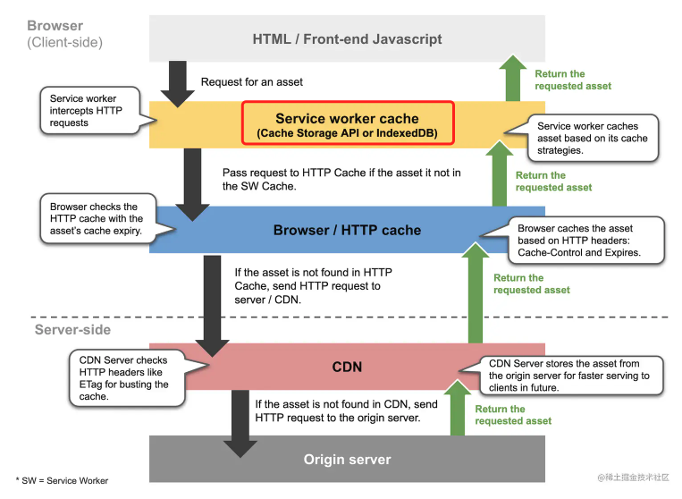
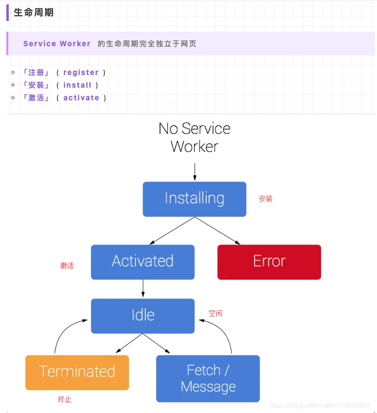
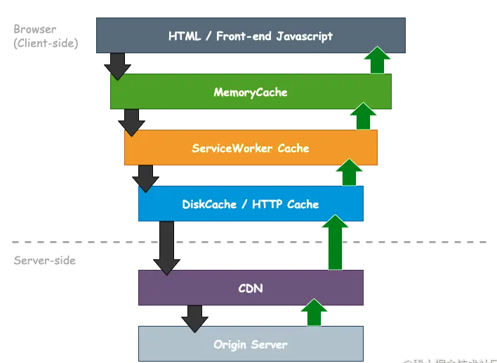

# 浏览器缓存

> 浏览器缓存是浏览器在本地存储已经访问过的网页资源（如 HTML、CSS、JavaScript 文件、图像等）的一种机制，目的是提高网页加载速度、减少对服务器的请求次数，并减轻网络流量压力。

浏览器缓存分为两种类型：**HTTP 缓存和本地缓存**。



## HTTP 缓存

HTTP 缓存：分为**强缓存和协商缓存**。

1. 强缓存（Cache-Control 和 Expires）：
  - 强缓存是浏览器在请求资源时，直接从本地缓存中加载资源而不向服务器发送请求的一种机制。
  - 强缓存通过设置响应头中的 Cache-Control 和 Expires 字段来控制缓存的有效期：
    - `Cache-Control: max-age=<seconds>`：指定资源的缓存时间，单位为秒。例如，`Cache-Control: max-age=3600` 表示资源在请求后的 3600 秒内有效。
    - `Expires: <date>`：指定资源的过期时间，用于指示客户端在该时间之前可以直接从缓存中加载资源，而不需要向服务器发送请求。Expires 字段的值是一个日期时间字符串。
2. 协商缓存（Last-Modified 和 ETag）：
  - 协商缓存是当强缓存失效时，浏览器向服务器发送请求，服务器根据资源的最后修改时间或者唯一标识符（ETag）来判断资源是否发生变化，从而决定是否返回资源内容。
  - 浏览器发送请求时，会在请求头中携带上一次请求的响应头中的 Last-Modified 或 ETag 字段，作为缓存标识符。
  - 服务器收到请求后，根据请求头中的缓存标识符判断资源是否发生变化：
    - 如果资源未发生变化，则返回状态码 304（Not Modified），告知客户端直接从缓存中加载资源。
    - 如果资源发生变化，则返回最新的资源内容，同时更新缓存标识符。

强缓存和协商缓存可以配合使用，当强缓存失效时，浏览器会发送带有缓存标识符的请求，服务器根据标识符判断是否返回新的资源内容。通过合理设置缓存控制策略，可以有效提高网页加载速度和减少服务器负载。

## 缓存控制

1. Cache-Control

Cache-Control 是最直接的方式来控制缓存策略。为了禁止缓存，可以设置如下：

```http
Cache-Control: no-store, no-cache, must-revalidate, post-check=0, pre-check=0
```

2. Pragma

Pragma 是一个 HTTP/1.0 头字段，通常与 HTTP/1.1 的 Cache-Control 一起使用，以兼容旧版 HTTP/1.0 缓存控制机制：

```http
Pragma: no-cache
```

3. Expires

Expires 头字段用于定义资源的过期时间。如果你想禁止浏览器缓存内容，可以将其设置为过去的时间，这样浏览器会认为该资源已经过期，不会将其缓存：

```http
Expires: Thu, 01 Jan 1970 00:00:00 GMT
```


参考文档:
- [HTTP 缓存](https://developer.mozilla.org/zh-cn/docs/web/http/caching_faq#%E7%BC%93%E5%AD%98%E6%8E%A7%E5%88%B6)

## 浏览器缓存流程



### 1. Service Worker

> ServiceWorker 检查资源是否存在其缓存中，并根据其编程的缓存策略决定是否返回资源。这个操作不会自动发生，需要在注册的 ServiceWorker 中定义 fetch 事件去拦截并处理网络请求，这样才能命中 ServiceWorker 缓存而不是网络或者 HTTP 缓存。

参考链接：https://juejin.cn/post/6844903783240204301



它是运行在浏览器背后的独立线程，使用它的前提是网络传输协议必须是 HTTPS，原因是 Service Worker 中涉及到请求拦截，所以使用 HTTPS 可以保障安全

```js
if ("serviceWorker" in navigator) {
  // 验证浏览器是否支持Service Worker
  navigator.serviceWorker
    .register("./sw-demo-cache.js", {
      // 注册Service Worker
      scope: "./"
    })
    .then(function(registration) {
      let serviceWorker;
      if (registration.installing) {
        // 监听Service Worker状态
        serviceWorker = registration.installing;
      }
    });
}
```

Service Worker 的状态（生命周期）如下：

> installing → installed → activating → activated


### 2. 内存缓存（Memory Cache）

> 内存缓存是浏览器中的第一级缓存，主要存储最近请求过的资源，包括 HTML 页面、JavaScript 文件、样式表、图片等。当浏览器需要请求某个资源时，首先会在内存缓存中查找是否存在该资源的副本，如果存在且未过期，则直接从内存中加载该资源，从而提高加载速度。

内存缓存中的 preloader 是页面优化的常见手段之一

`preloader` 可以实现响应式加载资源，如：

```html
<link rel="preload" as="image" href="map.png" media="(max-width: 600px)" />
<link rel="preload" as="script" href="map.js" media="(min-width: 601px)" />

```

它可以一边解析 js/css 文件，一边网络请求下一个资源

需要注意的事情是，内存缓存在缓存资源时并不关心返回资源的 HTTP 缓存头 Cache-Control 是什么值，同时资源的匹配也并非仅仅是对 URL 做匹配，还可能会对 Content-Type，CORS 等其他特征做校验


### 3. 磁盘缓存（Disk Cache）

> 磁盘缓存是浏览器中的第二级缓存，用于存储较长时间内的资源副本。当内存缓存中未找到所需资源，或者内存缓存中的资源已过期时，浏览器会继续在磁盘缓存中查找是否存在该资源的副本。如果磁盘缓存中存在且未过期，则从磁盘中加载该资源。磁盘缓存相比内存缓存容量更大，但读取速度相对较慢。

它会根据 HTTP Herder 中的字段判断哪些资源需要缓存，哪些资源可以不请求直接使用，哪些资源已经过期需要重新请求。并且即使在跨站点的情况下，相同地址的资源一旦被硬盘缓存下来，就不会再次去请求数据，绝大部分缓存都来自硬盘缓存

浏览器会根据情况选择将文件存储在内存还是硬盘中，对于大文件来说，大概率是不存储在内存中的，反之优先，当前系统内存使用率高的话，文件优先存储进硬盘

### 4. 网络请求（Network）
> 如果资源既不在内存缓存中，也不在磁盘缓存中，或者缓存中的资源已过期，则浏览器会发起网络请求，从服务器端重新获取该资源。网络请求是最耗时的一步，因为它涉及到与服务器之间的通信和数据传输。


## MemoryCache、DiskCache 在缓存流程的哪一层？

我们以 Chrome 为例，MemoryCache 作为第一公民，位于 ServiceWorker 之上。
也就是命中了 MemoryCache，就不会触发 ServiceWorker 的 fetch 事件。
而 DiskCache 则位于原来的 HTTP 缓存层：

