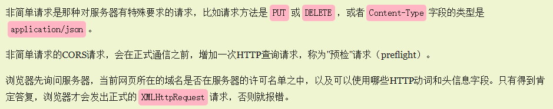

# 跨域

> 跨域（Cross-Origin）是指浏览器限制脚本在一个源（域名、协议、端口）下运行时，访问另一个源下的资源的行为。当浏览器发起跨域请求时，如果目标资源的域名、协议或端口与当前页面不同，浏览器会阻止该请求，以保护用户隐私和安全。

跨域问题的产生主要是因为浏览器的同源策略（Same-Origin Policy），同源策略规定了不同源之间的访问限制，包括 JavaScript 脚本的跨域请求、DOM 访问、Cookie 和 LocalStorage 的访问等。

## 什么是浏览器同源策略？

同源是指"协议+域名+端口"三者相同，即便两个不同的域名指向同一个ip地址，也非同源。

浏览器中的大部分内容都是受同源策略限制的，但是以下三个标签可以不受限制：
- ``
- `<link href=XXX>`
- `<script src=XXX>`


解决跨域问题的常见方法包括：

1. JSONP（JSON with Padding）： JSONP 是一种利用 `<script>`标签进行跨域请求的技术。通过在请求 URL 中添加一个回调函数的参数，服务器返回的数据会被包裹在这个回调函数中，从而实现跨域访问。
2. CORS（Cross-Origin Resource Sharing）： CORS 是一种通过在服务器端设置响应头来允许跨域请求的标准方式。服务器可以通过设置 Access-Control-Allow-Origin、Access-Control-Allow-Methods、Access-Control-Allow-Headers 等头部字段来指定允许跨域访问的源、请求方法和请求头。
3. 代理： 在服务器端设置代理，将跨域请求转发到目标服务器并返回结果。前端向自己的服务器发送请求，服务器再向目标服务器发送请求，并将结果返回给前端，这样就避免了跨域问题。
4. WebSocket： WebSocket 是一种全双工通信协议，可以在客户端和服务器之间建立持久连接。由于 WebSocket 不受同源策略的限制，因此可以用于跨域通信。
5. 跨域资源共享（Cross-Origin Resource Sharing）： CORS 是一种通过在服务器端设置响应头来允许跨域请求的标准方式。服务器可以通过设置 Access-Control-Allow-Origin、Access-Control-Allow-Methods、Access-Control-Allow-Headers 等头部字段来指定允许跨域访问的源、请求方法和请求头。
6. 通过 img 标签跨域

## jsonp

1. 前端页面通过创建一个 `<script>` 标签，指向包含 JSON 数据的 URL，同时在 URL 中添加一个回调函数的参数，例如：

```js
<script src="http://example.com/data?callback=myCallback"></script>
```

2.服务器接收到请求后，解析 URL 中的参数，并将数据包裹在回调函数中返回给客户端，例如：

```java
myCallback({"name": "John", "age": 30});
```

3. 客户端定义一个全局的回调函数，以处理服务器返回的数据，例如：

```js
function myCallback(data) {
    console.log(data.name); // 输出 "John"
}
window.myCallback = myCallback
```

通过以上步骤，前端页面就可以通过 `<script>` 标签获取到跨域服务器返回的数据，并且利用全局的回调函数进行处理。

JSONP 的实现原理是利用了浏览器对 `<script>` 标签的加载不受同源策略限制的特性，从而实现跨域请求。不过需要注意的是，JSONP 只支持 GET 请求，并且由于是将数据作为 JavaScript 代码执行，存在安全风险，可能被恶意注入恶意代码，因此在使用时需要谨慎防范。

## CORS（Cross-Origin Resource Sharing，跨域资源共享）

> CORS（Cross-Origin Resource Sharing，跨域资源共享）是一种机制，用于在浏览器中实现跨源请求资源的权限控制。当一个页面的源与另一个页面的源不同时，浏览器会实施同源策略，以防止页面间的恶意攻击。然而，有时需要在不同源之间共享资源，CORS就提供了一种安全的方式来实现这种跨域资源共享。




CORS 的工作原理如下：

1. 预检请求（Preflight Request）： 当跨域请求是一种复杂请求（例如包含特殊请求头或请求方法不是 GET、HEAD 或 POST），浏览器会在实际请求之前发送一个 OPTIONS 方法的预检请求。预检请求包含了一些预检信息，例如请求方法（OPTIONS）、请求头字段（例如自定义的请求头字段）、源信息等。服务器收到预检请求后，根据请求头中的 Origin 字段判断是否允许跨域访问，并返回适当的响应。
2. 简单请求（Simple Request）： 对于不满足预检请求的条件，即所谓的简单请求，浏览器会直接发送实际的请求（例如 GET、POST、HEAD 请求）。在发送实际请求时，浏览器会将 Origin 字段添加到请求头中，并且检查服务器返回的响应头中是否包含了 `Access-Control-Allow-Origin` 字段，以判断是否允许跨域访问。
3. 响应头设置： 服务器通过在响应头中添加一些特定的字段来告知浏览器是否允许跨域访问。其中，最常见的是 `Access-Control-Allow-Origin` 字段，用于指定允许访问的源。服务器还可以设置其他字段，如 `Access-Control-Allow-Methods、Access-Control-Allow-Headers` 等，来指定允许的请求方法和请求头字段。

通过以上机制，CORS 实现了对跨域资源共享的控制和限制，保护了用户和服务端的安全。开发者可以通过在服务器端设置相应的 CORS 头部信息来控制对跨域资源的访问权限，从而实现安全可控的跨域资源共享。
