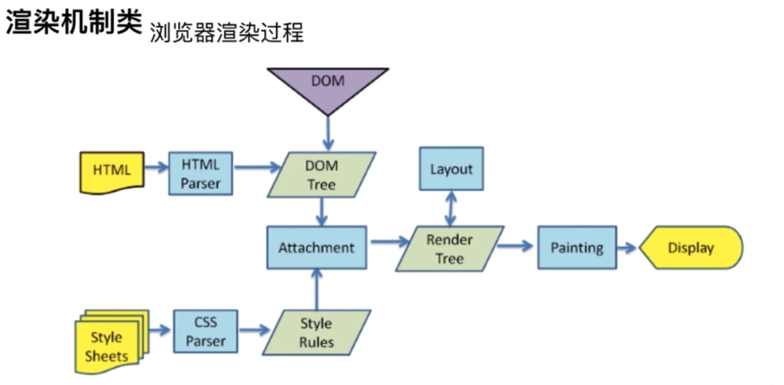
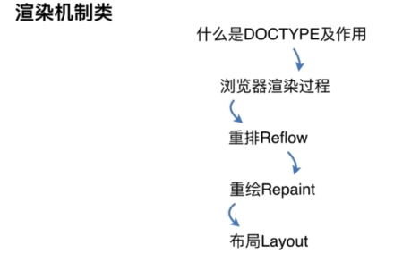
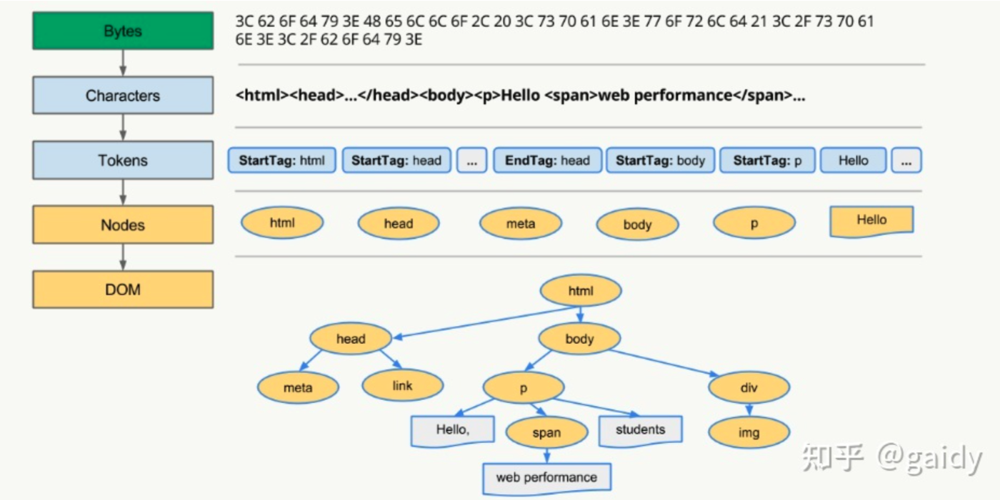
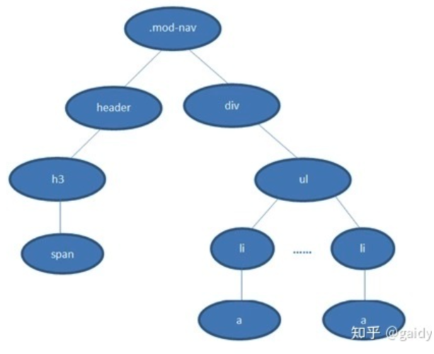

# 浏览器渲染机制

>浏览器渲染过程是指浏览器将 HTML、CSS 和 JavaScript 转换成可视化页面的整个流程。



它包括以下几个主要阶段：

1. HTML 解析： 浏览器首先会解析 HTML 文档，构建 DOM（Document Object Model）树。DOM 树是一个表示页面结构的树形结构，它包含了页面中所有的元素和其关系。
2. CSS 解析： 浏览器接着会解析 CSS 样式表，构建 CSSOM（CSS Object Model）树。CSSOM 树是一个表示页面样式的树形结构，它包含了所有的 CSS 规则和其关系。
3. 合并 DOM 和 CSSOM： 浏览器会将 DOM 树和 CSSOM 树合并成一个渲染树（Render Tree）。渲染树是一个结合了页面结构和样式的树形结构，它包含了所有需要渲染的节点以及其对应的样式。
4. 布局计算（Layout）： 浏览器根据渲染树的结构和样式信息，计算每个元素在页面中的位置和大小。这个过程也被称为重排（Reflow）。
5. 绘制（Painting）： 浏览器使用计算出的布局信息，将页面上的每个元素绘制到屏幕上。这个过程也被称为重绘（Repaint）。
6. 合成（Composite）： 浏览器将绘制好的页面元素进行合成，生成最终的页面图像。这个过程涉及到图层的合成和优化，以提高页面渲染的性能和效果。
7. 页面渲染完成： 当所有的元素都被绘制完成并合成到页面图像中后，页面渲染过程就完成了。此时用户可以看到页面上的内容，并且可以与页面进行交互。

以上是浏览器渲染过程的基本流程，不同的浏览器可能会有不同的实现细节和优化策略，但总体上遵循着类似的渲染原理。理解浏览器渲染过程对于前端开发非常重要，可以帮助开发者优化页面性能，提高用户体验。


## DOCTYPE

> DOCTYPE（Document Type Declaration）是一种用于指示 HTML 文档类型的声明。它位于 HTML 文档的顶部，位于 `<html>` 标签之前，告诉浏览器如何解析页面内容。

DOCTYPE 声明的语法如下：

```html
<!DOCTYPE html>
```

这是 HTML5 中的 DOCTYPE 声明，用于指示浏览器解析 HTML5 文档。HTML5 的 DOCTYPE 声明比较简洁，只需要声明为 `<!DOCTYPE html>` 即可，不再需要指定 DTD（Document Type Definition）。

DOCTYPE 声明的作用主要有以下几个方面：

1. 浏览器解析模式： DOCTYPE 声明告诉浏览器使用哪个 HTML 版本的解析规则来解析页面，以及是否要启用标准模式或兼容模式。
2. 文档验证： DOCTYPE 声明也可以用于验证 HTML 文档的正确性，确保文档符合相应的规范。
3. 兼容性： 在旧版浏览器中，正确的 DOCTYPE 声明可以确保页面以标准模式解析，提高页面的兼容性和稳定性。

总之，DOCTYPE 声明在 HTML 文档中扮演着重要的角色，它能够影响浏览器的解析行为，确保页面的正确渲染和兼容性。在编写 HTML 文档时，始终应该包含正确的 DOCTYPE 声明。





## DOM Tree 构建

> DOM 树（Document Object Model Tree）是浏览器解析 HTML 文档后构建的一个树形结构，它表示了整个 HTML 文档的结构和内容，包括了 HTML 元素、属性、文本内容等。



浏览器解析这段 HTML 代码的过程如下：

1. 解析 HTML 文档，根据标记构建语法树。
2. 构建 DOM 树：根据语法树创建对应的 DOM 节点，并根据其在 HTML 文档中的嵌套关系和顺序连接这些节点，形成一个树形结构。
3. 插入节点：将创建的 DOM 节点插入到正确的位置上，构建完整的 DOM 树。
4. 创建文档对象：将构建好的 DOM 树作为文档对象暴露给 JavaScript 脚本。
5. JavaScript 脚本通过文档对象访问和操作 DOM 树中的节点，实现对页面的动态操作和交互。


```js
// 定义一个函数来解析 HTML 代码并构建 DOM 树
function parseHTML(htmlString) {
    // 创建一个空的文档对象作为根节点
    const document = { 
        nodeName: '#document', 
        children: [],
    };

    // 使用正则表达式匹配 HTML 标签和文本内容
    const tagRegex = /<([^>]+)>/g;
    const textRegex = /([^<]+)/g;
    
    // 将 HTML 代码按照标签和文本内容分割成数组
    const tokens = htmlString.split(tagRegex);

    // 遍历 tokens 数组，构建 DOM 树
    let currentNode = document;
    for (let token of tokens) {
        if (token.startsWith('<')) {
            // 如果是 HTML 标签，创建一个新的元素节点并添加到当前节点的 children 数组中
            const tagName = token.slice(1, -1);
            const newNode = { 
                nodeName: tagName, 
                children: [],
            };
            currentNode.children.push(newNode);
            currentNode = newNode; // 更新当前节点为新创建的节点
        } else {
            // 如果是文本内容，创建一个新的文本节点并添加到当前节点的 children 数组中
            const textNode = { 
                nodeName: '#text', 
                nodeValue: token.trim(), // 去除首尾空白字符
            };
            currentNode.children.push(textNode);
        }
    }

    // 返回构建好的 DOM 树
    return document;
}

// 示例 HTML 代码
const htmlString = `
<!DOCTYPE html>
<html lang="en">
<head>
    <meta charset="UTF-8">
    <title>DOM Tree 解析示例</title>
</head>
<body>
    <div id="container">
        <h1>Hello, World!</h1>
        <p>This is a paragraph.</p>
        <ul>
            <li>Item 1</li>
            <li>Item 2</li>
            <li>Item 3</li>
        </ul>
    </div>
</body>
</html>
`;

// 调用解析函数，构建 DOM 树
const domTree = parseHTML(htmlString);
console.log(domTree); // 输出构建好的 DOM 树
```


## CSS 选择器解析过程

> CSS 选择器解析过程是浏览器对 CSS 规则进行匹配的过程，它决定了哪些样式规则应用于文档中的哪些元素。

**浏览器会『从右往左』解析CSS选择器**。

我们知道DOM Tree与Style Rules合成为 Render Tree，实际上是需要将Style Rules附着到DOM Tree上，因此需要根据选择器提供的信息对DOM Tree进行遍历，才能将样式附着到对应的DOM元素上。


以下这段css为例：

```css
.mod-nav h3 span {
  font-size: 16px;
}
```




若从左向右的匹配，过程是：

1. 从 .mod-nav 开始，遍历子节点 header 和子节点 div
2. 然后各自向子节点遍历。在右侧 div 的分支中
3. 最后遍历到叶子节点 a ，发现不符合规则，需要回溯到 ul 节点，再遍历下一个 li-a，一颗DOM树的节点动不动上千，这种效率很低。

如果从右至左的匹配：

1. 先找到所有的最右节点 span，对于每一个 span，向上寻找节点 h3
2. 由 h3再向上寻找 class=mod-nav 的节点
3. 最后找到根元素 html 则结束这个分支的遍历。

后者匹配性能更好，是因为**从右向左的匹配在第一步就筛选掉了大量的不符合条件的最右节点（叶子节点）**；而从左向右的匹配规则的性能都浪费在了失败的查找上面。


下面是 CSS 选择器解析过程的基本步骤：

1. 选择器分解： 浏览器首先将 CSS 规则中的选择器分解成不同的部分，以便逐个匹配元素。例如，对于 div.container > p:first-child 这样的选择器，会分解成 div、.container、>、p、:first-child 等部分。
2. 匹配元素： 浏览器从文档树的根节点开始，逐级匹配选择器中的每个部分，确定哪些元素符合当前部分的选择条件。对于结合选择器（如后代选择器、子选择器、相邻兄弟选择器等），浏览器会根据当前元素的父元素、子元素、兄弟元素等关系进行匹配。
3. 过滤元素： 在匹配过程中，浏览器会根据当前元素的属性、位置等信息进行过滤，将不符合条件的元素排除掉，只保留符合条件的元素。
4. 确定样式规则： 匹配完成后，浏览器会确定哪些 CSS 规则应用于符合条件的元素。如果选择器中包含了多个规则，浏览器会根据优先级、特殊性和后来者优先等原则来确定最终的样式规则。
5. 应用样式： 浏览器将确定的样式规则应用于对应的元素，根据规则设置元素的样式属性，如颜色、大小、边距等。
6. 重绘页面： 样式应用完成后，浏览器会根据新的样式规则重新绘制页面，更新元素的外观和布局。
7. 监听变化： 如果文档结构或样式规则发生变化（如添加新的元素、修改样式属性等），浏览器会重新进行选择器解析和样式计算，并更新页面的显示。


## 重绘（Repaint）

> 重绘是指当元素的样式发生变化，但不会影响其布局的情况下，浏览器重新绘制元素的过程。

触发重绘的操作

1. 修改元素的颜色、背景色、字体颜色等样式属性，
2. 修改元素透明度


## 重排

> 重排是指当页面布局发生变化，需要重新计算元素的位置和大小时，浏览器会触发的过程。

触发重排的操作:

1. 页面初次渲染
2. 浏览器窗口大小改变(resize)
3. 元素尺寸、位置、内容发生改变
4. 元素字体大小变化
5. 添加或者删除可见的 dom 元素
6. 激活 CSS 伪类（例如：:hover）
7. 查询某些属性或调用某些方法
  - clientWidth、clientHeight、clientTop、clientLeft
  - offsetWidth、offsetHeight、offsetTop、offsetLeft
  - scrollWidth、scrollHeight、scrollTop、scrollLeft
  - getComputedStyle()
  - getBoundingClientRect()
  - scrollTo()

重排必定触发重绘，重绘不一定触发重排。重绘的开销较小，重排的代价较高。

## 最佳实践


### CSS

1. 避免使用table布局
2. 将动画效果应用到position属性为absolute或fixed的元素上

### Javascript

1. 避免频繁操作样式，可汇总后统一**一次修改**
2. 尽量使用class进行样式修改
3. 减少dom的增删次数，可使用 字符串 或者 documentFragment 一次性插入
4. 极限优化时，修改样式可将其display: none后修改
5. 避免多次触发上面提到的那些会触发回流的方法，可以的话尽量用 变量存住
