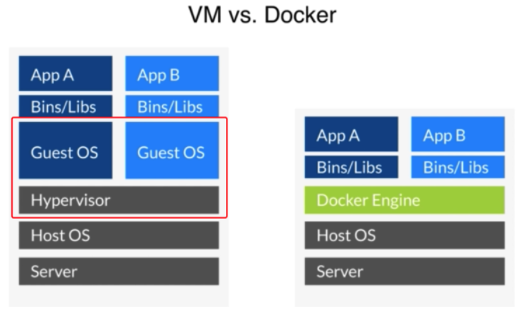
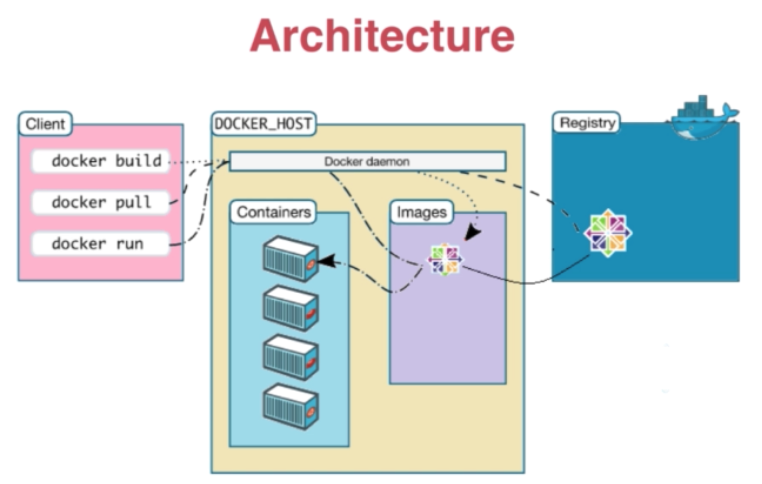
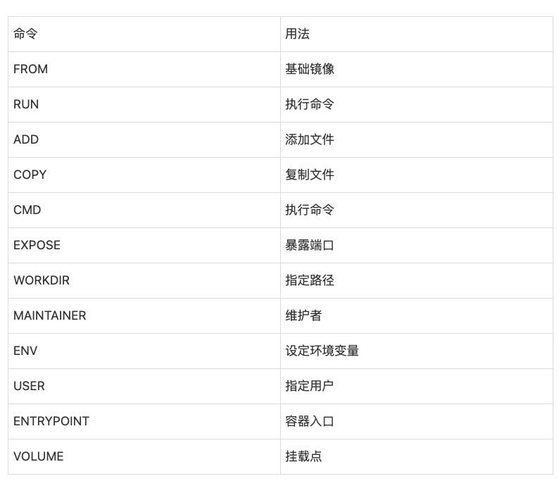

# Docker

## 主要特点

- 轻量级： Docker 容器与虚拟机相比更加轻量级，因为它们共享主机内核并使用基于进程隔离的技术。
- 可移植性： Docker 容器可以在任何支持 Docker 的平台上运行，无需修改代码。
- 快速部署： Docker 容器可以快速启动和停止，减少了开发、测试和部署的时间。
- 隔离性： Docker 容器之间是相互隔离的，每个容器都有自己的文件系统、网络和进程空间。
- 可扩展性： Docker 提供了一系列工具和 API，可以轻松地进行自动化部署和管理。

## 组成部分

- Docker Engine： Docker 的核心组件，负责管理容器的生命周期、镜像构建和网络等。
- Docker 镜像（Images）： Docker 镜像是一个只读的模板，包含了应用程序运行所需的文件系统和依赖项。Docker 容器是从镜像创建的。
- Docker 容器（Containers）： Docker 容器是 Docker 镜像的实例，它包含了运行应用程序所需的文件、环境变量和依赖项，并且可以独立运行在主机上。
- Docker 仓库（Registry）： Docker 仓库是用于存储和分享 Docker 镜像的地方，包括 Docker Hub、私有仓库等。
- Docker Compose： Docker Compose 是一个用于定义和运行多个 Docker 容器的工具，可以使用 YAML 文件定义多个容器之间的关系和配置。
- Docker Swarm 和 Kubernetes： Docker Swarm 和 Kubernetes 是 Docker 的编排工具，用于管理多个 Docker 容器的集群，实现自动化部署、扩展和管理。

## 总结常用指令
- docker pull (从远程仓库Docker  Hub拉取镜像文件。一个镜像需要的信息就是名称+标签。)
- docker  run -it centos:10.01 bash  (运行centos镜像，执行完成之后进入bash界面)
- docker  images (查看镜像的信息)
- docker  tag  (使用Tag添加镜像标签)
- docker rmi centos:latest (通过标签删除镜像)
- docker rmi ID  (通过id删除镜像)
- docker  create (容器创建，-d 是否在后台运行)
- docker  start (启动一个已经创建的容器)
- docker  ps (查看当前运行的容器,  -a 查看所有容器)
- docker run =  docker create +  docker start
- docker stop (终止容器)
- docker exec -it [container_name/container_id]  /bin/bash (进入容器中 -i:  打开标准输入输出,  -t:  让docker分配一个伪终端，并绑定在标准输入上，-u 执行用户命令)
- docker rm [container_name/container_id ]  (删除容器，-f  强制终止并删除一个正在运行的容器)
- docker  run -it -v /webapp centos  (容器内部创建一个数据卷)
- docker  run -it -v /src/webapp: /opt/webapp  centos (挂载一个主机目录作为数据卷)
- docker  run --name container1 -p 5000:5000 /src/webapp  (将本地的端口映射到容器的指定端口，映射所有接口地址)
- docker run --name container2 -p 127.0.0.1:5000:5000 /src/webapp (将本机指定的IP端口映射到容器指定的端口)
- docker run --name container3 -p 127.0.0.1::5000 (本机会随机分配一个端口，映射到容器的指定端口)
- docker  port [container_name/container_id]  (查询端口映射配置信息)
- docker  run -d -p 5000:5000 --name webapp --link db-container:db /src/webapp (容器互联，--link  name:alias)

## Q&A

1. Docker是什么 (可以类比为轻量级虚拟机
2. 容器是什么，有什么特征 (一个轻量级的沙箱，容器是从镜像创建的。可以启动开始停止删除，容器彼此间相互隔离。)
3. 容器和镜像的区别 (容器是镜像的运行实例，利用镜像可以创建一个容器：docker run -it ubuntu:14.04 bash)
4. 镜像仓库(Registry)是什么 (类似于代码仓库，是集中存放镜像文件的场所。)
5. Docker数据管理形式有哪些 (数据卷：容器内数据直接映射到本地主机环境，数据卷容器：使用特定容器维护数据卷)
6. 数据卷是什么 (可供容器使用的特殊目录，它将主机操作系统目录直接映射进容器。)
7. 虚拟机和Docker的区别

8. Docker的整体架构

核心在于 Dockerdaemon

9. Docker 镜像是什么 (只读模板，包含一个基本的操作系统，Docker运行容器前需要本地存在对应的镜像。)
10. 如何创建一个镜像 (基于已有镜像容器创建、基于本地模板导入、基于dockerfile创建)
11. 端口映射有什么作用 (在启动容器的时候，容器外部是无法通过网络访问容器内部的网络应用和服务，必须通过指定端口映射才可以访问。)
12. 容器互联是什么  (是一种让多个容器中的应用进行快速交互的方式。它会在源和接收容器之间创建连接关系，接收容器通过容器名快速访问到源容器。相当于创建了一个虚拟通道，两个容器不用再通过宿主主机端口映射进行连接。)
13. Dockefile的格式

14. 如何使用Docker镜像，添加、拷贝文件，执行命令
15. 如何注册一个Docker服务
