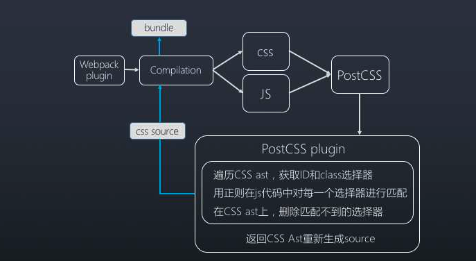

# tree shaking 原理

> Tree-shaking 是指在打包过程中剔除 JavaScript 中未引用的代码（也称为未使用代码），以减小打包后的文件体积，提高应用的性能。

- 参考文档： https://juejin.cn/post/6844903544756109319

通常，JavaScript 中会存在大量未使用的代码，例如未引用的函数、未被调用的变量等。在传统的打包工具中，这些未使用的代码也会被打包到最终的输出文件中，导致文件体积变大，影响应用的加载和执行速度。Tree-shaking 的目标就是通过静态分析代码的引用关系，将这些未使用的代码从最终的输出文件中剔除掉。

## tree shaking 原理

Tree-shaking 的原理**基于 ES6 模块的静态特性**。

ES6 模块系统具有以下特性，使得 Tree shaking 更加容易和有效：

1. 静态结构： ES6 模块系统的导入和导出语句是静态的，这意味着在编译时可以确定模块之间的依赖关系。因此，打包工具在分析代码时可以准确地识别出未使用的导出，从而进行有效的剪枝。
2. 优化机会： ES6 模块系统具有清晰的导入和导出语法，使得可以很容易地识别出模块之间的依赖关系。这为打包工具提供了优化的机会，可以通过分析这些依赖关系来确定哪些代码是未使用的，并将其从最终的输出中移除。
3. 纯粹性： ES6 模块系统鼓励编写纯粹的函数和模块，即不会在导入模块时执行任何副作用。这使得打包工具可以更加自信地剪切未使用的代码，因为它可以安全地假设未被引用的代码不会对应用程序的行为产生任何影响。

## ES6 module 特点
1. import 导入模块，只能在模块顶层使用
2. import 只能接受字符串常量
3. 模块依赖关系是确定的

ES6模块依赖关系是确定的，和运行时的状态无关，可以进行可靠的静态分析，这就是tree-shaking的基础。

所谓静态分析就是不执行代码，从字面量上对代码进行分析，ES6之前的模块化，比如我们可以动态require一个模块，只有执行后才知道引用的什么模块，这个就不能通过静态分析去做优化。

这是 ES6 modules 在设计时的一个重要考量，也是为什么没有直接采用 CommonJS，正是基于这个基础上，才使得 tree-shaking 成为可能，这也是为什么 rollup 和 webpack 2 都要用 ES6 module syntax 才能 tree-shaking。

## 代码示例

当使用 Webpack 进行打包时，可以通过配置 mode 为 'production'，并启用 optimization 中的 usedExports 来开启 Tree-shaking。

```js
const path = require('path');

module.exports = {
  mode: 'production',
  entry: './index.js',
  output: {
    filename: 'bundle.js',
    path: path.resolve(__dirname, 'dist'),
  },
  optimization: {
    usedExports: true,
  },
};

```

## 针对 es6 dynamic import 的 Tree shaking 如何实现

1. 静态分析： Webpack 在编译阶段会尝试静态地分析动态 import 语句，以确定导入的模块路径。如果能够确定导入的模块路径是静态的，Webpack 就可以直接将其视为静态 import 处理，进而进行 Tree shaking。
2. 生成异步 Chunk： 当 Webpack 遇到动态 import 语句时，它会将被导入的模块单独打包成一个异步 Chunk。这个异步 Chunk 在运行时才会被加载，因此在编译阶段无法确定其具体内容。
3. Webpack 中的 magic comments： Webpack 提供了一种特殊的注释语法，可以在动态 import 中提供一些提示信息，帮助打包工具更好地进行优化。例如，可以使用 /* webpackIgnore: true */ 来告诉 Webpack 忽略动态 import 语句中的模块，从而防止将其包含在最终的输出中。
4. Webpack 中的预取和预加载： Webpack 还支持通过 import(/* webpackPrefetch: true */ 'module') 和 import(/* webpackPreload: true */ 'module') 来提前加载模块。这些注释可以帮助 Webpack 在编译时确定哪些模块可能会被使用，并据此进行优化和 Tree shaking。
5. SideEffects 标记： 在模块的 package.json 文件中，可以使用 "sideEffects" 字段来告诉 Webpack 模块是否有副作用。如果一个模块被标记为没有副作用，Webpack 在 Tree shaking 时可以更加自信地删除未使用的导出。
6. Scope Hoisting： Webpack 还会尝试对模块进行 Scope Hoisting（作用域提升），将模块合并到一个函数作用域内，以减少模块间的函数调用开销和模块间的闭包嵌套，进而减小输出文件的体积。

## postcss tree shaking

PostCSS 提供了一个解析器，它能够将 CSS 解析成AST抽象语法树。然后我们能写各种插件，对抽象语法树做处理，最终生成新的css文件，以达到对css进行精确修改的目的。



### 执行流程

1. 插件监听webapck编译完成事件，webpack编译完成之后，从compilation中找出所有的css文件和js文件

```js
apply (compiler) {
  compiler.plugin('after-emit', (compilation, callback) => {

    let styleFiles = Object.keys(compilation.assets).filter(asset => {
      return /\.css$/.test(asset)
    })

    let jsFiles = Object.keys(compilation.assets).filter(asset => {
      return /\.(js|jsx)$/.test(asset)
    })
}
```

2. 将所有的css文件送至postCss处理，找出无用代码

```js
let tasks = []
styleFiles.forEach((filename) => {
    const source = compilation.assets[filename].source()
    let listOpts = {
      include: '',
      source: jsContents,  //传入全部js文件
      opts: this.options   //插件配置选项
    }
    tasks.push(postcss(treeShakingPlugin(listOpts)).process(source).then(result => {       
      let css = result.toString()  // postCss处理后的css AST  
      //替换webpack的编译产物compilation
      compilation.assets[filename] = {
        source: () => css,
        size: () => css.length
      }
      return result
    }))
})

```

3. postCss 遍历，匹配，删除过程

```js
 module.exports = postcss.plugin('list-selectors', function (options) {
  // 从根节点开始遍历
  cssRoot.walkRules(function (rule) {
    // Ignore keyframes, which can log e.g. 10%, 20% as selectors
    if (rule.parent.type === 'atrule' && /keyframes/.test(rule.parent.name)) return
    
    // 对每一个规则进行处理
    checkRule(rule).then(result => {
      if (result.selectors.length === 0) {
        // 选择器全部被删除
        let log = ' ✂️ [' + rule.selector + '] shaked, [1]'
        console.log(log)
        if (config.remove) {
          rule.remove()
        }
      } else {
        // 选择器被部分删除
        let shaked = rule.selectors.filter(item => {
          return result.selectors.indexOf(item) === -1
        })
        if (shaked && shaked.length > 0) {
          let log = ' ✂️ [' + shaked.join(' ') + '] shaked, [2]'
          console.log(log)
        }
        if (config.remove) {
          // 修改AST抽象语法树
          rule.selectors = result.selectors
        }
      }
    })
  })
})
```

4. checkRule 处理每一个规则核心代码

```js
let checkRule = (rule) => {
  return new Promise(resolve => {
    ...
    let secs = rule.selectors.filter(function (selector) {
      let result = true
      let processor = parser(function (selectors) {
        for (let i = 0, len = selectors.nodes.length; i < len; i++) {
          let node = selectors.nodes[i]
          if (_.includes(['comment', 'combinator', 'pseudo'], node.type)) continue
          for (let j = 0, len2 = node.nodes.length; j < len2; j++) {
            let n = node.nodes[j]
            if (!notCache[n.value]) {
              switch (n.type) {
                case 'tag':
                  // nothing
                  break
                case 'id':
                case 'class':
                  if (!classInJs(n.value)) {
                    // 调用classInJs判断是否在JS中出现过
                    notCache[n.value] = true
                    result = false
                    break
                  }
                  break
                default:
                  // nothing
                  break
              }
            } else {
              result = false
              break
            }
          }
        }
      })
      ...
    })
    ...
  })
}
```
