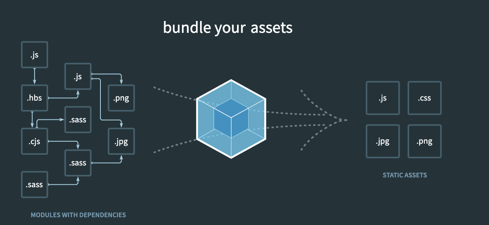

# webpack

> Webpack 是一个现代 JavaScript 应用程序的静态模块打包工具。它主要用于将各种类型的文件（如 JavaScript、CSS、图像等）打包成一个或多个静态资源文件，以便在浏览器中加载。

## webpack 原理

Webpack 的原理可以概括如下：

1. 入口（Entry）：Webpack 从指定的入口文件开始，递归地构建出项目的依赖关系图。
2. 模块解析（Module Resolution）：Webpack 根据入口文件的依赖关系，使用模块解析器（如 webpack/lib/ModuleResolutionPlugin）解析出每个模块的路径，并读取相应的文件内容。
3. 加载器（Loaders）：Webpack 可以通过加载器来处理各种类型的文件，例如转换 ES6/ES7 代码、编译 TypeScript、处理 CSS、处理图片等。加载器是一个转换器，它将源文件转换成 Webpack 可以处理的模块。
4. 转换（Transformation）：加载器将源文件转换成 JavaScript 模块，这样 Webpack 就可以理解和处理它们了。
5. 依赖图（Dependency Graph）：Webpack 根据模块之间的依赖关系，构建出一个依赖图（Dependency Graph）。在这个过程中，Webpack 会将模块的依赖关系进行静态分析，并将每个模块的依赖关系添加到依赖图中。
6. 代码拆分（Code Splitting）：Webpack 支持代码拆分，可以将代码拆分成多个块，然后按需加载。这样可以减小初始加载时间，提高页面性能。
7. 模块合并（Module Concatenation）：Webpack 将模块合并成一个或多个输出文件。它可以根据配置项来进行代码分割、按需加载、优化模块的顺序等。
8. 输出（Output）：Webpack 将打包好的模块输出到指定的目录，并生成一个或多个静态资源文件（如 JavaScript、CSS、图片等）。这些文件可以被浏览器加载并执行。
9. 插件系统（Plugin System）：Webpack 的功能可以通过插件扩展。插件可以监听 Webpack 构建过程的各个阶段，并在其中执行自定义逻辑，例如代码压缩、文件拷贝、静态资源处理等。

## 构建流程

1. 解析入口文件：Webpack 从指定的入口文件开始，根据配置文件（如 webpack.config.js）中的 entry 字段，确定项目的入口模块。
2. 解析模块：Webpack 使用模块解析器（如 `enhance-resolve`）解析入口模块及其依赖的其他模块。它会根据模块的路径和文件后缀名等信息，确定模块的位置，并读取相应的文件内容。
3. 加载器处理：Webpack 根据配置文件中的 rules 字段，使用相应的加载器（Loader）来处理模块。加载器负责将不同类型的文件转换成 Webpack 可以处理的模块格式（通常是 JavaScript）。
4. 依赖图构建：在模块解析的过程中，Webpack 会根据模块之间的依赖关系，构建出一个依赖图（Dependency Graph）。这个依赖图记录了每个模块的依赖关系，以及它们之间的引用关系。
5. 代码拆分：根据配置文件中的 optimization.splitChunks 和 optimization.runtimeChunk 等选项，Webpack 可以对代码进行拆分，将模块拆分成多个块，然后按需加载。
6. 模块合并：Webpack 将经过加载器处理和拆分的模块，按照配置文件中的 output 字段，合并成一个或多个输出文件。这些输出文件通常是 JavaScript、CSS 或其他静态资源文件。
7. 输出文件生成：Webpack 将合并好的模块输出到指定的目录中，并生成一个或多个静态资源文件。这些文件可以被浏览器加载和执行。
8. 插件执行：Webpack 在构建过程中会触发各个插件的执行。插件可以监听 Webpack 的各个阶段，并在其中执行自定义逻辑，例如代码压缩、文件拷贝、静态资源处理等。
9. 构建完成：Webpack 完成所有的构建任务后，会输出构建结果的统计信息，例如构建耗时、输出文件大小等。此时构建任务完成，可以执行下一步操作，例如运行测试、部署到服务器等。

总的来说，Webpack 的构建流程是一个逐步处理模块、依赖分析、代码转换和文件输出的过程。通过加载器、插件等机制，Webpack 能够实现灵活而高效的项目构建。
