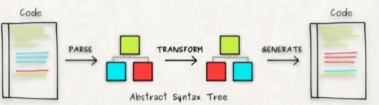

# Babel 原理

> Babel 在将源码转换为目标代码的过程中，涉及到了很多细节工作，包括词法分析、语法分析、AST 转换等。

Babel 步骤可以简单概括为解析、转换和生成。



下面我将详细说明 Babel 在转换过程中的一些内部细节，并给出具体的示例代码。

1. 词法分析（Lexical Analysis）： Babel 使用词法分析器将源码分解成一系列 Token。

例如，对于下面的箭头函数：

```js
const add = (a, b) => a + b;
```

词法分析器将会识别出以下 Token：

```vb
Identifier: const
Identifier: add
Punctuator: =
Punctuator: (
Identifier: a
Punctuator: ,
Identifier: b
Punctuator: )
Arrow: =>
Identifier: a
Punctuator: +
Identifier: b
Punctuator: ;
```

2. 语法分析（Syntax Analysis）： Babel 使用语法分析器根据语法规则将这些 Token 组装成 AST。

例如，对于上面的代码，Babel 将生成以下 AST：

```json
{
  "type": "Program",
  "body": [
    {
      "type": "VariableDeclaration",
      "declarations": [
        {
          "type": "VariableDeclarator",
          "id": {
            "type": "Identifier",
            "name": "add"
          },
          "init": {
            "type": "ArrowFunctionExpression",
            "params": [
              {
                "type": "Identifier",
                "name": "a"
              },
              {
                "type": "Identifier",
                "name": "b"
              }
            ],
            "body": {
              "type": "BinaryExpression",
              "operator": "+",
              "left": {
                "type": "Identifier",
                "name": "a"
              },
              "right": {
                "type": "Identifier",
                "name": "b"
              }
            },
            "expression": true
          }
        }
      ],
      "kind": "const"
    }
  ],
  "sourceType": "module"
}
```

3. AST 转换（AST Transformation）： Babel 使用插件和预设对 AST 进行转换。

例如，我们可以使用 `@babel/plugin-transform-arrow-functions` 插件**将箭头函数转换为普通函数**：

```json
{
  "plugins": ["@babel/plugin-transform-arrow-functions"]
}
```

转换后的 AST 如下所示：

```json
{
  "type": "Program",
  "body": [
    {
      "type": "VariableDeclaration",
      "declarations": [
        {
          "type": "VariableDeclarator",
          "id": {
            "type": "Identifier",
            "name": "add"
          },
          "init": {
            "type": "FunctionExpression",
            "id": null,
            "params": [
              {
                "type": "Identifier",
                "name": "a"
              },
              {
                "type": "Identifier",
                "name": "b"
              }
            ],
            "body": {
              "type": "BlockStatement",
              "body": [
                {
                  "type": "ReturnStatement",
                  "argument": {
                    "type": "BinaryExpression",
                    "operator": "+",
                    "left": {
                      "type": "Identifier",
                      "name": "a"
                    },
                    "right": {
                      "type": "Identifier",
                      "name": "b"
                    }
                  }
                }
              ]
            },
            "generator": false,
            "expression": false,
            "async": false
          }
        }
      ],
      "kind": "const"
    }
  ],
  "sourceType": "module"
}
```


```js
const add = function (a, b) {
  return  a + b;
};
```