# vite 核心原理

1. 当声明一个 script标签类型为 module 时,如

```html
<script type="module" src="/src/main.js"></script>
```

2. 当浏览器解析资源时，会往当前域名发起一个GET请求main.js文件

```js
// main.js
import { createApp } from 'vue'
import App from './App.vue'
createApp(App).mount('#app')
```

3. 请求到了main.js文件，会检测到内部含有import引入的包，又会 import 引用发起HTTP请求获取模块的内容文件，如App.vue、vue文件

Vite其核心原理是利用浏览器现在已经支持ES6的import,碰见import就会发送一个HTTP请求去加载文件，Vite启动一个 koa 服务器拦截这些请求，并在后端进行相应的处理将项目中使用的文件通过简单的分解与整合，然后再以ESM格式返回返回给浏览器。Vite整个过程中没有对文件进行打包编译，做到了真正的按需加载，所以其运行速度比原始的webpack开发编译速度快出许多！


## 基于ESM的Dev server

> 在Vite出来之前，传统的打包工具如Webpack是先解析依赖、打包构建再启动开发服务器，Dev Server 必须等待所有模块构建完成，当我们修改了 bundle模块中的一个子模块， 整个 bundle 文件都会重新打包然后输出。项目应用越大，启动时间越长。


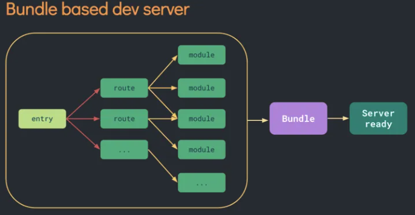


而Vite利用浏览器对ESM的支持，当 import 模块时，浏览器就会下载被导入的模块。先启动开发服务器，当代码执行到模块加载时再请求对应模块的文件,本质上实现了动态加载。灰色部分是暂时没有用到的路由，所有这部分不会参与构建过程。随着项目里的应用越来越多，增加route，也不会影响其构建速度。

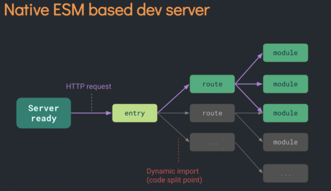


##  基于ESM 的 HMR 热更新

目前所有的打包工具实现热更新的思路都大同小异：**主要是通过WebSocket创建浏览器和服务器的通信监听文件的改变，当文件被修改时，服务端发送消息通知客户端修改相应的代码，客户端对应不同的文件进行不同的操作的更新**。

- Webpack: 重新编译，请求变更后模块的代码，客户端重新加载
- Vite: 请求变更的模块，再重新加载

Vite 通过 `chokidar` 来监听文件系统的变更，只用对发生变更的模块重新加载， 只需要精确的使相关模块与其临近的 HMR边界连接失效即可，这样HMR 更新速度就不会因为应用体积的增加而变慢而 Webpack 还要经历一次打包构建。所以 HMR 场景下，Vite 表现也要好于 Webpack。

## 热更新核心流程

1. 创建一个websocket服务端和client文件，启动服务
2. 通过chokidar监听文件变更
3. 当代码变更后，服务端进行判断并推送到客户端
4. 客户端根据推送的信息执行不同操作的更新

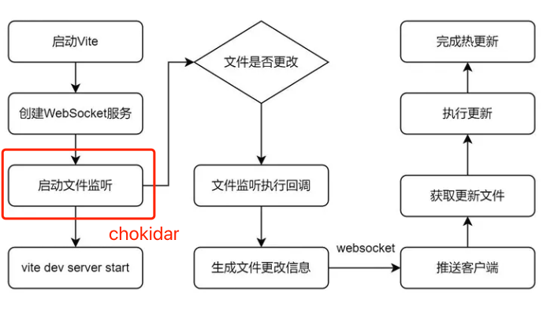


启动热更新：createWebSocketServer

```ts
export async function createServer(
  inlineConfig: InlineConfig = {}
): Promise<ViteDevServer> {
  ....
  const ws = createWebSocketServer(httpServer, config, httpsOptions)
  const { ignored = [], ...watchOptions } = serverConfig.watch || {}
  const watcher = chokidar.watch(path.resolve(root), {
    ignored: [
      '**/node_modules/**',
      '**/.git/**',
      ...(Array.isArray(ignored) ? ignored : [ignored])
    ],
    ignoreInitial: true,
    ignorePermissionErrors: true,
    disableGlobbing: true,
    ...watchOptions
  }) as FSWatcher
  ....
  watcher.on('change', async (file) => {

  })
  watcher.on('add', (file) => {
  })
  watcher.on('unlink', (file) => {
  })
  ...
  return server
}
```

创建 ws 服务

```ts
export function createWebSocketServer(
  server: Server | null,
  config: ResolvedConfig,
  httpsOptions?: HttpsServerOptions
): WebSocketServer {
  let wss: WebSocket
  let httpsServer: Server | undefined = undefined
  // 热更新配置
  const hmr = isObject(config.server.hmr) && config.server.hmr
  const wsServer = (hmr && hmr.server) || server
  // 普通模式
  if (wsServer) {
    wss = new WebSocket({ noServer: true })
    wsServer.on('upgrade', (req, socket, head) => {
      // 监听通过vite客户端发送的websocket消息，通过HMR_HEADER区分
      if (req.headers['sec-websocket-protocol'] === HMR_HEADER) {
        wss.handleUpgrade(req, socket as Socket, head, (ws) => {
          wss.emit('connection', ws, req)
        })
      }
    })
  } else { // 中间件模式
    // vite dev server in middleware mode
    wss = new WebSocket(websocketServerOptions)
  }
  wss.on('connection', (socket) => {
    ...
  })
  // 错误处理
  wss.on('error', (e: Error & { code: string }) => {
    ...
  })
  // 返回
  return {
    on: wss.on.bind(wss),
    off: wss.off.bind(wss),
    send(payload: HMRPayload) {
      ...
    },
    close() {
      ...
    }
  }
}
```

执行热更新：moduleGraph+handleHMRUpdate模块

```ts
watcher.on('change', async (file) => {
    file = normalizePath(file)
    if (file.endsWith('/package.json')) {
      return invalidatePackageData(packageCache, file)
    }
    // invalidate module graph cache on file change
    moduleGraph.onFileChange(file)
    if (serverConfig.hmr !== false) {
      try {
        await handleHMRUpdate(file, server)
      } catch (err) {
        ws.send({
          type: 'error',
          err: prepareError(err)
        })
      }
    }
  })
```

**moduleGraph**

> moduleGraph 是Vite定义的用来记录整个应用的模块依赖图的类，除此之外还有moduleNode。

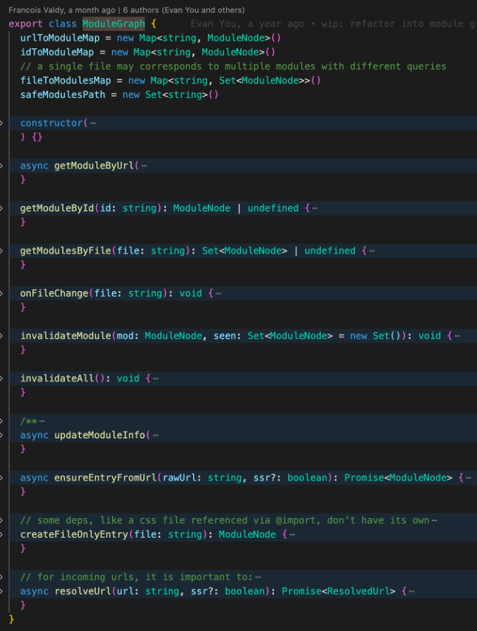


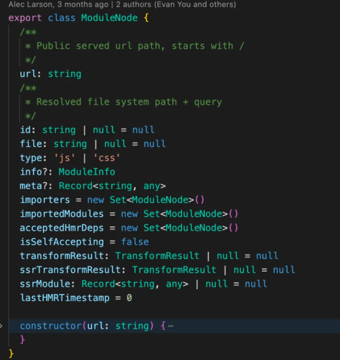


moduleGraph是由一系列 map 组成，而这些map分别是url、id、file等与ModuleNode的映射，而ModuleNode 是 Vite中定义的最小模块单位。通过这两个类可以构建下面的模块依赖图：

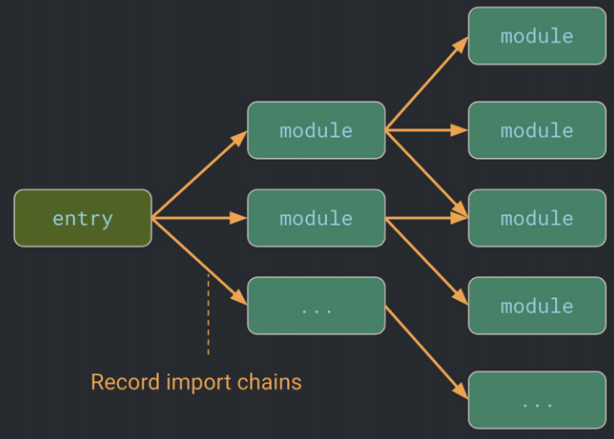

可以看看moduleGraph.``onFileChange这个函数：

主要是用来清空被修改文件对应的ModuleNode对象的 transformResult 属性，使之前的模块已有的转换缓存失效。这块也就是Vite在热更新里的缓存机制。可以看看官网的介绍。

```ts
onFileChange(file: string): void {
    const mods = this.getModulesByFile(file)
    if (mods) {
      const seen = new Set<ModuleNode>()
      mods.forEach((mod) => {
        this.invalidateModule(mod, seen)
      })
    }
  }

  invalidateModule(mod: ModuleNode, seen: Set<ModuleNode> = new Set()): void {
    mod.info = undefined
    mod.transformResult = null
    mod.ssrTransformResult = null
    invalidateSSRModule(mod, seen)
  }
```

**handleHMRUpdate**

> handleHMRUpdate 模块主要是监听文件的更改，进行处理和判断通过WebSocket给客户端发送消息通知客户端去请求新的模块代码。

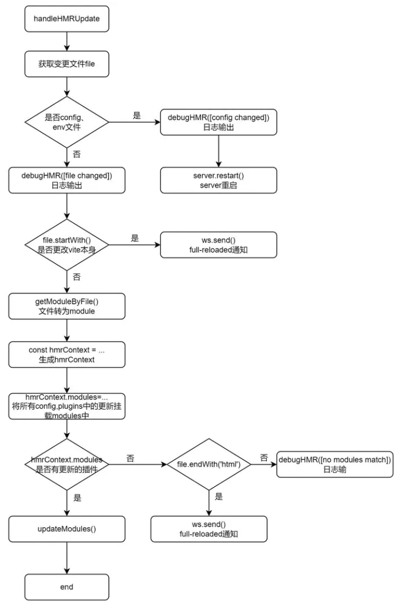

**客户端：websocket通信和更新处理**

> 客户端：当我们配置了热更新且不是ssr的时候，Vite底层在处理html的时候会把HMR相关的客户端代码写入在我们的代码中，如下：

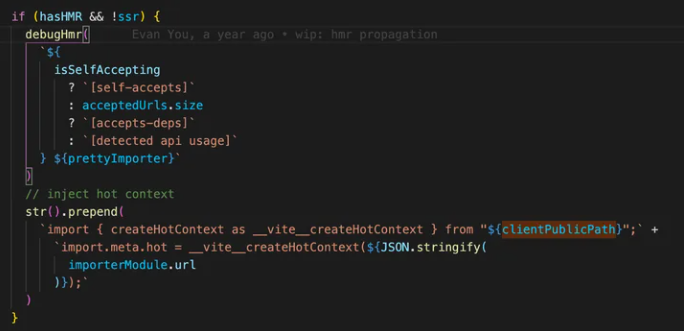

当接收到服务端推送的消息，通过不同的消息类型做相应的处理，如(connected、update、custom...)，在实际开发热更新中使用最频繁的是update(动态加载热更新模块)和full-reload(刷新整个页面)事件。

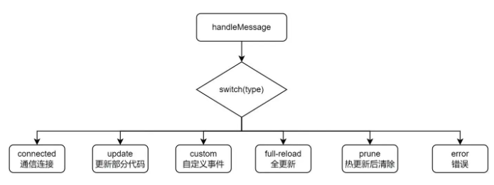


**优化：浏览器的缓存策略提高响应速度**

> 同时，Vite 还利用HTTP加速整个页面的重新加载。设置响应头使得依赖模块(dependency module)进行强缓存，而源码文件通过设置 304 Not Modified 而变成可依据条件而进行更新。

若需要对依赖代码模块做改动可手动操作使缓存失效:

```bash
$ vite --force
```
或者手动删除 node_modules/.``vite 中的缓存文件。


## 基于esbuild的依赖预编译优化

###  为什么需要预构建？

1. 支持commonJS依赖
2. 上面提到Vite是基于浏览器原生支持ESM的能力实现的，但要求用户的代码模块必须是ESM模块，因此必须将commonJs的文件提前处理，转化成 ESM 模块并缓存入 node_modules/.vite
3. 减少模块和请求数量

除此之外，我们常用的lodash工具库，里面有很多包通过单独的文件相互导入，而 lodash-es这种包会有几百个子模块，当代码中出现 import { debounce } from 'lodash-es' 会发出几百个 HTTP 请求，这些请求会造成网络堵塞，影响页面的加载。

Vite 将有许多内部模块的 ESM 依赖关系转换为单个模块，以提高后续页面加载性能。

通过预构建 lodash-es 成为一个模块，也就只需要一个 HTTP 请求了！

### 为什么使用Esbuild?

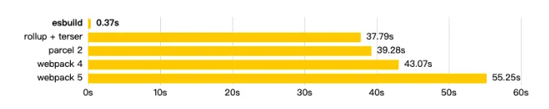

这是Esbuild首页的图。新一代的打包工具，提供了与Webpack、Rollup、Parcel 等工具相似的资源打包能力，但在时速上达到**10～100倍**的差距，耗时是Webpack2%~3%

1. 编译运行 VS 解释运行

大多数前端打包工具都是基于 JavaScript 实现的，大家都知道JavaScript是解释型语言，边运行边解释。而 Esbuild 则选择使用 Go 语言编写，该语言可以编译为原生代码,在编译的时候都将语言转为机器语言，在启动的时候直接执行即可，在 CPU 密集场景下，Go 更具性能优势。

2. 多线程 VS 单线程

JavaScript 本质上是一门单线程语言，直到引入 WebWorker 之后才有可能在浏览器、Node 中实现多线程操作。就我对Webpack的源码理解，其源码也并未使用 WebWorker 提供的多线程能力。而GO天生的多线程优势。
对构建流程进行了优化，充分利用 CPU 资源

### esbuild 实现原理？

Vite预编译之后，将文件缓存在node_modules/.vite/文件夹下。根据以下地方来决定是否需要重新执行预构建。

- package.json中：dependencies发生变化
- 包管理器的lockfile

如果想强制让Vite重新预构建依赖，可以使用--force启动开发服务器，或者直接删掉node_modules/.vite/文件夹。

### 核心代码实现

1. 通过createServer创建server对象后，当服务器启动会执行httpServer.listen方法
2. 在执行createServer时，Vite底层会重写server.listen方法:首先调用插件的buildStart再执行runOptimize()方法
3. runOptimize()调用optimizeDeps()和createMissingImporterRegisterFn()方法

```ts
const runOptimize = async () => {
    if (config.cacheDir) {
      server._isRunningOptimizer = true
      try {
        server._optimizeDepsMetadata = await optimizeDeps(
          config,
          config.server.force || server._forceOptimizeOnRestart
        )
      } finally {
        server._isRunningOptimizer = false
      }
      server._registerMissingImport = createMissingImporterRegisterFn(server)
    }
  }
if (!middlewareMode && httpServer) {
  let isOptimized = false
  // overwrite listen to run optimizer before server start
  const listen = httpServer.listen.bind(httpServer)
  httpServer.listen = (async (port: number, ...args: any[]) => {
    if (!isOptimized) {
      try {
        await container.buildStart({})
        await runOptimize()
        isOptimized = true
      } catch (e) {
        httpServer.emit('error', e)
        return
      }
    }
    return listen(port, ...args)
  }) as any
} else {
  await container.buildStart({})
  await runOptimize()
}
```

 **整体的流程图**

核心代码都在packages/``vite``/``src``/``node``/optimizer/index.ts里面

- 自动搜寻依赖主要模块：esbuildScanPlugin
- 预构建编译主要模块：esbuildDepPlugin

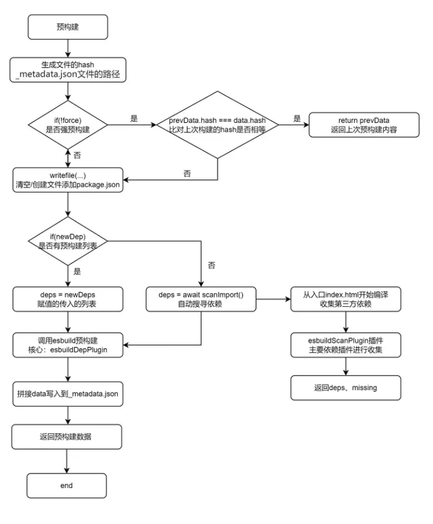


### vite基于Rollup的 Plugins

> Vite 从 preact 的 WMR 中得到了启发，将Vite Plugins继承Rollup`` Plugins `` ``API，在其基础上进行了一些扩展(如Vite特有的钩子等)，同时Vite也基于Rollup plugins机制提供了强大的插件API。目前和 Vite 兼容或者内置的插件，可以查看vite-rollup-plugins


使用Vite插件可以扩展Vite能力，通过暴露一些构建打包过程的一些时机配合工具函数，让用户可以自定义地写一些配置代码，执行在打包过程中。比如解析用户自定义的文件输入，在打包代码前转译代码，或者查找。


### Vite独有钩子

1. config：可以在Vite被解析之前修改Vite的相关配置。钩子接收原始用户配置config和一个描述配置环境的变量env
2. configResolved：解析Vite配置后调用，配置确认
3. configureserver：主要用来配置开发服务器，为dev-server添加自定义的中间件
4. transformindexhtml：主要用来转换index.html，钩子接收当前的 HTML 字符串和转换上下文
5. handlehotupdate：执行自定义HMR更新，可以通过ws往客户端发送自定义的事件

### vite 钩子调用

1. 服务启动时调用一次
  - options: 获取、操纵Rollup选项
  - buildstart：开始创建

2. 在每个传入模块请求时被调用
  - resolveId: 创建自定义确认函数，可以用来定位第三方依赖
  - load：可以自定义加载器，可用来返回自定义的内容
  - transform：在每个传入模块请求时被调用，主要是用来转换单个模块

3. 服务关闭时调用一次
  - buildend：在服务器关闭时被调用
  - closeBundle

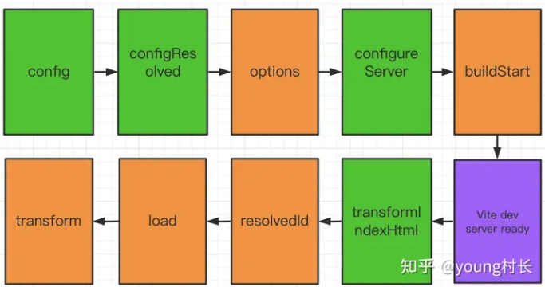


Vite的官网可以看出：Vite插件可以用一个 enforce 属性（类似于 Webpack加载器）来调整它的应用顺序。enforce 的值可以是pre 或 post。解析后的插件将按照以下顺序排列：

1. Alias
2. enforce:'pre'的自定义插件
3. Vite核心插件
4. 没有enforce的自定义插件
5. Vite构建用的插件
6. enforce:'post'的自定义插件
7. Vite后置构建插件

## 总结

优点：
1. 快速的冷启动: 采用No Bundle和esbuild预构建，速度远快于Webpack
2. 高效的热更新：基于ESM实现，同时利用HTTP头来加速整个页面的重新加载，增加缓存策略
3. 真正的按需加载: 基于浏览器ESM的支持，实现真正的按需加载

缺点：
1. 生态系统兼容性
  - 插件生态：虽然 Vite 的插件生态正在迅速增长，但它可能还没有 Webpack 那样成熟和广泛。一些特定的 Webpack 插件可能没有直接的 Vite 等价物，需要寻找替代品或等待社区支持。
2. 遗留项目兼容性
  - 迁移复杂性：对于使用了复杂 Webpack 配置的遗留项目，迁移到 Vite 可能会遇到挑战。Vite 侧重于现代 JavaScript，遗留项目可能需要额外的配置或重构才能兼容。
3. 生产构建差异
  - 构建优化：虽然 Vite 使用 Rollup 进行生产构建，以实现优秀的打包优化，但某些 Webpack 的高级优化配置可能需要手动调整才能在 Vite 中复现。
4. 多页面应用（MPA）支持
  - MPA配置：虽然 Vite 支持多页面应用，但其配置相对于使用 Webpack 可能更为复杂，特别是在处理复杂的资源链接和代码拆分时。
5. 服务端渲染（SSR）支持
  - SSR限制：Vite 提供了对 SSR 的支持，但与专门为 SSR 或静态站点生成（如 Next.js 或 Nuxt.js）设计的框架相比，其实现可能更为基础，需要开发者进行更多的手动配置和优化。
6. 跨浏览器兼容性
  - 旧浏览器支持：由于 Vite 在开发模式下依赖现代浏览器的原生 ES 模块支持，对旧浏览器的支持较差。虽然生产构建可以通过转译和 polyfills 支持旧浏览器，但在开发过程中可能无法完全体验 Vite 的所有优势。
