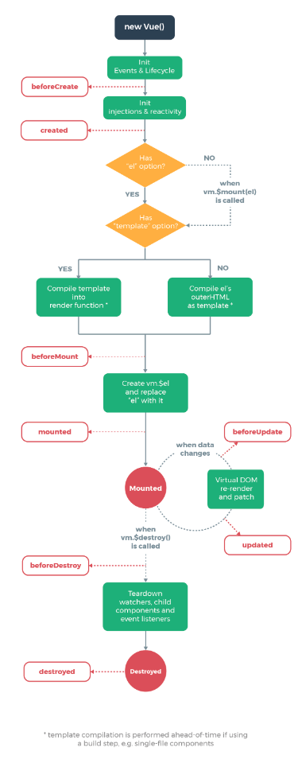

# Vue

> Vue.js 是一款流行的前端 JavaScript 框架，用于构建用户界面和单页面应用。它的核心思想是通过数据驱动视图，将页面抽象成一个组件树，每个组件都包含了自己的 HTML 模板、JavaScript 代码和样式。

## Vue 组成

1. 响应式数据：
  - Vue.js 提供了响应式的数据绑定机制，当数据发生变化时，相关的视图会自动更新。这使得开发者无需手动操作 DOM，只需关注数据的变化，Vue.js 就会帮助你更新页面。
2. 组件化开发：
  - Vue.js 支持组件化开发，将页面划分为多个独立的组件，每个组件包含自己的模板、脚本和样式。组件可以复用、嵌套和组合，使得代码更加模块化和可维护。
3. 指令和事件：
  - Vue.js 提供了丰富的指令和事件，用于处理用户交互和页面逻辑。例如 v-bind 用于绑定数据到 HTML 属性、v-on 用于监听事件、v-if 和 v-for 用于条件渲染和列表渲染等。
4. 生命周期钩子：
  - Vue.js 组件具有生命周期钩子函数，可以在组件的不同阶段执行相应的逻辑。常用的生命周期钩子包括 created、mounted、updated 和 destroyed 等。
5. Vue Router：
  - Vue.js 提供了官方的路由库 Vue Router，用于实现单页面应用的路由管理。Vue Router 支持路由嵌套、路由参数、路由导航守卫等功能，使得页面的路由管理变得简单而灵活。
6. Vuex：
  - Vuex 是 Vue.js 的状态管理库，用于集中管理应用的状态。Vuex 实现了一个单一的全局状态树，并提供了一些 API 和规则保证状态的改变只能通过提交 mutation 来进行，使得状态变化可追踪和可调试。
7. 服务端渲染：
  - Vue.js 支持服务端渲染（SSR），可以在服务器端预先渲染出页面的 HTML 内容，然后将其发送给客户端，提高页面的加载性能和 SEO。

## Vue 执行过程

1. 初始化阶段：
  - 创建 Vue 实例，进行初始化参数的合并和设置。
  - 初始化生命周期钩子函数，并执行 beforeCreate 生命周期钩子。
  - 初始化数据响应式，包括对数据进行劫持和监听，建立数据与视图的关联。
  - 初始化事件监听器，包括对组件内部事件的绑定和处理。

2. 编译阶段：
  - 编译模板，将模板字符串编译成渲染函数。
  - 解析模板中的指令和事件，生成对应的渲染函数代码。
  - 优化渲染函数，生成 VNode 节点树。

3. 挂载阶段：
  - 执行 beforeMount 生命周期钩子。
  - 将 VNode 节点树渲染成真实的 DOM 元素。
  - 将渲染后的 DOM 元素挂载到页面上。
  - 执行 mounted 生命周期钩子。

4. 更新阶段：
  - 监听数据变化，当数据发生变化时，触发响应式更新。
  - 执行 beforeUpdate 生命周期钩子。
  - 重新生成 VNode 节点树。
  - 使用虚拟 DOM 比对新旧 VNode 节点树，找出差异并更新视图。
  - 执行 updated 生命周期钩子。

5. 销毁阶段：
  - 调用 beforeDestroy 生命周期钩子。
  - 清除事件监听器。
  - 销毁子组件。
  - 执行 destroyed 生命周期钩子。

总的来说，Vue.js 在执行过程中主要包括初始化、编译、挂载、更新和销毁等阶段，每个阶段都有相应的生命周期钩子函数可以进行扩展和处理。这些阶段和操作保证了 Vue.js 应用能够正确地初始化、渲染、更新和销毁，实现了数据与视图的同步更新和管理。

