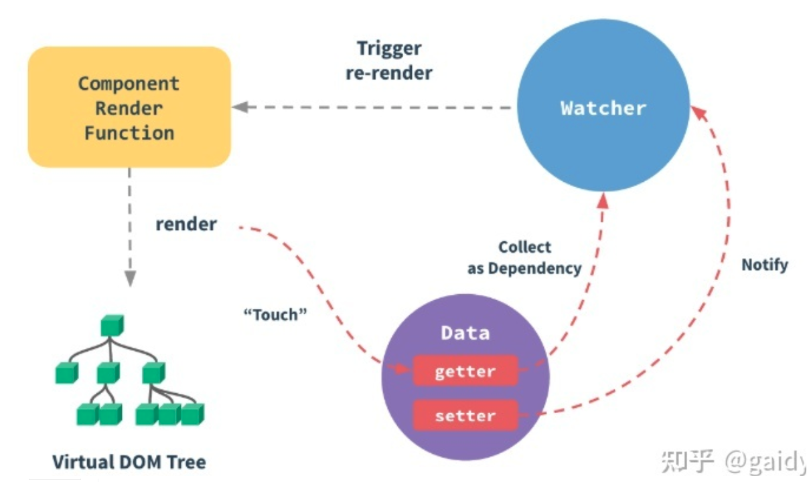

# Vue 响应式原理

> Vue 的响应式原理是 Vue.js 框架的核心之一，它使得当数据发生变化时，相关的视图会自动更新，从而实现了数据和视图的绑定。



1. 数据劫持（Data Observation）：Vue 使用了数据劫持的技术，通过 Object.defineProperty() 方法来劫持对象的属性，监听属性的读取和写入操作，从而实现对数据的观测。
2. 依赖收集（Dependency Collection）：在组件渲染过程中，Vue 会建立虚拟 DOM 和数据之间的联系，当数据被访问时，会收集对应的依赖（Watcher），建立依赖关系图。
3. 响应式数据更新（Reactive Data Update）：当数据发生变化时，Vue 会通知相关的依赖（Watcher）进行更新，从而触发相应的视图更新。
4. 批量异步更新（Batched Asynchronous Updates）：Vue 会对数据变化进行批量处理，并使用异步更新队列来确保在一次事件循环中完成所有的视图更新，提高性能。

## 源码实现

Vue.js 的响应式原理是通过使用 Object.defineProperty 或 Proxy 对象来劫持对象的属性的读取和设置操作，从而实现对数据的监听和响应。当数据发生变化时，Vue.js 能够自动更新相关的视图。

1. 初始化阶段：

在 Vue 实例初始化阶段，Vue 会对数据进行递归遍历，对每个属性都通过 Object.defineProperty 或 Proxy 进行劫持，为其添加 getter 和 setter。这样当数据被访问或修改时，Vue 就能够捕获到，并触发相应的更新操作。

2. getter 函数：

对象的 getter 函数负责收集依赖，当一个属性被读取时，Vue 会将当前的 Watcher 对象添加到该属性的依赖列表中，用于在数据更新时通知 Watcher 执行更新操作。

3. setter 函数：

对象的 setter 函数负责派发更新，当一个属性被修改时，Vue 会触发该属性的 setter 函数，然后遍历依赖列表，逐个通知 Watcher 执行更新操作。

## 代码示例

case1:

```html
<!DOCTYPE html>
<html lang="en">
<head>
  <meta charset="UTF-8">
  <meta name="viewport" content="width=device-width, initial-scale=1.0">
  <title>Vue Reactive Example</title>
</head>
<body>

<div id="app">
  <p>{{ message }}</p>
  <button @click="changeMessage">Change Message</button>
</div>

<script src="https://cdn.jsdelivr.net/npm/vue/dist/vue.js"></script>
<script>
  // 创建 Vue 实例
  const vm = new Vue({
    el: '#app',
    data: {
      message: 'Hello, Vue!'
    },
    methods: {
      changeMessage() {
        // 修改数据
        this.message = 'Hello, Reactive Vue!';
      }
    }
  });

  // 模拟 Vue 的响应式原理
  function defineReactive(obj, key, val) {
    let value = val;
    Object.defineProperty(obj, key, {
      get() {
        console.log(`Getter: ${key} = ${value}`);
        return value;
      },
      set(newValue) {
        console.log(`Setter: ${key} = ${newValue}`);
        if (newValue !== value) {
          value = newValue;
          // 模拟通知更新
          updateView();
        }
      }
    });
  }

  function updateView() {
    console.log('View Updated');
    // 更新视图的代码可以放在这里
  }

  // 模拟 Vue 对数据的劫持
  defineReactive(vm, 'message', vm.message);

  // 模拟点击按钮后修改数据的过程
  setTimeout(() => {
    vm.changeMessage();
  }, 1000);
</script>

</body>
</html>

```

case2:

```js
function observer(value, cb) {
  Object.keys(value).forEach(key => defineReactive(value,key,value[key], cb))
}

function defineReactive(obj,key,val,cb) {
  Object.defineProperty(obj,key, {
    enumerable: true,
    configurable: true,
    get() {
      console.log('getter 触发')
      return val
    },
    set(newVal) {
      console.log('setter 触发')
      val = newVal
      cb()
    }
  })
}

class Vue {
  constructor(options) {
    // 挂载 _data
    this._data = options.data
    // 响应式
    observer(this._data, options.render)
  }
}
let app = new Vue({
  el: '#app',
  data: {
      text: 'text',
      text2: 'text2'
  },
  render(){
      console.log("render");
  }
})

console.log(app._data.text) // text
console.log(app.text) // undefined
```

case3:

> 绑定 this，将属性挂载到 this 对象上


```js
function observer(value, cb) {
  Object.keys(value).forEach(key => defineReactive(value,key,value[key], cb))
}

function defineReactive(obj,key,val,cb) {
  Object.defineProperty(obj,key, {
    enumerable: true,
    configurable: true,
    get() {
      console.log('getter 触发')
      return val
    },
    set(newVal) {
      console.log('setter 触发')
      val = newVal
      cb()
    }
  })
}


function proxy(data) {
  Object.keys(data).forEach(key => {
    Object.defineProperty(this, key, {
      enumerable: true,
      configurable: true,
      get: () => {
        // 将_data上的数据，代理到this上
        return this._data[key]
      },
      set: (newVal) => {
        this._data[key] = newVal
      }
    })
  })
}

class Vue {
  constructor(options) {
    // 挂载 _data
    this._data = options.data
    // 响应式
    observer(this._data, options.render)
    // 数据代理
    proxy.call(this, options.data)
  }
}
let app = new Vue({
  el: '#app',
  data: {
      text: 'text',
      text2: 'text2'
  },
  render(){
      console.log("render");
  }
})
console.log(app._data.text) // text
console.log(app.text) // text
```