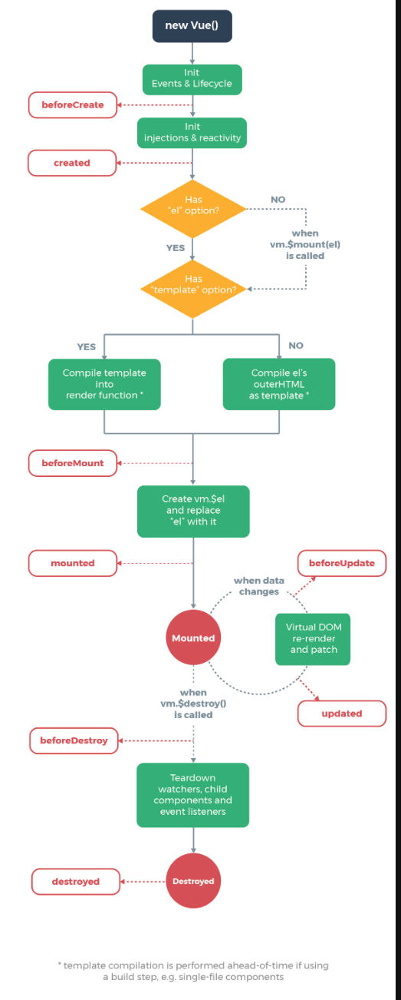

# 生命周期

> 每个阶段都有两个生命周期钩子函数。

- 创建阶段--beforeCreate，created
- 挂载阶段--beforeMount，mounted
- 更新阶段--beforeUpdate，updated
- 销毁阶段--beforeDestroy，destroyed
- 激活、停用阶段--activated/deactivated

## 流程图




## 创建阶段（Creation）

> 在 Vue.js 组件的创建阶段，主要涉及了 beforeCreate 和 created 两个生命周期钩子函数。

```js
function Vue(options) {
  this._init(options);
}

Vue.prototype._init = function(options) {
  // 初始化数据
  this.$options = options;
  // 初始化生命周期钩子函数
  this.$options.beforeCreate.forEach(hook => hook.call(this));
  // 初始化数据观测
  this._initData();
  // 其他初始化操作
  // ...

  // 调用 created 钩子函数
  this.$options.created.forEach(hook => hook.call(this));
};
```

### 1. beforeCreate 钩子函数

触发时机：
  - beforeCreate 钩子函数在 Vue 实例被初始化之后，数据观测 (data observer) 和 event/watcher 事件配置之前被调用。

主要作用：
  - 在此阶段，Vue 实例已经创建，但是还没有初始化数据观测和事件处理。
  - 通常在 beforeCreate 钩子函数中无法访问 data、computed、methods 等数据和方法，因为它们在此时还未被初始化。
  - 可以执行一些与 Vue 实例初始化相关的操作，例如：
    - 设置组件的初始状态。
    - 执行一些异步操作，例如发送网络请求或订阅事件。

### 2. created 钩子函数

触发时机：
  - created 钩子函数在 Vue 实例创建完成，数据观测 (data observer) 和 event/watcher 事件配置已完成之后被调用。
主要作用：
  - 在此阶段，Vue 实例已经创建完成，并且数据观测和事件处理也已经完成。
  - 可以访问 data、computed、methods 等数据和方法。
  - 通常在 created 钩子函数中执行一些需要使用到 Vue 实例的操作，例如：
    - 修改数据状态。
    - 执行一些初始化操作，例如获取数据或订阅事件。
    - 执行一些需要在模板渲染之前完成的操作，例如设置定时器或监听窗口 resize 事件。


## 挂载阶段（Mounting）

> 在 Vue.js 组件的挂载阶段，主要涉及了 beforeMount 和 mounted 两个生命周期钩子函数。


```js
Vue.prototype._mount = function(el) {
  // 将根 DOM 元素保存到 Vue 实例中
  this.$el = el;
  // 调用 beforeMount 钩子函数
  callHook(this, 'beforeMount');
  const vnode = this._render();
  // 执行挂载操作
  this._update(vnode);
  // 调用 mounted 钩子函数
  callHook(this, 'mounted');
};

function callHook(vm, hook) {
  const handlers = vm.$options[hook];
  if (handlers) {
    for (let i = 0, j = handlers.length; i < j; i++) {
      handlers[i].call(vm);
    }
  }
}

Vue.prototype._update = function(vnode) {
  // 渲染虚拟 DOM 到真实 DOM 上
  const prevVnode = this._vnode;
  this._vnode = vnode;
  if (!prevVnode) {
    // 初次渲染
    this.$el = this.__patch__(this.$el, vnode);
  } else {
    // 更新渲染
    this.$el = this.__patch__(prevVnode, vnode);
  }
};

Vue.prototype._render = function() {
  // 调用渲染函数生成虚拟 DOM
  const vnode = this.$options.render.call(this, this.$createElement);
  return vnode;
};
```

### 1. beforeMount 钩子函数

触发时机：
  - beforeMount 钩子函数在 Vue 实例挂载到 DOM 之前被调用。
  - 在这个阶段，模板已经编译完成，但是尚未将虚拟 DOM 渲染到真实的 DOM 上。

主要作用：
  - 在 beforeMount 钩子函数中，可以访问到 Vue 实例的数据和方法，并且可以操作 DOM。
  - 通常在这个阶段执行一些需要在组件挂载到 DOM 之前完成的操作，例如：
    - 修改数据状态。
    - 执行一些操作来准备将组件挂载到 DOM 上。

### 2. mounted 钩子函数

触发时机：
  - mounted 钩子函数在 Vue 实例挂载到 DOM 后被调用。
  - 在这个阶段，Vue 实例已经被挂载到 DOM 上，可以执行 DOM 操作。

主要作用：
  - 在 mounted 钩子函数中，可以访问到已经挂载到 DOM 上的 Vue 实例，并且可以执行 DOM 操作。
  - 通常在这个阶段执行一些需要在组件挂载到 DOM 后完成的操作，例如：
    - 获取已挂载元素的大小和位置信息。
    - 执行一些初始化操作，例如绑定事件监听器。

## 更新阶段（Updating）

> 更新阶段是 Vue.js 组件生命周期中的一个重要阶段，用于处理数据发生变化后的更新操作。在更新阶段，主要涉及了 beforeUpdate 和 updated 两个生命周期钩子函数。

```js
Vue.prototype._update = function(vnode) {
  // 保存之前的虚拟 DOM
  const prevVnode = this._vnode;
  // 更新当前的虚拟 DOM
  this._vnode = vnode;
  // 调用 beforeUpdate 钩子函数
  callHook(this, 'beforeUpdate');
  // 执行更新操作，将新的虚拟 DOM 渲染到真实 DOM 上
  this.$el = this.__patch__(prevVnode, vnode);
  // 调用 updated 钩子函数
  callHook(this, 'updated');
};

function callHook(vm, hook) {
  const handlers = vm.$options[hook];
  if (handlers) {
    for (let i = 0, j = handlers.length; i < j; i++) {
      handlers[i].call(vm);
    }
  }
}

Vue.prototype.__patch__ = function(oldVnode, vnode) {
  // 如果旧的虚拟 DOM 不存在，则说明是初次渲染，直接创建新的真实 DOM 并返回
  if (!oldVnode) {
    return this.__createElm(vnode);
  }
  // 如果旧的虚拟 DOM 和新的虚拟 DOM 是同一个节点，则执行更新操作
  if (sameVnode(oldVnode, vnode)) {
    this.__patchVnode(oldVnode, vnode);
    return oldVnode.elm;
  }
  // 如果旧的虚拟 DOM 和新的虚拟 DOM 不是同一个节点，则销毁旧的虚拟 DOM，并创建新的真实 DOM
  const oldEl = oldVnode.elm;
  const parent = oldEl.parentNode;
  const el = this.__createElm(vnode);
  parent.insertBefore(el, oldEl.nextSibling);
  parent.removeChild(oldEl);
  return el;
};

// 判断两个虚拟 DOM 是否是同一个节点
function sameVnode(vnode1, vnode2) {
  return vnode1.key === vnode2.key && vnode1.tag === vnode2.tag;
}

// 创建真实 DOM
Vue.prototype.__createElm = function(vnode) {
  const { tag, children, text } = vnode;
  if (typeof tag === 'string') {
    vnode.elm = document.createElement(tag);
    if (Array.isArray(children)) {
      children.forEach(childVnode => {
        this.__createElm(childVnode);
        vnode.elm.appendChild(childVnode.elm);
      });
    } else if (typeof text === 'string') {
      vnode.elm.textContent = text;
    }
  } else {
    vnode.elm = document.createTextNode(text);
  }
  return vnode.elm;
};

// 更新虚拟 DOM
Vue.prototype.__patchVnode = function(oldVnode, vnode) {
  // 省略实现，使用 diff 算法更新真实 DOM
};
```


### 1. beforeUpdate 钩子函数

触发时机：
  - beforeUpdate 钩子函数在数据更新导致重新渲染之前被调用。
  - 在这个阶段，虚拟 DOM 已经重新渲染，但尚未将更新的内容应用到真实的 DOM 上。

主要作用：
  - 在 beforeUpdate 钩子函数中，可以访问到更新前的 DOM 和数据。
  - 通常在这个阶段执行一些在更新之前需要做的操作，例如：
    - 访问更新前的 DOM，执行一些 DOM 操作。
    - 访问更新前的数据，执行一些数据处理。

### 2. updated 钩子函数

触发时机：
  - updated 钩子函数在数据更新导致重新渲染并应用到 DOM 上之后被调用。
  - 在这个阶段，虚拟 DOM 已经重新渲染，并且更新的内容已经应用到真实的 DOM 上。

主要作用：
  - 在 updated 钩子函数中，可以访问到更新后的 DOM 和数据。
  - 通常在这个阶段执行一些在更新之后需要做的操作，例如：
    - 访问更新后的 DOM，执行一些 DOM 操作。
    - 访问更新后的数据，执行一些数据处理。

## 销毁阶段（Destruction）

> 在 Vue.js 组件的销毁阶段，主要涉及了 beforeDestroy 和 destroyed 两个生命周期钩子函数。

```js
Vue.prototype.$destroy = function() {
  // 调用 beforeDestroy 钩子函数
  callHook(this, 'beforeDestroy');
  // 执行销毁操作
  this.__cleanup();
  // 调用 destroyed 钩子函数
  callHook(this, 'destroyed');
};

function callHook(vm, hook) {
  const handlers = vm.$options[hook];
  if (handlers) {
    for (let i = 0, j = handlers.length; i < j; i++) {
      handlers[i].call(vm);
    }
  }
}

Vue.prototype.__cleanup = function() {
  // 执行销毁操作，例如取消定时器、解绑事件等
  // 这里只是一个示例，具体操作根据实际需求而定
};
```

### 1. beforeDestroy 钩子函数

触发时机：
  - beforeDestroy 钩子函数在实例销毁之前被调用。
  - 在这个阶段，Vue 实例仍然完全可用。

主要作用：
  - 在 beforeDestroy 钩子函数中，可以执行一些在销毁之前需要做的清理操作。
  - 通常在这个阶段执行一些清理操作，例如取消定时器、取消订阅事件等。


### 2. destroyed 钩子函数

触发时机：
  - destroyed 钩子函数在实例销毁之后被调用。
  - 在这个阶段，Vue 实例已经完全被销毁，所有的事件监听器被移除，所有的子实例被销毁。

主要作用：
  - 在 destroyed 钩子函数中，可以执行一些在销毁之后需要做的操作。
  - 通常在这个阶段执行一些清理操作或释放资源，例如清除缓存、解绑事件等。


## 激活和停用阶段（Activation/Deactivation）

> 在 Vue.js 组件的生命周期中，激活和停用阶段通常用于处理组件的可见性变化，例如组件被插入或从 DOM 中移除。这两个阶段涉及了 activated、deactivated 钩子函数以及组件的 keep-alive 功能。

```js
Vue.prototype.__patch__ = function(oldVnode, vnode) {
  // 省略其他实现，只展示激活和停用相关的部分
  if (vnode.data.keepAlive) {
    if (oldVnode && oldVnode.componentInstance) {
      // 如果是从缓存中激活的组件，则调用 activated 钩子函数
      callHook(oldVnode.componentInstance, 'activated');
    } else {
      // 如果是初次渲染，则执行激活操作
      activateComponent(vnode.componentInstance);
    }
  }
};

function activateComponent(vm) {
  // 执行激活操作，将组件插入到 DOM 中
  // 省略实现细节
  // 调用 activated 钩子函数
  callHook(vm, 'activated');
}

Vue.prototype.__patch__ = function(oldVnode, vnode) {
  // 省略其他实现，只展示激活和停用相关的部分
  if (vnode.data.keepAlive) {
    if (!vnode.componentInstance) {
      // 如果组件被移出缓存，则调用 deactivated 钩子函数
      callHook(oldVnode.componentInstance, 'deactivated');
    }
  }
};
```

### 1. 激活阶段

触发时机：
  - 激活阶段与 Vue 实例的 keep-alive 功能相关联，当组件被插入到 keep-alive 组件中时触发。
  - 在这个阶段，组件从缓存中激活，并重新插入到 DOM 中。

主要作用：
  - 在激活阶段，activated 钩子函数会被调用。
  - 通常在这个阶段执行一些需要在组件重新激活后执行的操作，例如重新加载数据、重新注册事件等。

### 2. 停用阶段

触发时机：
  - 停用阶段与 Vue 实例的 keep-alive 功能相关联，当组件被移出 keep-alive 组件时触发。
  - 在这个阶段，组件被移出 DOM，并缓存起来。

主要作用：
  - 在停用阶段，deactivated 钩子函数会被调用。
  - 通常在这个阶段执行一些需要在组件停用后执行的操作，例如清除数据、解绑事件等。