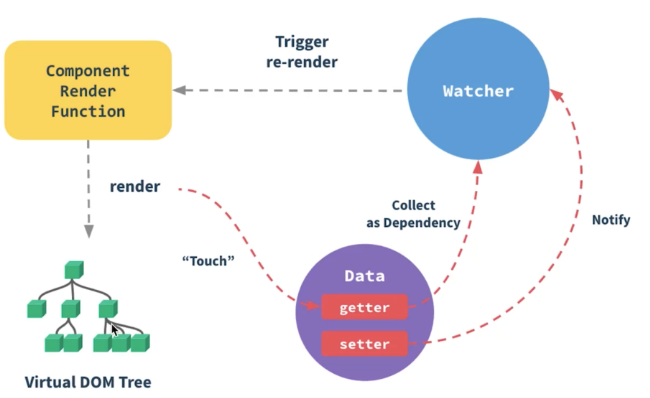

# Vue 组件渲染过程

## 流程图



## 1.编译 vue template 模板

> 编译 Vue 模板的过程可以通过 vue-template-compiler 模块来实现。

```js
const compiler = require('vue-template-compiler');

// Vue 模板
const template = `
  <div>
    <h1>{{ message }}</h1>
    <button @click="handleClick">Click me</button>
  </div>
`;

// 编译 Vue 模板
const compiled = compiler.compile(template);

// 输出编译结果
console.log(compiled.render);
```


## 2.生成 Virtual DOM

> 生成 Virtual DOM 的过程实际上是执行渲染函数，将模板转换为 Virtual DOM。

```js
const Vue = require('vue');

// 渲染函数
const render = function(createElement) {
  return createElement('div', [
    createElement('h1', this.message),
    createElement('button', { on: { click: this.handleClick } }, 'Click me')
  ]);
};

// 创建 Vue 实例
const vm = new Vue({
  data() {
    return {
      message: 'Hello, Vue!'
    };
  },
  methods: {
    handleClick() {
      this.message = 'Hello, World!';
    }
  },
  render
});

// 执行渲染函数，生成 Virtual DOM
const vnode = vm.$options.render.call(vm, Vue.prototype.$createElement);

// 输出生成的 Virtual DOM
console.log(vnode);
```

## 3.收集依赖

> 对于 Vue 来说，依赖收集是在执行渲染函数时触发的，在执行渲染函数时，会自动触发数据的读取操作，从而将模板中使用到的数据进行依赖收集。这是因为 Vue 使用了响应式系统，当数据被读取时，会自动添加依赖关系。

```js
let activeWatcher = null;

class Dep {
  constructor() {
    this.subscribers = new Set(); // 订阅者集合
  }

  // 添加订阅者
  depend() {
    if (activeWatcher) {
      this.subscribers.add(activeWatcher);
    }
  }

  // 通知订阅者更新
  notify() {
    this.subscribers.forEach(subscriber => subscriber.update());
  }
}


class Watcher {
  constructor(vm, expression, callback) {
    this.vm = vm; // Vue 实例
    this.expression = expression; // 表达式
    this.callback = callback; // 回调函数
    this.value = this.getValue(); // 初始化值
  }

  // 获取当前值
  getValue() {
    activeWatcher = this;
    let value = this.vm[this.expression];
    activeWatcher = null;
    return value;
  }

  // 更新方法
  update() {
    const oldValue = this.value;
    this.value = this.getValue();
    this.callback.call(this.vm, this.value, oldValue);
  }
}

// Vue 实例
const vm = {
  data: {
    message: 'Hello, Vue!'
  }
};

// 定义依赖
const dep = new Dep();

// 创建 Watcher 实例，观察依赖
const watcher = new Watcher(vm, 'data.message', (newValue, oldValue) => {
  console.log(`数据发生变化：${oldValue} => ${newValue}`);
});

// 读取数据，触发依赖收集
dep.depend();

// 模拟数据变化
vm.data.message = 'Hello, World!';

// 通知依赖更新
dep.notify();

```

- Dep 类表示一个依赖对象，包含了订阅者集合以及添加订阅者和通知订阅者更新的方法。
- Watcher 类表示一个观察者对象，用于观察数据的变化，并在数据变化时执行回调函数。
- 在 Vue 实例中，定义了一个数据对象 vm.data.message。
- 创建了一个依赖对象 dep，并添加了一个订阅者。
- 创建了一个 Watcher 实例 watcher，观察 vm.data.message 数据的变化，并在变化时执行回调函数。
- 模拟数据变化后，通知依赖更新，触发订阅者的更新操作。


## 4.观察依赖

> 将收集到的依赖放入 Watcher 进行观察

## 5.更新依赖

> 当收集到的依赖被修改时，会 Notify 通知 Watcher 更新依赖

## 6.重新渲染

Watcher 触发重新渲染 re-render，组件更新