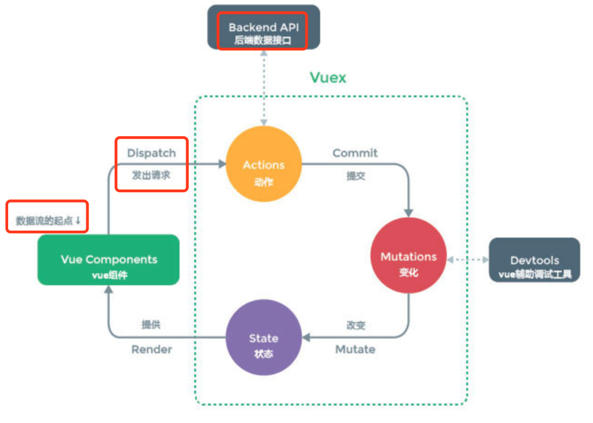

# vuex 数据流转

## 流程图



```
       ┌───────────────┐
       │   Component   │
       └───────┬───────┘
               │
       dispatch│
               ▼
       ┌───────────────┐
       │    Actions    │──────┐
       └───────────────┘      │
                              │ async
                              │ operations
       ┌───────────────┐      │
       │   Mutations   │◄─────┘
       └───────────────┘
               │
      commit   │
               ▼
       ┌───────────────┐
       │     State     │
       └───────────────┘
               │
        read    │
               ▼
       ┌───────────────┐
       │   Component   │
       └───────────────┘
               │
       update  │
               ▼
       ┌───────────────┐
       │   Getters     │
       └───────────────┘

```

- 组件：Vue组件是用户界面的基础。组件负责触发actions（通过dispatch）和读取state（直接访问或通过getters）。
- Actions：Actions是处理异步操作的地方。一个action被触发后，可以执行异步操作（如API请求），然后提交一个mutation。
- Mutations：Mutations是唯一修改state的地方，且必须是同步函数。当需要更改状态时，action会提交（commit）一个mutation。
- State：State是存储应用状态的地方。它是数据的源头，在这里定义的数据可以被组件读取和监听。
- Getters：Getters是Vuex的计算属性。当state中的数据需要经过转换后才能使用时，可以使用getters来提供这些派生状态。

## 实现原理

> Vuex 的实现原理基于 Vue.js 的响应式系统。其核心是利用 Vue 实例来响应式地处理状态的变化，并通过一套定义良好的流程（actions、mutations、state、getters）来管理状态变化，确保状态变更的可追踪性和可维护性。

以下是 Vuex 实现原理的关键点：

### 响应式状态

- Vue 响应式系统：Vuex 的状态存储是基于 Vue 实例的，这意味着 Vuex 的 state 是响应式的。当 Vue 组件从 Vuex state 读取状态时，如果状态变化，那些依赖这些状态的组件会自动重新渲染。
- 单一状态树：Vuex 使用单一状态树 —— 也就是说，用一个对象包含了全部的应用层级状态。这个对象需要传递给 Vuex.Store 的实例，从而让 Vuex 能够管理应用的所有状态。
  - 集中管理：应用的所有状态（数据）集中存储在单个 store 中，而不是分散在各个组件中。这包括应用的数据、UI状态等。
  - 单一来源：因为所有状态都存储在一个地方，所以状态的来源是单一的。无论应用的哪个部分需要某个状态，都是从同一个地方获取，这有助于确保状态的一致性。
  - 易于维护：当应用规模变大时，如果状态分散在各处，管理和维护状态会变得复杂。单一状态树使状态的管理变得集中和统一，提高了可维护性。
  - 便于调试：由于所有状态变化都通过 Vuex 的 mutations 进行，这使得状态变化的追踪和调试变得更加简单。Vuex 提供的开发工具可以帮助开发者查看状态变化的历史记录和时光旅行调试。
  - 响应式：Vuex 利用 Vue 的响应式机制，确保状态的变化能够实时反映到视图上。当状态更新时，依赖这些状态的组件会自动更新。

### 状态读取与变更

- Getters：为了从 state 中派生出一些状态，Vuex 允许我们在 store 中定义“getters”（可以认为是 store 的计算属性）。Getters 会暴露为 store.getters 对象，可以在组件中像访问计算属性那样访问这些值。
- Mutations：Vuex 中的 mutations 非常类似于事件：每个 mutation 都有一个字符串的事件类型 (type) 和 一个回调函数 (handler)。这个回调函数就是我们实际进行状态更改的地方，并且它会接受 state 作为第一个参数。Mutation 必须是同步函数，这是 Vuex 中进行状态更改的唯一方式。
- Actions：与 mutations 不同，actions 可以包含任意异步操作。Action 通过 store.dispatch 方法触发，而不是直接更改状态，actions 可以提交（commit）mutation。

### Modules

- 模块化状态管理：随着应用的复杂度增加，store 对象可能会变得非常臃肿。
- Vuex 允许我们将 store 分割成模块（module），每个模块拥有自己的 state、mutations、actions、getters 甚至是嵌套子模块 —— 这样就允许我们更好地组织代码和更高的复用性。


## 实现细节

> Vuex的实现细节涉及到多个核心部分，包括其安装过程、Store的创建、响应式状态的维护、以及如何实现模块化管理等。


### 1.安装过程

Vuex作为Vue的插件，其安装过程主要是通过`Vue.use(Vuex)`实现的。在这一过程中（`beforeCreate`），Vuex会向所有的Vue组件注入(**全局mixin**)$store属性，使得组件能够通过this.$store访问到全局的Store实例。

```js
let Vue // 用来记录Vue构造函数，确保安装插件时Vue已经可用

function install(_Vue) {
  if (Vue && _Vue === Vue) {
    if (process.env.NODE_ENV !== 'production') {
      console.error('[vuex] already installed. Vue.use(Vuex) should be called only once.')
    }
    return
  }
  Vue = _Vue
  applyMixin(Vue)
}

function applyMixin(Vue) {
  Vue.mixin({ beforeCreate: vuexInit })

  function vuexInit() {
    const options = this.$options
    // store 注入
    if (options.store) {
      this.$store = typeof options.store === 'function' ? options.store() : options.store
    } else if (options.parent && options.parent.$store) {
      this.$store = options.parent.$store
    }
  }
}
```

### 2.Store的创建

Store是Vuex的核心，它是一个包含了应用所有状态的容器。在Vuex中，Store的创建是通过`new Vuex.Store(options)`进行的。

Store构造函数内部会进行一系列的初始化工作，比如初始化state、安装mutations、actions和getters等。

store 源码参考: https://github.com/vuejs/vuex/blob/ffc7d00314a371c09d288bc5123793031d182cd2/src/store.js#L61C5-L61C17

```js
class Store {
  constructor(options = {}) {
    // 省略部分代码...

    // 定义响应式的state
    const store = this
    const { dispatch, commit } = this
    this.dispatch = function boundDispatch(type, payload) {
      return dispatch.call(store, type, payload)
    }
    this.commit = function boundCommit(type, payload, options) {
      return commit.call(store, type, payload, options)
    }

    // 初始化state
    resetStoreVM(this, state)
  }

  // 省略其他方法...
}

function resetStoreVM(store, state, hot) {
  const oldVm = store._vm

  // 绑定getters到store上
  store.getters = {}
  const wrappedGetters = store._wrappedGetters
  const computed = {}
  // 省略部分代码...

  // 使用一个Vue实例来存储state，使其变为响应式
  store._vm = new Vue({
    data: {
      $$state: state // 通过 vue 实例，改造响应式state ！！！
    },
    computed
  })

  // 省略其他代码...
}
```

### 3.响应式状态的维护

Vuex利用Vue的响应式机制来实现状态的响应式更新。通过将state作为一个Vue实例的data属性，Vuex使得当state变化时，依赖这些状态的组件能够自动获取最新的状态并重新渲染。

### 4.模块化管理

Vuex支持通过模块化的方式来组织状态管理逻辑。每个模块可以拥有自己的state、mutations、actions和getters。

Vuex在初始化Store时，会根据模块注册信息递归地对模块进行处理，将模块的状态合并到全局的state中，并将模块的mutations、actions和getters也相应地注册到Store上。

```js
function installModule(store, rootState, path, module, hot) {
  // 省略部分代码...

  // 设置模块的state
  if (path.length > 0) {
    const parentState = path.slice(0, -1).reduce((state, key) => state[key], rootState)
    Vue.set(parentState, moduleName, module.state)
  }

  // 注册模块的mutations、actions和getters
  if (module._rawModule.mutations) {
    Object.keys(module._rawModule.mutations).forEach(key => {
      const mutation = module._rawModule.mutations[key]
      registerMutation(store, key, mutation, local)
    })
  }

  // 省略actions和getters的注册代码...
}
```