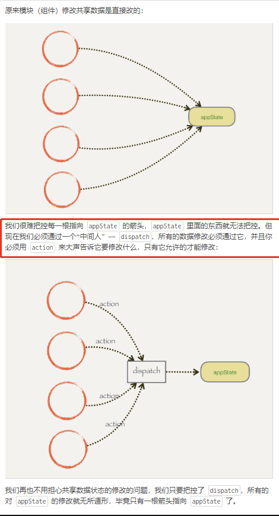
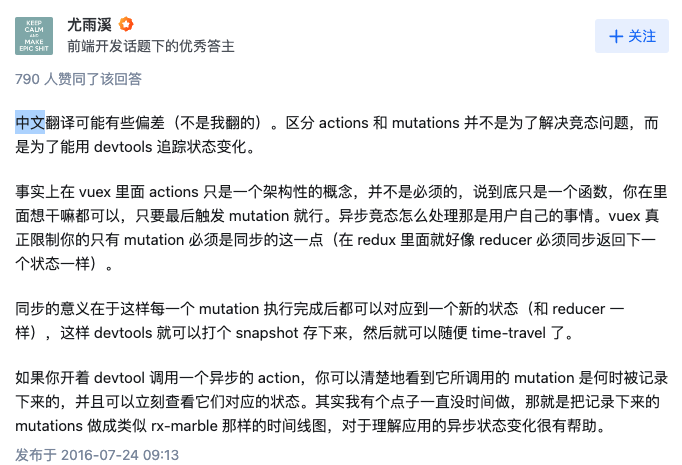

# 为什么只能通过mutation修改值

> vuex 不但是一种全局修改数据的工具，更重要的意义是在于把跨组件的交互，拆分为基于状态管理的处理。

使用如 vuex 本身就是希望基于这样一个数据结构的约定，使得项目代码更加直观和简单。每一个 state 树对应整个项目的一个数据，每一个 mutation 执行完成后都可以更新到一个新的状态。这样 devtools 就可以打个 snapshot 存下来。

可以尝试开着 devtool 调用一个异步的 action，可以清楚地看到它所调用的 mutation 是何时被记录下来的，并且可以立刻查看 mutation 对应的状态。

所以，通过commit 提交 mutation 的方式来修改 state 时，vue的调试工具能够记录每一次 state 的变化，这样方便调试。但是如果是直接修改state，则没有这个记录，那样做会使状态不受我们管控。如果是多个模块需要引用一个state的，然后每个人可能由不同的人开发，如果直接修改值，可能会造成数据的混乱，Mutation 也记录不到，到时候调试会有麻烦。但是通过 mutation 修改 state 这样设计，就有个统一的地方进行逻辑运算去修改。如果逻辑有变动，修改一个地方就可以了。




vuex 更改state 是 dispatch 给 action，action 再 commit 给 mutation，这样实现了**单向数据改动**区别普通双向绑定

具体原因如下:

1. 维持状态的可预测性

在大型应用中，状态在很多地方被多种操作所共享和修改，如果状态可以在任何地方被随意修改，很难追踪到状态是在何处、何时、由于什么原因发生了改变，这会导致数据流向难以理解和维护。通过集中式的状态管理，并且约定只有 mutation 才能修改 state，Vuex 使得状态变化变得可追踪和可预测。

2. 支持插件

由于所有的状态变更都通过 mutation 进行，Vuex 可以提供如日志记录、状态快照、时光旅行等开发工具，帮助开发者更好地理解和调试应用的状态变化。如果状态可以在任何地方被随意修改，这些工具将无法正确地记录状态变化的过程。

3. 实现响应式系统的要求

Vuex 的状态是响应式的，这是基于 Vue 的响应式系统实现的。在 Vue 中，如果要确保数据变化能够被检测到，就必须通过 Vue 提供的方法来进行，如使用 Vue.set 来给响应式对象添加一个属性。Vuex 的 mutation 就是在这样的机制下工作的，它确保状态的改变是响应式的，且组件依赖的状态发生变化时能够自动更新。

4. 支持异步操作

虽然 mutation 本身是同步的，但是通过 action 来处理异步操作，则可以在操作完成后通过 mutation 同步更新状态。这样既保证了异步行为的处理，又能通过同步的 mutation 来确保状态的改变是可追踪和可预测的。如果允许外部直接修改 state，那么在异步操作中就很难保证状态的一致性和正确性。


## Vuex 通过几个核心机制来确保数据状态只能通过 mutation 进行修改，而不是直接修改 state。

这些机制包括：

1. 封装和保护 state：Vuex 的 state 在 store 中是被封装的，外部访问和修改 state 必须通过提供的接口（例如 getters 和 mutations）。
2. 使用严格模式：在严格模式下，Vuex 会在每次状态变更时检查是不是由 mutation 引起的。如果状态变更不是由 mutation 引起的，Vuex 会抛出错误。
3. 利用 Vue 的响应式机制：Vuex 的状态变更依赖于 Vue 的响应式系统，只有通过 Vue 提供的方法（如 Vue.set）修改状态，才能触发视图更新。

### 源码实现

> 在 Vuex 的源码中，Store 的构造函数中会有对应的逻辑来初始化 state，并通过 Vue 实例的数据响应式机制来保证 state 的响应性。同时，在 Vuex 中，_withCommit 方法被设计为一个内部方法，用于确保在执行 mutation 时，能够正确地跟踪状态的改变。这个方法主要用于严格模式下，确保状态的改变只能通过 mutation 来进行，从而维护状态变更的可追踪性和一致性。


```js
class Store {
  constructor(options = {}) {
    // 省略其他初始化代码...

    // 初始化 state
    const state = options.state || {}
    this._vm = new Vue({
      data: {
        $$state: state
      }
    })

    // 启用严格模式
    if (options.strict) {
      enableStrictMode(this)
    }

    if (oldVm) {
      if (hot) {
        // dispatch changes in all subscribed watchers
        // to force getter re-evaluation for hot reloading.
        store._withCommit(() => {
          oldVm._data.$$state = null
        })
      }
      Vue.nextTick(() => oldVm.$destroy())
    }
    // 省略其他代码...
  }

  get state() {
    return this._vm._data.$$state
  }

  set state(v) {
    if (process.env.NODE_ENV !== 'production') {
      assert(false, `use store.replaceState() to explicit replace store state.`)
    }
  }

  // 省略其他代码...
}

function enableStrictMode(store) {
  store._vm.$watch(function () { return this._data.$$state }, () => {
    assert(store._committing, `do not mutate vuex store state outside mutation handlers.`)
  }, { deep: true, sync: true })
}

// _withCommit 方法用来执行 mutation，确保只能在 mutation 中修改 state
_withCommit(fn) {
  const committing = this._committing
  this._committing = true
  fn()
  this._committing = committing
}

```
在上面的代码中，有几个关键点：

- 响应式 state：通过将 state 包装在 Vue 实例的 data 中（$$state），利用 Vue 的响应式系统来管理 Vuex 的 state。
- 严格模式：通过 enableStrictMode 函数启用 Vuex 的严格模式，在严格模式下，如果检测到状态变更不是由 mutation 引起的，会抛出错误。
- 保护 state：通过自定义 setter 来阻止直接修改 state，如果尝试直接修改 state（不通过 mutation），在开发环境下会抛出警告。


## vuex中为什么把把异步操作封装在action，把同步操作放在mutations？

参考： https://www.zhihu.com/question/48759748/answer/112823337

