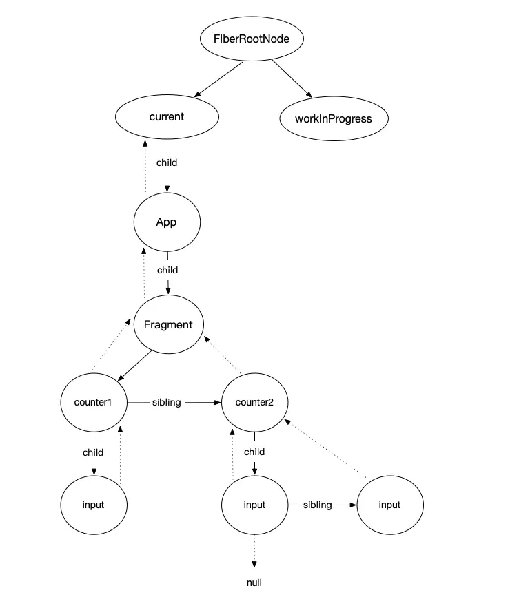

# Fiber

Fiber 架构的主要目标是使 React 能够**利用分片和暂停工作**的能力，从而提高其在动画、布局、手势、暂停/中断工作等方面的表现。

1. 我们可以通过合理调度策略合理分配CPU资源，从而提高用户响应速度
2. 通过Fiber架构，让自己的调度过程变得可中断。适当让出CPU执行权，让浏览器能及时响应用户的交互

## Fiber 是一个执行单元

浏览器每次执行完一个执行单元，React就会检查还剩多少时间，如果没有时间就将控制权让出去

## Fiber 节点的数据结构

> 每个 Fiber 节点代表了一个工作单元，对应于 React 组件树中的一个组件。Fiber 节点的数据结构包含了组件类型、对应的 DOM 节点、组件的 props 和 state、对子节点和兄弟节点的引用、以及任务的优先级等信息。这样的设计使得每个 Fiber 节点既可以表示一个工作任务，也可以构建成一棵树，反映组件的层级结构。



- return： 父节点，指向上一个fiber
- child ： 子节点，指向自身下面的第一个fiber
- sibling ： 兄弟组件, 指向一个兄弟节点

它的遍历过程：

1. 从current（Root）开始通过child向下找
2. 如果有child先遍历子节点，直到null为止
3. 然后看是否有兄弟节点
4. 有兄弟节点则遍历兄弟节点
5. 然后再看兄弟节点是否有子节点
6. 然后return看父节点是否有兄弟节点
7. 直到root


```js
class FiberNode {
  constructor(tag, pendingProps, key, mode) {
    // 实例属性
    this.tag = tag; // 标记不同组件类型，如classComponent，functionComponent
    this.key = key; // react元素上的key 就是jsx上写的那个key，也就是最终ReactElement上的
    this.elementType = null; // createElement的第一个参数，ReactElement上的type
    this.type = null; // 表示fiber的真实类型 ，elementType基本一样，在使用了懒加载之类的功能时可能会不一样
    this.stateNode = null; // 实例对象，比如class组件new完后就挂载在这个属性上面，如果是RootFiber，那么它上面挂的是FiberRoot

    // fiber
    this.return = null; // 父节点，指向上一个fiber
    this.child = null; // 子节点，指向自身下面的第一个fiber
    this.sibling = null; // 兄弟组件, 指向一个兄弟节点
    
    this.index = 0; //  一般如果没有兄弟节点的话是0 当某个父节点下的子节点是数组类型的时候会给每个子节点一个index，index和key要一起做diff

    this.ref = null; // reactElement上的ref属性

    this.pendingProps = pendingProps; // 新的props
    this.memoizedProps = null; // 旧的props
    this.updateQueue = null; // fiber上的更新队列 执行一次setState就会往这个属性上挂一个新的更新, 每条更新最终会形成一个链表结构，最后做批量更新
    this.memoizedState = null; // 对应memoizedProps，上次渲染的state，相当于当前的state，理解成prev和next的关系

    this.mode = mode; // 表示当前组件下的子组件的渲染方式

    // effects

    this.effectTag = NoEffect; // 表示当前fiber要进行何种更新
    this.nextEffect = null; // 指向下个需要更新的fiber
  
    this.firstEffect = null; // 指向所有子节点里，需要更新的fiber里的第一个
    this.lastEffect = null; // 指向所有子节点中需要更新的fiber的最后一个

    this.expirationTime = NoWork; // 过期时间，代表任务在未来的哪个时间点应该被完成
    this.childExpirationTime = NoWork; // child过期时间

    this.alternate = null; // current树和workInprogress树之间的相互引用
  }
}
```

## Fiber 节点标记

> 在 React Fiber 架构中，Fiber 节点通过特定的标记（effectTag）来表示节点在当前更新中所要执行的工作类型。这些标记帮助 React 确定如何处理和优化节点的更新、添加、删除等操作。

下面是一些常见的 effectTag 类型及其含义：

1. Placement (插入): 表示一个新的 Fiber 节点需要被添加到 DOM 中。这通常发生在初次渲染或者组件内部生成了新的子节点时。
2. Update (更新): 表示一个 Fiber 节点的属性、状态或上下文发生了变化，需要应用这些更新到对应的 DOM 节点或组件实例上。
3. Deletion (删除): 表示一个 Fiber 节点及其对应的 DOM 节点需要从 DOM 树中移除。
4. PlacementAndUpdate (插入并更新): 一个特殊的情况，表示一个节点不仅是新插入的，而且在插入时就需要进行属性上的更新。
5. ContentReset (内容重置): 用于标记文本节点的内容需要重置。这通常发生在组件内部使用 key 属性强制重新创建时。
6. Callback (回调): 表示在完成节点的布局和绘制后，需要执行的回调函数，如生命周期方法或 Hook 的 effect 清理和执行函数。
7. DidCapture (捕获错误): 用于错误边界（Error boundaries）的处理，表示子树中有组件抛出了错误，需要这个错误边界组件来处理。
8. Ref (引用更新): 表示需要更新组件的 ref 引用。当组件被挂载、更新或卸载时，ref 回调需要被调用。

## 工作循环（Work Loop）

React Fiber 实现了一个循环，称为工作循环，负责遍历 Fiber 树，执行更新。这个循环可以根据任务的优先级被中断和恢复。当浏览器有更高优先级的任务（如用户输入）时，React 可以暂停当前的工作循环，先处理这些任务，以确保应用的响应性。完成这些任务后，再回到之前的工作循环中。

React 的工作循环大致可以分为三个阶段：

1. 调度（Schedule）
2. 渲染（Render）
3. 提交（Commit）

这个流程涉及到调度任务、执行渲染工作以及将变化应用到 DOM 上。

```js
// 假设的任务队列，每个任务都有一个优先级
const taskQueue = [];

// 调度任务
function scheduleTask(task) {
  taskQueue.push(task);
  requestIdleCallback(performTask);
}

// 执行任务
function performTask(deadline) {
  while ((deadline.timeRemaining() > 0 || deadline.didTimeout) && taskQueue.length > 0) {
    const task = taskQueue.shift(); // 获取任务
    performUnitOfWork(task); // 执行单元任务
  }
  if (taskQueue.length > 0) {
    requestIdleCallback(performTask);
  }
}

// 执行一个工作单元，这里简化为打印任务信息
function performUnitOfWork(task) {
  console.log(`执行任务: ${task.name}`);
}

// 模拟任务调度
scheduleTask({name: '更新组件A', priority: 'high'});
scheduleTask({name: '更新组件B', priority: 'low'});
```

## 任务调度机制

React Fiber 使用了一种叫做“调度器（Scheduler）”的机制来管理任务的优先级和执行。调度器可以决定哪些任务应该优先执行，哪些可以延后处理。这是通过给每个任务分配一个优先级来实现的。例如，响应用户输入或动画的更新会被赋予更高的优先级。

## 处理优先级

在 Fiber 架构中，不同类型的更新可以有不同的优先级。这允许 React 在执行更新时做出更智能的决策。例如，紧急更新（如键盘输入）可以立即执行，而低优先级的更新（如数据预加载）可以在浏览器空闲时执行。

## 源码实现

```js
function performUnitOfWork(fiber) {
  // 执行当前 Fiber 节点的工作，例如创建 DOM 节点、更新 DOM
  // ...

  // 如果有子节点，返回子节点作为下一个工作单元
  if (fiber.child) {
    return fiber.child;
  }

  // 如果没有子节点，回溯到父节点，直到找到有兄弟节点的父节点
  let nextFiber = fiber;
  while (nextFiber) {
    if (nextFiber.sibling) {
      return nextFiber.sibling;
    }
    nextFiber = nextFiber.return;
  }
}

function workLoop(deadline) {
  let shouldYield = false;
  while (nextUnitOfWork && !shouldYield) {
    nextUnitOfWork = performUnitOfWork(nextUnitOfWork);
    shouldYield = deadline.timeRemaining() < 1;
  }

  if (!nextUnitOfWork && wipRoot) {
    // 提交阶段：应用所有更改到 DOM
  }

  requestIdleCallback(workLoop);
}

let nextUnitOfWork = null;
let wipRoot = null; // Work in progress root

requestIdleCallback(workLoop);
```

## Fiber 如何实现暂停

> 在React的Fiber架构中，"暂停任务"是指在执行组件渲染或更新工作时，React可以根据任务的优先级和浏览器的帧率动态地中断和恢复这些任务。

这种能力是通过Fiber架构的设计实现的，它允许React将渲染工作分割成小块，并利用浏览器的requestIdleCallback（或其自己的调度策略）来决定何时处理这些任务。

### 如何实现暂停

Fiber架构通过以下机制实现任务的暂停和恢复：

1. 时间分片（Time Slicing）：React利用Fiber架构将长时间运行的任务（如大型列表的渲染）分割成多个小任务（每个Fiber节点是一个任务单元）。每个小任务完成后，React会检查当前帧是否还有剩余时间。如果没有足够的时间，React会暂停当前工作，等待下一个idle period（空闲期）再继续。
2. 优先级调度（Priority Scheduling）：React为不同类型的更新分配了不同的优先级。例如，用户交互（如点击事件）具有更高的优先级，而数据获取则可能具有较低的优先级。React会根据这些优先级来决定哪些任务应该先执行，哪些可以稍后再执行。
3. 双缓冲技术（Double Buffering）：在更新过程中，React在内存中构建一棵新的Fiber树（workInProgress树），这棵树代表了应用的下一个状态。React通过在背后构建这棵树，可以随时中断工作，而不会影响当前屏幕上显示的内容。一旦所有相关的工作都完成了，React会将这棵树一次性提交到DOM上，这个过程称为"提交阶段"（commit phase）。

### 调度器（Scheduler）

React实现了自己的调度器（Scheduler），来优化任务的执行。调度器基于requestIdleCallback的概念，但是为了更好的跨浏览器兼容性和精确控制，React实现了自己的调度逻辑。这个调度器负责管理任务的优先级，以及在浏览器的主线程空闲时执行任务。

```js
// 伪代码，展示原理
function workLoop(deadline) {
  while (有任务 && deadline.timeRemaining() > 0) {
    // 执行任务
    performUnitOfWork(task);
    // 检查是否还有剩余时间
    if (没有剩余时间) {
      // 暂停工作，等待下一个idle period
      requestIdleCallback(workLoop);
    }
  }
}
window.requestIdleCallback((deadline) => {
  // deadline.timeRemaining() 返回当前帧中剩余的时间
  while (deadline.timeRemaining() > 0 && tasks.length > 0) {
    performTask(tasks.shift());
  }

  if (tasks.length > 0) {
    // 如果还有未完成的任务，再次请求空闲回调
    window.requestIdleCallback(myIdleCallback);
  }
});

// 启动任务
requestIdleCallback(workLoop);
```

## VNode 和 Fiber 有什么差异

> VNode（虚拟节点）和Fiber是 React 框架中的两个核心概念，它们在 React 的内部实现中扮演着不同的角色，并且分别属于不同的阶段和目的。

### VNode与Fiber的差别

- 目的与阶段：VNode主要关注的是**如何通过虚拟表示来描述界面，属于渲染前的准备阶段**；而Fiber关注的是**如何高效地执行渲染（或更新）任务，属于渲染过程的调度与执行阶段**。
- 粒度与结构：虚拟DOM通常表示的是组件树的结构，而Fiber节点提供了更细粒度的控制，每个Fiber节点代表了一个工作单元，不仅包含状态和类型信息，还包含执行该工作的具体指令。
功能与用途：虚拟DOM的主要用途是提高DOM操作的效率，通过diff算法减少实际的DOM操作次数；Fiber架构的引入则是为了优化React的渲染策略，引入异步渲染和任务分割的能力，从而提升了应用的响应性和性能。

### VNode（虚拟节点）

- 定义：VNode，即虚拟DOM节点，是一个简单的JavaScript对象，它是对真实DOM节点的抽象表示。虚拟DOM技术是React等现代前端框架的基础，用于优化DOM操作，提高应用性能。
- 用途：VNode使得开发者可以通过声明式的方式描述界面，而无需直接操作DOM。React在组件渲染时会生成VNode树，然后将这个树与上一次渲染的VNode树进行比较，通过差异算法（diffing）计算出实际需要在DOM上进行的最小更新。
- 特点：VNode主要用于渲染阶段之前，作为描述界面的数据结构。每次组件更新时，都会重新生成VNode。

虚拟DOM节点（VNode）通常包含以下属性：

- type：元素的类型，可以是字符串（对应DOM标签名），也可以是函数（对应函数组件）或类（对应类组件）。
- props：包含属性和子元素的对象。
- key：用于在列表中标识唯一的VNode，帮助React进行高效的更新。
- children：子元素的数组，也可以是单个子元素。

```js
const vnode = {
  type: 'div',
  props: {
    className: 'container',
    children: [
      {
        type: 'span',
        props: {
          children: 'Hello, world!'
        }
      }
    ]
  }
};
```

### Fiber

- 定义：Fiber是React16中引入的一种新的内部实现机制，用于改进其渲染过程。Fiber架构的目的是使React能够利用协调算法（reconciliation）进行非阻塞渲染，从而提高应用的性能和响应能力。
- 用途：Fiber为每个React元素创建了一个工作单元，这些工作单元构成了Fiber树。React可以根据需要暂停、中断、恢复或取消更新过程中的工作。这种能力使得React可以执行如时间分片（time slicing）、并发（concurrency）等高级功能。
- 特点：Fiber节点是对组件树中的组件实例或DOM节点的更细粒度表示，包含渲染相关的状态信息以及指向其他Fiber节点的链接。Fiber架构允许React更灵活地安排或中断工作任务。

Fiber节点的示例结构可能如下（简化版）：

- type和key：与VNode类似，用于标识Fiber节点的类型和唯一性。
- child：指向第一个子节点。
- sibling：指向下一个兄弟节点。
- return：指向父节点。
- stateNode：与该Fiber节点相关联的本地状态或实例。
- memoizedProps和memoizedState：分别记录了上一次渲染时的props和state，用于比较是否需要更新。
- updateQueue：更新队列，存储了该Fiber节点的状态更新和副作用。

```js
const fiberNode = {
  type: MyComponent,
  key: null,
  stateNode: null, // 对于类组件，这里会是组件实例
  child: null, // 指向第一个子Fiber
  sibling: null, // 指向下一个兄弟Fiber
  return: null, // 指向父Fiber
  memoizedProps: {...}, // 上次渲染的props
  memoizedState: {...}, // 上次渲染的state
  updateQueue: {...} // 更新队列
};
```