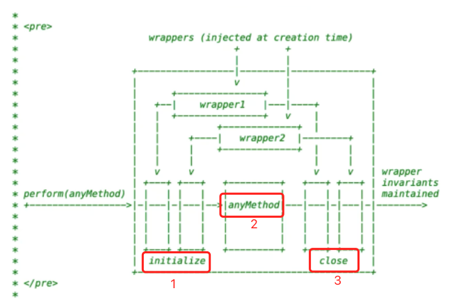

# React 事务机制(Transaction)

> React 的事务（Transaction）是 React 内部机制的一个概念，用于封装组件更新的过程，确保在整个更新过程中，React 的内部状态保持一致。这个概念主要是在 React 的内部实现中使用，对于开发者来说是透明的，不需要直接操作或了解事务机制来开发 React 应用。

## 工作原理

React 的事务机制允许在执行一系列方法或操作之前和之后，自动执行指定的“包装器”（wrappers）。这些包装器定义了在事务开始之前和结束之后应当执行的操作。这种机制让 React 可以将一些预处理和后处理逻辑“包裹”起来，确保这些逻辑在组件的状态更新过程中得到正确的处理。



## 实现细节

React 事务的实现通常涉及以下几个关键部分：

1. 初始化：在事务开始之前，执行初始化操作。
2. 执行：执行实际的业务逻辑，比如组件的渲染和更新。
3. 关闭：在事务结束之后，执行清理操作。


```js
class Transaction {
  constructor(wrappers) {
    this.wrappers = wrappers;
  }

  perform(anyMethod) {
    this.wrappers.forEach(wrapper => wrapper.initialize());
    try {
      anyMethod();
    } finally {
      this.wrappers.slice().reverse().forEach(wrapper => wrapper.close());
    }
  }
}

// 定义一些在事务开始和结束时需要执行的操作
const wrappers = [
  {
    initialize() {
      console.log('开始事务：初始化');
    },
    close() {
      console.log('结束事务：清理');
    },
  },
  // 可以添加更多的包装器，实现不同的逻辑
];

// 使用事务
const transaction = new Transaction(wrappers);

// 执行一个方法，该方法将被事务所包裹
transaction.perform(() => {
  console.log('执行中：更新组件状态');
});
```

在这个例子中，Transaction 类接受一个包装器数组，每个包装器都有 initialize 和 close 方法。当调用 perform 方法执行某个操作时，它首先执行所有包装器的 initialize 方法，然后执行实际的操作（在这个例子中是打印“执行中：更新组件状态”），最后执行每个包装器的 close 方法。

这个简单的模型展示了 React 事务机制的基本思想：通过预先定义的包装器，在执行核心逻辑前后自动执行一些额外的操作。在 React 内部，这种机制被用于管理复杂的更新逻辑，保证组件的更新和渲染过程的正确性和高效性。


