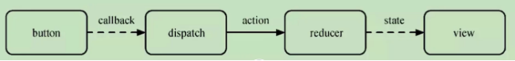

# Redux

> Redux 是一个用于管理应用状态的库，常用于构建复杂的用户界面。它提供了一个可预测的状态管理容器，使得状态的更新逻辑集中于一处，便于追踪状态变化和管理应用状态。

Redux 主要通过以下几个核心概念来实现状态管理：



1. Actions

Actions 是把数据从应用传到 store 的有效载荷。它们是 store 数据的唯一来源。通常来说，你会通过 store.dispatch() 将 action 传到 store。

一个 action 是一个普通的 JavaScript 对象，必须有一个 type 属性来指示发生了什么类型的操作。根据这个类型，reducers 可以理解如何处理这个 action。

```js
{
  type: 'ADD_TODO',
  text: 'Build my first Redux app'
}
```

2. Reducers

> action 经过 reducer ，找到对应的 type, 更新对应的 state

Reducers 指定了应用状态的变化如何响应 actions 并发送到 store 的。

记住 actions 只是描述了有事情发生了这一事实，并没有描述应用如何更新 state。

Reducer 是一个纯函数，接收旧的 state 和一个 action，返回新的 state。

```js
function todoApp(state = initialState, action) {
  switch (action.type) {
    case 'ADD_TODO':
      return Object.assign({}, state, {
        todos: [...state.todos, action.text]
      });
    default:
      return state;
  }
}
```


3. Store


Store 将 actions 和 reducers 联系到一起。它有以下职责：

维持应用的 state；
提供 getState() 方法获取 state；
提供 dispatch(action) 方法更新 state；
通过 subscribe(listener) 注册监听器。

4. Dispatch

> 组件通过 dispatch ,去通知 redux ，store需要更新

## 工作流程

1. 通过 button 点击事件，触发 dispatch
2. reducer 接受到 dispatch 发送的 action.type 更新 state
3. state 变更之后，驱动视图更新


- dispatch(action)

组件通过 dispatch ,去通知 redux ，store需要更新

- reducer -> 返回 newState

action 经过 reducer ，找到对应的 type, 更新对应的 state

- subscribe -> 视图更新

state 更新之后，组件订阅到 state 变更之后，开始驱动视图更新

 

mapStateToProps会订阅Store，每当state更新时，会自动执行，重新计算UI组件的参数来触发UI组件的重新渲染，connect方法可以省略mapStateProps参数，这样UI组件就不会订阅Store 

mapDispatchToProps用来遍历 UI 组件的参数到store.dispatch方法的映射 

## 为什么使用 Redux

- 集中管理状态：Redux 提供了一个集中的状态管理方案，便于应用中不同组件间的状态共享和管理。
- 可预测性：通过使用纯函数来执行修改，确保了相同的输入必定返回相同的输出，易于测试和调试。
- 灵活性：Redux 本身很小，可以与任何 UI 层库一起使用，最常见的搭配是 React。


代码演示

```js
import { createStore } from 'react-redux'

// reducer 就是描述 action 如何把 state
// 变成新的 state 的过程
const reducer = (state, action) => {
    switch(action.type) {
        case 'A':
            return state.count + 1
        case 'B':
            return state.count - 1
        default:
            return state
    }
}

// createStore 接收一个 reducer
const store = createStore(reducer)

// 订阅
store.subscribe(() => {
    // 驱动视图更新
    console.log(store.getStore())
})

// 改变 store 的唯一方式就是通过 dispatch
// 一个 action 去修改 store
store.dispatch({
    type: 'A'
})
store.dispatch({
    type: 'B'
})

```
